# SIGMA — Tablas y relaciones

Las **238 tablas** del modelo con sus relaciones, dominio por dominio.

Base: `db_acd593_sigma` · SQL Server. Complementa `SIGMA_MODELO_DATOS_v3.md`, que tiene el
inventario y las reglas de diseño; aquí están las relaciones.

---

## 1. Cómo leer este documento

Cada relación viene marcada con su procedencia, y la distinción no es un tecnicismo:

| Marca | Qué significa | Cuántas |
|:--:|---|---:|
| **✓** | **Verificada.** Existe un `FOREIGN KEY` en un script `.sql` de este proyecto | **554** |
| ○ | **Derivada** de la convención de nombres. Todavía no tiene DDL escrito | 241 |

> **Por qué se separan.** Lo verificado se puede ejecutar hoy contra la base y falla si está mal.
> Lo derivado es una afirmación de diseño que todavía nadie comprobó contra un motor. Mezclarlas
> daría una falsa sensación de completitud: parecería que las 243 tablas están construidas cuando
> lo que está construido es lo de los bloques 04 a 10.

### 1.1 La convención que hace derivables las relaciones

En este modelo **el nombre declara la relación**, y por eso se puede derivar sin adivinar:

| Patrón | Significa | Ejemplo |
|---|---|---|
| `<pfx>_<entidad>` | FK a `<Entidad>` | `otr_activo` → `Activo` |
| `A_B` donde `A` es tabla | `A_B` pertenece a `A` | `Orden_Trabajo_Paso` → `Orden_Trabajo` |
| `A_B` donde ambas son tablas | Relación entre `A` y `B` | `Plan_Actividad_Repuesto` |
| `<pfx>_cliente` | Aislamiento multicliente | en toda tabla de negocio |

La FK se llama `<pfx>_<entidad>` **sin el sufijo `_id`**: es `otr_activo`, no `otr_activo_id`.

### 1.2 Las relaciones que no se ven en los diagramas

Los diagramas de abajo muestran **solo relaciones entre entidades de negocio**. Las FK a catálogos
se listan en las tablas pero no se dibujan: con 76 catálogos, dibujarlos convertiría cada
diagrama en una maraña ilegible sin agregar información — un catálogo es siempre el lado «uno».

---

## 2. La relación que atraviesa todo: `Cliente`

Antes de los dominios, la relación que aparece en casi todas las tablas y que no se repite en cada
diagrama porque los haría ilegibles.

```sql
CONSTRAINT UX_ACT_CLIENTE_ID UNIQUE ([act_cliente], [act_id])

CONSTRAINT FK_OTR_ACTIVO_CLIENTE FOREIGN KEY ([otr_cliente], [otr_activo])
    REFERENCES [dbo].[Activo] ([act_cliente], [act_id])
```

**La FK es compuesta a propósito.** Con una FK simple a `act_id`, una OT del cliente A podría
apuntar a un activo del cliente B y la base lo aceptaría. Con la compuesta, el motor lo impide: el
aislamiento entre clientes deja de depender de que alguien escriba bien el `WHERE`.

`Cliente` recibe **148 relaciones entrantes** — es la tabla más referenciada del modelo.

---

## 3. Relaciones por dominio

### D1 · Organización y seguridad

54 tablas: 37 de negocio y 17 catálogos.

*Dominio de 37 entidades: el diagrama completo es ilegible en una página. Las relaciones están en la tabla.*

| Tabla | pfx | Relaciones |
|---|:--:|---|
| `Centro_Costo` | `cco` | ✓ `cco_centro_costo_padre` → `Centro_Costo` · ✓ `cco_cliente` → `Cliente` |
| `Cliente` | `cli` | *referenciada por 148 tablas* |
| `Cliente_App_Instalacion` | `cai` | ○ `cai_cliente` → `Cliente` |
| `Cliente_Binario` | `clb` | ✓ `clb_cliente` → `Cliente` · ○ `clb_cliente` → `Cliente` |
| `Cliente_Instalacion` | `cin` | ○ `cin_cliente` → `Cliente` |
| `Cliente_Instalacion_Usuario` | `ciu` | ○ `ciu_cliente_instalacion` → `Cliente_Instalacion` · ○ `ciu_usuario` → `Usuario` · ○ `ciu_cliente` → `Cliente` |
| `Cliente_Usuario` | `ucl` | ○ `ucl_cliente` → `Cliente` · ○ `ucl_usuario` → `Usuario` |
| `Cliente_Usuario_Perfil` | `cup` | ○ `cup_cliente_usuario` → `Cliente_Usuario` · ○ `cup_cliente` → `Cliente` |
| `Cliente_Usuario_Permiso` | `cpm` | ✓ `cpm_cliente_instalacion` → `Cliente_Instalacion` · ✓ `cpm_cliente_usuario` → `Cliente_Usuario` · ✓ `cpm_permiso` → `Permiso` · ○ `cpm_cliente_usuario` → `Cliente_Usuario` · ○ `cpm_permiso` → `Permiso` · ○ `cpm_cliente` → `Cliente` |
| `Criticidad_Nivel` `C` | `crn` | *referenciada por 4 tablas* |
| `Dia_Semana` `C` | `dse` | *referenciada por 1 tabla* |
| `Especialidad` `C` | `esp` | *referenciada por 6 tablas* |
| `Especialidad_Nivel` `C` | `enl` | ○ `enl_especialidad` → `Especialidad` |
| `Frecuencia_Tipo` `C` | `fre` | *referenciada por 1 tabla* |
| `Grupo_Trabajo` | `gtr` | ✓ `gtr_cliente` → `Cliente` · ✓ `gtr_cliente_instalacion` → `Cliente_Instalacion` · ✓ `gtr_especialidad` → `Especialidad` |
| `Grupo_Trabajo_Usuario` | `gtu` | ✓ `gtu_grupo_trabajo` → `Grupo_Trabajo` · ✓ `gtu_usuario` → `Usuario` · ○ `gtu_grupo_trabajo` → `Grupo_Trabajo` · ○ `gtu_usuario` → `Usuario` · ○ `gtu_cliente` → `Cliente` |
| `Idioma` | `idi` | ○ `idi_cliente` → `Cliente` |
| `Instalacion_Area` | `iar` | ✓ `iar_area_padre` → `Instalacion_Area` · ✓ `iar_cliente` → `Cliente` · ✓ `iar_cliente_instalacion` → `Cliente_Instalacion` · ✓ `iar_instalacion_area_tipo` → `Instalacion_Area_Tipo` |
| `Instalacion_Area_Tipo` `C` | `iat` | ○ `iat_instalacion_area` → `Instalacion_Area` |
| `Log` | `log` | *referenciada por 2 tablas* |
| `Log_Estado` | `loe` | ○ `loe_log` → `Log` |
| `Log_Tabla` | `lot` | ○ `lot_log` → `Log` |
| `Magnitud` `C` | `mag` | *referenciada por 1 tabla* |
| `Menu_Funcion` | `mfu` | *referenciada por 1 tabla* |
| `Menu_Funcion_Perfil` | `mfp` | ○ `mfp_menu_funcion` → `Menu_Funcion` |
| `Menu_Perfil` | `mpe` | — |
| `Menus` | `mnu` | — |
| `Modulos_Sistema` | `mds` | — |
| `Momento_Ejecucion` `C` | `moe` | *referenciada por 3 tablas* |
| `Moneda` `C` | `mon` | *referenciada por 6 tablas* |
| `Operador_Comparacion` `C` | `opc` | *referenciada por 2 tablas* |
| `Paises` | `pai` | *referenciada por 1 tabla* |
| `Perfil_Permiso` | `ppe` | ✓ `ppe_perfil` → `Perfiles` · ✓ `ppe_permiso` → `Permiso` · ○ `ppe_cliente` → `Cliente` |
| `Perfiles` | `per` | ○ `per_cliente` → `Cliente` |
| `Permiso` | `prm` | ✓ `prm_permiso_ambito` → `Permiso_Ambito` · ○ `prm_cliente` → `Cliente` |
| `Permiso_Ambito` `C` | `pam` | ○ `pam_permiso` → `Permiso` |
| `Privacidad_Modulos_Sistema` | `pms` | — |
| `Proceso_Estado` `C` | `pes` | *referenciada por 6 tablas* |
| `Registro_Origen` `C` | `ror` | *referenciada por 4 tablas* |
| `Responsabilidad_Tipo` `C` | `rst` | — |
| `Severidad` `C` | `sev` | *referenciada por 7 tablas* |
| `Sis_Excepcion` | `lge` | — |
| `Sys_Parametros` | `par` | — |
| `Tipo_Dato` `C` | `tda` | *referenciada por 3 tablas* |
| `Tipo_Perfil` | `tpp` | — |
| `Unidad_Tiempo` `C` | `uti` | *referenciada por 1 tabla* |
| `Usuario` | `usu` | ○ `usu_cliente` → `Cliente` |
| `Usuario_Accesibilidad` | `uac` | ✓ `uac_idioma` → `Idioma` · ✓ `uac_usuario` → `Usuario` · ○ `uac_usuario` → `Usuario` · ○ `uac_cliente` → `Cliente` |
| `Usuario_App_Dispositivo` | `uad` | ○ `uad_usuario` → `Usuario` · ○ `uad_cliente` → `Cliente` |
| `Usuario_Especialidad` | `ues` | ✓ `ues_cliente` → `Cliente` · ✓ `ues_especialidad` → `Especialidad` · ✓ `ues_especialidad_nivel` → `Especialidad_Nivel` · ✓ `ues_usuario` → `Usuario` · ○ `ues_usuario` → `Usuario` · ○ `ues_especialidad` → `Especialidad` |
| `Usuario_Foto` | `uft` | ○ `uft_usuario` → `Usuario` · ○ `uft_cliente` → `Cliente` |
| `Usuario_Paises` | `upa` | ○ `upa_usuario` → `Usuario` · ○ `upa_paises` → `Paises` · ○ `upa_cliente` → `Cliente` |
| `Usuario_Perfil` | `upe` | ○ `upe_usuario` → `Usuario` · ○ `upe_cliente` → `Cliente` |
| `Zona_Horaria` | `zho` | ○ `zho_cliente` → `Cliente` |

### D2 · Activos y ubicación técnica

18 tablas: 13 de negocio y 5 catálogos.

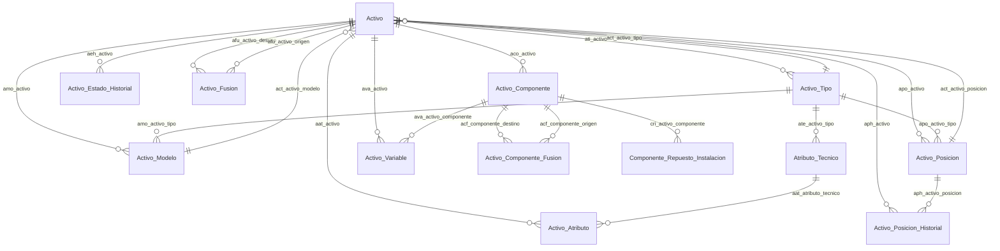

| Tabla | pfx | Relaciones |
|---|:--:|---|
| `Activo` | `act` | ✓ `act_activo_estado` → `Activo_Estado` · ✓ `act_activo_modelo` → `Activo_Modelo` · ✓ `act_activo_padre` → `Activo` · ✓ `act_activo_posicion` → `Activo_Posicion` · ✓ `act_activo_tipo` → `Activo_Tipo` · ✓ `act_centro_costo` → `Centro_Costo` · ✓ `act_cliente` → `Cliente` · ✓ `act_cliente_instalacion` → `Cliente_Instalacion` · ✓ `act_criticidad_nivel` → `Criticidad_Nivel` · ✓ `act_fusionado_en` → `Activo` · ✓ `act_instalacion_area` → `Instalacion_Area` · ✓ `act_registro_descubrimiento` → `Registro_Descubrimiento` · ✓ `act_registro_origen` → `Registro_Origen` |
| `Activo_Atributo` | `aat` | ✓ `aat_activo` → `Activo` · ✓ `aat_atributo_tecnico` → `Atributo_Tecnico` · ✓ `aat_cliente` → `Cliente` · ✓ `aat_registro_descubrimiento` → `Registro_Descubrimiento` · ✓ `aat_unidad_medida` → `Unidad_Medida` · ○ `aat_activo` → `Activo` |
| `Activo_Componente` | `aco` | ✓ `aco_activo` → `Activo` · ✓ `aco_activo_componente_estado` → `Activo_Componente_Estado` · ✓ `aco_cliente` → `Cliente` · ✓ `aco_componente_padre` → `Activo_Componente` · ✓ `aco_componente_posicion` → `Componente_Posicion` · ✓ `aco_componente_tipo` → `Componente_Tipo` · ✓ `aco_criticidad_nivel` → `Criticidad_Nivel` · ✓ `aco_fusionado_en` → `Activo_Componente` · ✓ `aco_registro_descubrimiento` → `Registro_Descubrimiento` · ✓ `aco_registro_origen` → `Registro_Origen` · ○ `aco_activo` → `Activo` |
| `Activo_Componente_Estado` `C` | `ace` | ○ `ace_activo_componente` → `Activo_Componente` |
| `Activo_Componente_Fusion` | `acf` | ✓ `acf_cliente` → `Cliente` · ✓ `acf_componente_destino` → `Activo_Componente` · ✓ `acf_componente_origen` → `Activo_Componente` · ○ `acf_activo_componente` → `Activo_Componente` |
| `Activo_Estado` `C` | `aes` | ○ `aes_activo` → `Activo` |
| `Activo_Estado_Historial` | `aeh` | ✓ `aeh_activo` → `Activo` · ✓ `aeh_activo_estado` → `Activo_Estado` · ✓ `aeh_cliente` → `Cliente` · ✓ `aeh_orden_trabajo` → `Orden_Trabajo` · ○ `aeh_activo_estado` → `Activo_Estado` |
| `Activo_Fusion` | `afu` | ✓ `afu_activo_destino` → `Activo` · ✓ `afu_activo_origen` → `Activo` · ✓ `afu_cliente` → `Cliente` · ○ `afu_activo` → `Activo` |
| `Activo_Modelo` | `amo` | ✓ `amo_activo_tipo` → `Activo_Tipo` · ✓ `amo_cliente` → `Cliente` · ○ `amo_activo` → `Activo` |
| `Activo_Posicion` | `apo` | ✓ `apo_activo_tipo` → `Activo_Tipo` · ✓ `apo_cliente` → `Cliente` · ✓ `apo_cliente_instalacion` → `Cliente_Instalacion` · ✓ `apo_instalacion_area` → `Instalacion_Area` · ○ `apo_activo` → `Activo` |
| `Activo_Posicion_Historial` | `aph` | ✓ `aph_activo` → `Activo` · ✓ `aph_activo_posicion` → `Activo_Posicion` · ✓ `aph_activo_posicion_motivo` → `Activo_Posicion_Motivo` · ✓ `aph_cliente` → `Cliente` · ✓ `aph_orden_trabajo` → `Orden_Trabajo` · ○ `aph_activo_posicion` → `Activo_Posicion` |
| `Activo_Posicion_Motivo` `C` | `apm` | ○ `apm_activo_posicion` → `Activo_Posicion` |
| `Activo_Tipo` | `ati` | ✓ `ati_activo_tipo_padre` → `Activo_Tipo` · ✓ `ati_cliente` → `Cliente` · ○ `ati_activo` → `Activo` |
| `Activo_Variable` | `ava` | ✓ `ava_activo_componente` → `Activo_Componente` · ✓ `ava_cliente` → `Cliente` · ✓ `ava_registro_descubrimiento` → `Registro_Descubrimiento` · ✓ `ava_unidad_medida` → `Unidad_Medida` · ✓ `ava_variable_medicion` → `Variable_Medicion` · ○ `ava_activo` → `Activo` |
| `Atributo_Tecnico` | `ate` | ✓ `ate_activo_tipo` → `Activo_Tipo` · ✓ `ate_cliente` → `Cliente` · ✓ `ate_tipo_dato` → `Tipo_Dato` · ✓ `ate_unidad_medida` → `Unidad_Medida` |
| `Componente_Posicion` `C` | `cpn` | *referenciada por 1 tabla* |
| `Componente_Repuesto_Instalacion` | `cri` | ✓ `cri_activo_componente` → `Activo_Componente` · ✓ `cri_activo_medidor` → `Activo_Medidor` · ✓ `cri_cliente` → `Cliente` · ✓ `cri_orden_trabajo_instalacion` → `Orden_Trabajo` · ✓ `cri_orden_trabajo_retiro` → `Orden_Trabajo` · ✓ `cri_repuesto` → `Repuesto` · ✓ `cri_repuesto_estado_final` → `Repuesto_Estado_Final` · ✓ `cri_repuesto_lote` → `Repuesto_Lote` · ✓ `cri_repuesto_retiro_motivo` → `Repuesto_Retiro_Motivo` · ✓ `cri_usuario_tecnico` → `Usuario` · ○ `cri_activo_componente` → `Activo_Componente` |
| `Componente_Tipo` `C` | `cto` | *referenciada por 1 tabla* |

### D3 · Variables y mediciones

7 tablas: 5 de negocio y 2 catálogos.

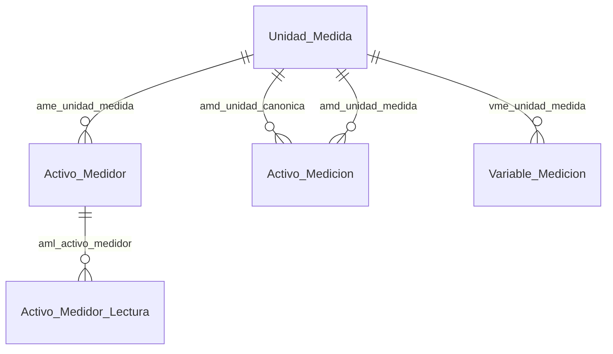

| Tabla | pfx | Relaciones |
|---|:--:|---|
| `Activo_Medicion` | `amd` | ✓ `amd_activo_componente` → `Activo_Componente` · ✓ `amd_activo_variable` → `Activo_Variable` · ✓ `amd_checklist_ejecucion_respuesta` → `Checklist_Ejecucion_Respuesta` · ✓ `amd_cliente` → `Cliente` · ✓ `amd_dato_origen` → `Dato_Origen` · ✓ `amd_entrada_modo` → `Entrada_Modo` · ✓ `amd_medicion_calidad` → `Medicion_Calidad` · ✓ `amd_orden_trabajo` → `Orden_Trabajo` · ✓ `amd_unidad_canonica` → `Unidad_Medida` · ✓ `amd_unidad_medida` → `Unidad_Medida` · ○ `amd_activo` → `Activo` |
| `Activo_Medidor` | `ame` | ✓ `ame_activo_componente` → `Activo_Componente` · ✓ `ame_cliente` → `Cliente` · ✓ `ame_registro_descubrimiento` → `Registro_Descubrimiento` · ✓ `ame_unidad_medida` → `Unidad_Medida` · ○ `ame_activo` → `Activo` |
| `Activo_Medidor_Lectura` | `aml` | ✓ `aml_activo_medidor` → `Activo_Medidor` · ✓ `aml_cliente` → `Cliente` · ✓ `aml_dato_origen` → `Dato_Origen` · ✓ `aml_entrada_modo` → `Entrada_Modo` · ✓ `aml_medicion_calidad` → `Medicion_Calidad` · ✓ `aml_orden_trabajo` → `Orden_Trabajo` · ○ `aml_activo_medidor` → `Activo_Medidor` |
| `Dato_Origen` `C` | `dor` | *referenciada por 2 tablas* |
| `Medicion_Calidad` `C` | `mca` | *referenciada por 2 tablas* |
| `Unidad_Medida` | `ume` | ✓ `ume_magnitud` → `Magnitud` · ✓ `ume_unidad_base` → `Unidad_Medida` · ○ `ume_cliente` → `Cliente` |
| `Variable_Medicion` | `vme` | ✓ `vme_cliente` → `Cliente` · ✓ `vme_tipo_dato` → `Tipo_Dato` · ✓ `vme_unidad_medida` → `Unidad_Medida` |

### D4 · Repuestos e inventario

12 tablas: 9 de negocio y 3 catálogos.

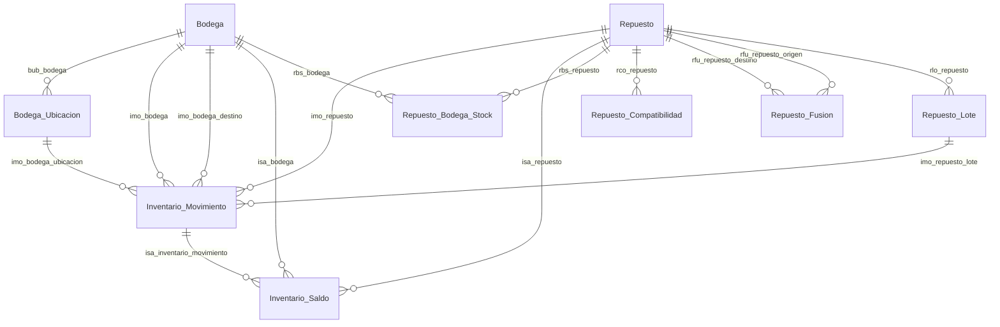

| Tabla | pfx | Relaciones |
|---|:--:|---|
| `Bodega` | `bod` | ✓ `bod_cliente` → `Cliente` · ✓ `bod_cliente_instalacion` → `Cliente_Instalacion` |
| `Bodega_Ubicacion` | `bub` | ✓ `bub_bodega` → `Bodega` · ○ `bub_bodega` → `Bodega` · ○ `bub_cliente` → `Cliente` |
| `Inventario_Movimiento` | `imo` | ✓ `imo_bodega` → `Bodega` · ✓ `imo_bodega_destino` → `Bodega` · ✓ `imo_bodega_ubicacion` → `Bodega_Ubicacion` · ✓ `imo_cliente` → `Cliente` · ✓ `imo_inventario_movimiento_tipo` → `Inventario_Movimiento_Tipo` · ✓ `imo_moneda` → `Moneda` · ✓ `imo_orden_trabajo` → `Orden_Trabajo` · ✓ `imo_repuesto` → `Repuesto` · ✓ `imo_repuesto_lote` → `Repuesto_Lote` |
| `Inventario_Movimiento_Tipo` `C` | `imt` | ○ `imt_inventario_movimiento` → `Inventario_Movimiento` |
| `Inventario_Saldo` | `isa` | ✓ `isa_bodega` → `Bodega` · ✓ `isa_cliente` → `Cliente` · ✓ `isa_repuesto` → `Repuesto` · ○ `isa_inventario_movimiento` → `Inventario_Movimiento` |
| `Repuesto` | `rep` | ✓ `rep_cliente` → `Cliente` · ✓ `rep_fusionado_en` → `Repuesto` · ✓ `rep_moneda` → `Moneda` · ✓ `rep_registro_descubrimiento` → `Registro_Descubrimiento` · ✓ `rep_registro_origen` → `Registro_Origen` · ✓ `rep_unidad_medida` → `Unidad_Medida` |
| `Repuesto_Bodega_Stock` | `rbs` | ✓ `rbs_bodega` → `Bodega` · ✓ `rbs_cliente` → `Cliente` · ✓ `rbs_repuesto` → `Repuesto` · ○ `rbs_repuesto` → `Repuesto` |
| `Repuesto_Compatibilidad` | `rco` | ✓ `rco_activo_componente` → `Activo_Componente` · ✓ `rco_activo_modelo` → `Activo_Modelo` · ✓ `rco_activo_tipo` → `Activo_Tipo` · ✓ `rco_repuesto` → `Repuesto` · ○ `rco_repuesto` → `Repuesto` · ○ `rco_cliente` → `Cliente` |
| `Repuesto_Estado_Final` `C` | `ref` | ○ `ref_repuesto` → `Repuesto` |
| `Repuesto_Fusion` | `rfu` | ✓ `rfu_cliente` → `Cliente` · ✓ `rfu_repuesto_destino` → `Repuesto` · ✓ `rfu_repuesto_origen` → `Repuesto` · ○ `rfu_repuesto` → `Repuesto` |
| `Repuesto_Lote` | `rlo` | ✓ `rlo_cliente` → `Cliente` · ✓ `rlo_moneda` → `Moneda` · ✓ `rlo_proveedor` → `Proveedor` · ✓ `rlo_repuesto` → `Repuesto` · ○ `rlo_repuesto` → `Repuesto` |
| `Repuesto_Retiro_Motivo` `C` | `rrm` | ○ `rrm_repuesto` → `Repuesto` |

### D5 · Motor de programación

10 tablas: 9 de negocio y 1 catálogos.

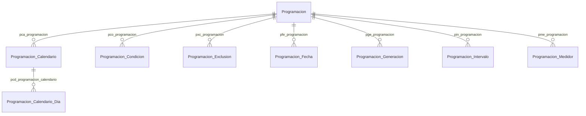

| Tabla | pfx | Relaciones |
|---|:--:|---|
| `Programacion` | `pro` | ✓ `pro_cliente` → `Cliente` · ✓ `pro_programacion_tipo` → `Programacion_Tipo` · ✓ `pro_zona_horaria` → `Zona_Horaria` |
| `Programacion_Calendario` | `pca` | ✓ `pca_frecuencia_tipo` → `Frecuencia_Tipo` · ✓ `pca_programacion` → `Programacion` · ○ `pca_programacion` → `Programacion` · ○ `pca_cliente` → `Cliente` |
| `Programacion_Calendario_Dia` | `pcd` | ✓ `pcd_dia_semana` → `Dia_Semana` · ✓ `pcd_programacion_calendario` → `Programacion_Calendario` · ○ `pcd_programacion_calendario` → `Programacion_Calendario` · ○ `pcd_cliente` → `Cliente` |
| `Programacion_Condicion` | `pco` | ✓ `pco_activo_variable` → `Activo_Variable` · ✓ `pco_operador_comparacion` → `Operador_Comparacion` · ✓ `pco_programacion` → `Programacion` · ✓ `pco_severidad` → `Severidad` · ○ `pco_programacion` → `Programacion` · ○ `pco_cliente` → `Cliente` |
| `Programacion_Exclusion` | `pxc` | ✓ `pxc_programacion` → `Programacion` · ○ `pxc_programacion` → `Programacion` · ○ `pxc_cliente` → `Cliente` |
| `Programacion_Fecha` | `pfe` | ✓ `pfe_programacion` → `Programacion` · ○ `pfe_programacion` → `Programacion` · ○ `pfe_cliente` → `Cliente` |
| `Programacion_Generacion` | `pge` | ✓ `pge_programacion` → `Programacion` · ○ `pge_programacion` → `Programacion` · ○ `pge_cliente` → `Cliente` |
| `Programacion_Intervalo` | `pin` | ✓ `pin_programacion` → `Programacion` · ✓ `pin_unidad_tiempo` → `Unidad_Tiempo` · ○ `pin_programacion` → `Programacion` · ○ `pin_cliente` → `Cliente` |
| `Programacion_Medidor` | `pme` | ✓ `pme_activo_medidor` → `Activo_Medidor` · ✓ `pme_programacion` → `Programacion` · ○ `pme_programacion` → `Programacion` · ○ `pme_cliente` → `Cliente` |
| `Programacion_Tipo` `C` | `pti` | ○ `pti_programacion` → `Programacion` |

### D6 · Planes de mantenimiento

12 tablas: 10 de negocio y 2 catálogos.

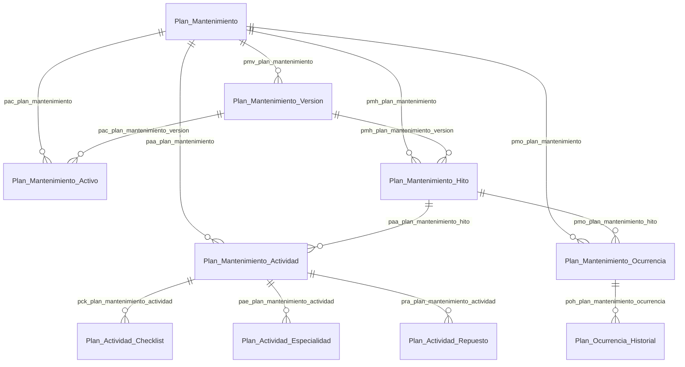

| Tabla | pfx | Relaciones |
|---|:--:|---|
| `Plan_Actividad_Checklist` | `pck` | ✓ `pck_checklist_plantilla_version` → `Checklist_Plantilla_Version` · ✓ `pck_momento_ejecucion` → `Momento_Ejecucion` · ✓ `pck_plan_mantenimiento_actividad` → `Plan_Mantenimiento_Actividad` · ○ `pck_plan_mantenimiento_actividad` → `Plan_Mantenimiento_Actividad` · ○ `pck_cliente` → `Cliente` |
| `Plan_Actividad_Especialidad` | `pae` | ✓ `pae_especialidad` → `Especialidad` · ✓ `pae_especialidad_nivel` → `Especialidad_Nivel` · ✓ `pae_plan_mantenimiento_actividad` → `Plan_Mantenimiento_Actividad` · ○ `pae_plan_mantenimiento_actividad` → `Plan_Mantenimiento_Actividad` · ○ `pae_especialidad` → `Especialidad` · ○ `pae_cliente` → `Cliente` |
| `Plan_Actividad_Repuesto` | `pra` | ✓ `pra_plan_mantenimiento_actividad` → `Plan_Mantenimiento_Actividad` · ✓ `pra_repuesto` → `Repuesto` · ✓ `pra_unidad_medida` → `Unidad_Medida` · ○ `pra_plan_mantenimiento_actividad` → `Plan_Mantenimiento_Actividad` · ○ `pra_repuesto` → `Repuesto` · ○ `pra_cliente` → `Cliente` |
| `Plan_Mantenimiento` | `pma` | ✓ `pma_activo_modelo` → `Activo_Modelo` · ✓ `pma_activo_tipo` → `Activo_Tipo` · ✓ `pma_cliente` → `Cliente` · ✓ `pma_cliente_instalacion` → `Cliente_Instalacion` · ✓ `pma_usuario_planificador` → `Usuario` |
| `Plan_Mantenimiento_Actividad` | `paa` | ✓ `paa_permiso_trabajo_tipo` → `Permiso_Trabajo_Tipo` · ✓ `paa_plan_mantenimiento_hito` → `Plan_Mantenimiento_Hito` · ✓ `paa_procedimiento` → `Procedimiento` · ○ `paa_plan_mantenimiento` → `Plan_Mantenimiento` · ○ `paa_cliente` → `Cliente` |
| `Plan_Mantenimiento_Activo` | `pac` | ✓ `pac_activo` → `Activo` · ✓ `pac_activo_componente` → `Activo_Componente` · ✓ `pac_activo_medidor` → `Activo_Medidor` · ✓ `pac_plan_mantenimiento_version` → `Plan_Mantenimiento_Version` · ○ `pac_plan_mantenimiento` → `Plan_Mantenimiento` · ○ `pac_activo` → `Activo` · ○ `pac_cliente` → `Cliente` |
| `Plan_Mantenimiento_Hito` | `pmh` | ✓ `pmh_orden_trabajo_prioridad` → `Orden_Trabajo_Prioridad` · ✓ `pmh_orden_trabajo_tipo` → `Orden_Trabajo_Tipo` · ✓ `pmh_plan_mantenimiento_version` → `Plan_Mantenimiento_Version` · ✓ `pmh_programacion` → `Programacion` · ✓ `pmh_unidad_medida` → `Unidad_Medida` · ○ `pmh_plan_mantenimiento` → `Plan_Mantenimiento` · ○ `pmh_cliente` → `Cliente` |
| `Plan_Mantenimiento_Ocurrencia` | `pmo` | ✓ `pmo_activo` → `Activo` · ✓ `pmo_activo_componente` → `Activo_Componente` · ✓ `pmo_cliente` → `Cliente` · ✓ `pmo_ocurrencia_origen` → `Plan_Mantenimiento_Ocurrencia` · ✓ `pmo_orden_trabajo` → `Orden_Trabajo` · ✓ `pmo_plan_mantenimiento_hito` → `Plan_Mantenimiento_Hito` · ✓ `pmo_plan_ocurrencia_estado` → `Plan_Ocurrencia_Estado` · ✓ `pmo_programacion` → `Programacion` · ○ `pmo_plan_mantenimiento` → `Plan_Mantenimiento` |
| `Plan_Mantenimiento_Version` | `pmv` | ✓ `pmv_plan_mantenimiento` → `Plan_Mantenimiento` · ✓ `pmv_plan_version_estado` → `Plan_Version_Estado` · ✓ `pmv_usuario_publicacion` → `Usuario` · ○ `pmv_plan_mantenimiento` → `Plan_Mantenimiento` · ○ `pmv_cliente` → `Cliente` |
| `Plan_Ocurrencia_Estado` `C` | `poe` | ○ `poe_plan_mantenimiento_ocurrencia` → `Plan_Mantenimiento_Ocurrencia` |
| `Plan_Ocurrencia_Historial` | `poh` | ✓ `poh_estado_anterior` → `Plan_Ocurrencia_Estado` · ✓ `poh_estado_nuevo` → `Plan_Ocurrencia_Estado` · ✓ `poh_plan_mantenimiento_ocurrencia` → `Plan_Mantenimiento_Ocurrencia` · ✓ `poh_usuario_creacion` → `Usuario` · ○ `poh_plan_mantenimiento_ocurrencia` → `Plan_Mantenimiento_Ocurrencia` · ○ `poh_cliente` → `Cliente` |
| `Plan_Version_Estado` `C` | `pve` | ○ `pve_plan_mantenimiento_version` → `Plan_Mantenimiento_Version` |

### D7 · Checklist dinámico

23 tablas: 15 de negocio y 8 catálogos.

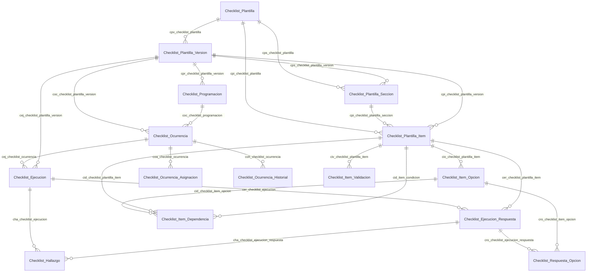

| Tabla | pfx | Relaciones |
|---|:--:|---|
| `Checklist_Asignacion_Tipo` `C` | `cat` | *referenciada por 1 tabla* |
| `Checklist_Ejecucion` | `cej` | ✓ `cej_activo` → `Activo` · ✓ `cej_checklist_ejecucion_estado` → `Checklist_Ejecucion_Estado` · ✓ `cej_checklist_ocurrencia` → `Checklist_Ocurrencia` · ✓ `cej_checklist_plantilla_version` → `Checklist_Plantilla_Version` · ✓ `cej_cliente` → `Cliente` · ✓ `cej_usuario_ejecutor` → `Usuario` |
| `Checklist_Ejecucion_Estado` `C` | `cee` | ○ `cee_checklist_ejecucion` → `Checklist_Ejecucion` |
| `Checklist_Ejecucion_Respuesta` | `cer` | ✓ `cer_checklist_ejecucion` → `Checklist_Ejecucion` · ✓ `cer_checklist_plantilla_item` → `Checklist_Plantilla_Item` · ✓ `cer_dictado_voz` → `Dictado_Voz` · ✓ `cer_entrada_modo` → `Entrada_Modo` · ✓ `cer_unidad_canonica` → `Unidad_Medida` · ✓ `cer_unidad_medida` → `Unidad_Medida` · ○ `cer_checklist_ejecucion` → `Checklist_Ejecucion` · ○ `cer_cliente` → `Cliente` |
| `Checklist_Hallazgo` | `cha` | ✓ `cha_activo` → `Activo` · ✓ `cha_activo_componente` → `Activo_Componente` · ✓ `cha_checklist_ejecucion` → `Checklist_Ejecucion` · ✓ `cha_checklist_ejecucion_respuesta` → `Checklist_Ejecucion_Respuesta` · ✓ `cha_cliente` → `Cliente` · ✓ `cha_criticidad_nivel` → `Criticidad_Nivel` · ✓ `cha_orden_trabajo` → `Orden_Trabajo` · ✓ `cha_proceso_estado` → `Proceso_Estado` · ✓ `cha_severidad` → `Severidad` · ✓ `cha_usuario_confirmacion` → `Usuario` |
| `Checklist_Item_Dependencia` | `cid` | ✓ `cid_checklist_item_opcion` → `Checklist_Item_Opcion` · ✓ `cid_checklist_plantilla_item` → `Checklist_Plantilla_Item` · ✓ `cid_item_condicion` → `Checklist_Plantilla_Item` · ✓ `cid_operador_comparacion` → `Operador_Comparacion` · ○ `cid_checklist_plantilla_item` → `Checklist_Plantilla_Item` · ○ `cid_cliente` → `Cliente` |
| `Checklist_Item_Opcion` | `cio` | ✓ `cio_checklist_plantilla_item` → `Checklist_Plantilla_Item` · ✓ `cio_severidad` → `Severidad` · ○ `cio_checklist_plantilla_item` → `Checklist_Plantilla_Item` · ○ `cio_cliente` → `Cliente` |
| `Checklist_Item_Tipo` `C` | `cit` | ○ `cit_checklist_plantilla_item` → `Checklist_Plantilla_Item` |
| `Checklist_Item_Validacion` | `civ` | ✓ `civ_checklist_plantilla_item` → `Checklist_Plantilla_Item` · ✓ `civ_unidad_medida` → `Unidad_Medida` · ○ `civ_checklist_plantilla_item` → `Checklist_Plantilla_Item` · ○ `civ_cliente` → `Cliente` |
| `Checklist_Ocurrencia` | `coc` | ✓ `coc_activo` → `Activo` · ✓ `coc_checklist_ocurrencia_estado` → `Checklist_Ocurrencia_Estado` · ✓ `coc_checklist_plantilla_version` → `Checklist_Plantilla_Version` · ✓ `coc_checklist_programacion` → `Checklist_Programacion` · ✓ `coc_cliente` → `Cliente` · ✓ `coc_instalacion_area` → `Instalacion_Area` · ✓ `coc_ocurrencia_origen` → `Checklist_Ocurrencia` |
| `Checklist_Ocurrencia_Asignacion` | `coa` | ✓ `coa_checklist_ocurrencia` → `Checklist_Ocurrencia` · ✓ `coa_grupo_trabajo` → `Grupo_Trabajo` · ✓ `coa_usuario` → `Usuario` · ○ `coa_checklist_ocurrencia` → `Checklist_Ocurrencia` · ○ `coa_cliente` → `Cliente` |
| `Checklist_Ocurrencia_Estado` `C` | `coe` | ○ `coe_checklist_ocurrencia` → `Checklist_Ocurrencia` |
| `Checklist_Ocurrencia_Historial` | `coh` | ✓ `coh_checklist_ocurrencia` → `Checklist_Ocurrencia` · ✓ `coh_estado_anterior` → `Checklist_Ocurrencia_Estado` · ✓ `coh_estado_nuevo` → `Checklist_Ocurrencia_Estado` · ✓ `coh_usuario_creacion` → `Usuario` · ○ `coh_checklist_ocurrencia` → `Checklist_Ocurrencia` · ○ `coh_cliente` → `Cliente` |
| `Checklist_Plantilla` | `cpl` | ✓ `cpl_activo_tipo` → `Activo_Tipo` · ✓ `cpl_checklist_asignacion_tipo` → `Checklist_Asignacion_Tipo` · ✓ `cpl_cliente` → `Cliente` · ✓ `cpl_cliente_instalacion` → `Cliente_Instalacion` |
| `Checklist_Plantilla_Item` | `cpi` | ✓ `cpi_activo_variable` → `Activo_Variable` · ✓ `cpi_checklist_item_tipo` → `Checklist_Item_Tipo` · ✓ `cpi_checklist_plantilla_seccion` → `Checklist_Plantilla_Seccion` · ✓ `cpi_checklist_plantilla_version` → `Checklist_Plantilla_Version` · ✓ `cpi_unidad_medida` → `Unidad_Medida` · ○ `cpi_checklist_plantilla` → `Checklist_Plantilla` · ○ `cpi_cliente` → `Cliente` |
| `Checklist_Plantilla_Seccion` | `cps` | ✓ `cps_checklist_plantilla_version` → `Checklist_Plantilla_Version` · ○ `cps_checklist_plantilla` → `Checklist_Plantilla` · ○ `cps_cliente` → `Cliente` |
| `Checklist_Plantilla_Version` | `cpv` | ✓ `cpv_checklist_plantilla` → `Checklist_Plantilla` · ✓ `cpv_checklist_version_estado` → `Checklist_Version_Estado` · ✓ `cpv_usuario_publicacion` → `Usuario` · ○ `cpv_checklist_plantilla` → `Checklist_Plantilla` · ○ `cpv_cliente` → `Cliente` |
| `Checklist_Programacion` | `cpr` | ✓ `cpr_activo` → `Activo` · ✓ `cpr_checklist_plantilla_version` → `Checklist_Plantilla_Version` · ✓ `cpr_cliente` → `Cliente` · ✓ `cpr_grupo_trabajo` → `Grupo_Trabajo` · ✓ `cpr_instalacion_area` → `Instalacion_Area` · ✓ `cpr_programacion` → `Programacion` · ✓ `cpr_usuario_responsable` → `Usuario` |
| `Checklist_Respuesta_Estado` `C` | `cre` | ○ `cre_checklist_ejecucion_respuesta` → `Checklist_Ejecucion_Respuesta` |
| `Checklist_Respuesta_Opcion` | `cro` | ✓ `cro_checklist_ejecucion_respuesta` → `Checklist_Ejecucion_Respuesta` · ✓ `cro_checklist_item_opcion` → `Checklist_Item_Opcion` · ○ `cro_checklist_ejecucion_respuesta` → `Checklist_Ejecucion_Respuesta` · ○ `cro_cliente` → `Cliente` |
| `Checklist_Version_Estado` `C` | `cve` | ○ `cve_checklist_plantilla_version` → `Checklist_Plantilla_Version` |
| `Cumplimiento_Politica` `C` | `cpo` | — |
| `Dependencia_Accion` `C` | `dac` | — |

### D8 · Tareas

11 tablas: 9 de negocio y 2 catálogos.

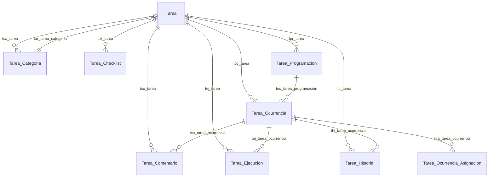

| Tabla | pfx | Relaciones |
|---|:--:|---|
| `Tarea` | `tar` | ✓ `tar_activo` → `Activo` · ✓ `tar_cliente` → `Cliente` · ✓ `tar_cliente_instalacion` → `Cliente_Instalacion` · ✓ `tar_instalacion_area` → `Instalacion_Area` · ✓ `tar_tarea_categoria` → `Tarea_Categoria` · ✓ `tar_tarea_prioridad` → `Tarea_Prioridad` |
| `Tarea_Categoria` | `tca` | ✓ `tca_cliente` → `Cliente` · ○ `tca_tarea` → `Tarea` |
| `Tarea_Checklist` | `tck` | ✓ `tck_checklist_plantilla_version` → `Checklist_Plantilla_Version` · ✓ `tck_momento_ejecucion` → `Momento_Ejecucion` · ✓ `tck_tarea` → `Tarea` · ○ `tck_tarea` → `Tarea` · ○ `tck_cliente` → `Cliente` |
| `Tarea_Comentario` | `tco` | ✓ `tco_comentario_padre` → `Tarea_Comentario` · ✓ `tco_dictado_voz` → `Dictado_Voz` · ✓ `tco_tarea_ocurrencia` → `Tarea_Ocurrencia` · ✓ `tco_usuario_creacion` → `Usuario` · ○ `tco_tarea` → `Tarea` · ○ `tco_cliente` → `Cliente` |
| `Tarea_Ejecucion` | `tej` | ✓ `tej_tarea_ocurrencia` → `Tarea_Ocurrencia` · ✓ `tej_usuario_ejecutor` → `Usuario` · ○ `tej_tarea` → `Tarea` · ○ `tej_cliente` → `Cliente` |
| `Tarea_Historial` | `thi` | ✓ `thi_estado_anterior` → `Tarea_Ocurrencia_Estado` · ✓ `thi_estado_nuevo` → `Tarea_Ocurrencia_Estado` · ✓ `thi_tarea_ocurrencia` → `Tarea_Ocurrencia` · ✓ `thi_usuario_creacion` → `Usuario` · ○ `thi_tarea` → `Tarea` · ○ `thi_cliente` → `Cliente` |
| `Tarea_Ocurrencia` | `toc` | ✓ `toc_cliente` → `Cliente` · ✓ `toc_ocurrencia_origen` → `Tarea_Ocurrencia` · ✓ `toc_orden_trabajo` → `Orden_Trabajo` · ✓ `toc_tarea` → `Tarea` · ✓ `toc_tarea_ocurrencia_estado` → `Tarea_Ocurrencia_Estado` · ✓ `toc_tarea_programacion` → `Tarea_Programacion` · ○ `toc_tarea` → `Tarea` |
| `Tarea_Ocurrencia_Asignacion` | `toa` | ✓ `toa_grupo_trabajo` → `Grupo_Trabajo` · ✓ `toa_tarea_ocurrencia` → `Tarea_Ocurrencia` · ✓ `toa_usuario` → `Usuario` · ○ `toa_tarea_ocurrencia` → `Tarea_Ocurrencia` · ○ `toa_cliente` → `Cliente` |
| `Tarea_Ocurrencia_Estado` `C` | `toe` | ○ `toe_tarea_ocurrencia` → `Tarea_Ocurrencia` |
| `Tarea_Prioridad` `C` | `tpa` | ○ `tpa_tarea` → `Tarea` |
| `Tarea_Programacion` | `tpr` | ✓ `tpr_grupo_trabajo` → `Grupo_Trabajo` · ✓ `tpr_programacion` → `Programacion` · ✓ `tpr_tarea` → `Tarea` · ✓ `tpr_usuario_responsable` → `Usuario` · ○ `tpr_tarea` → `Tarea` · ○ `tpr_programacion` → `Programacion` · ○ `tpr_cliente` → `Cliente` |

### D9 · Órdenes de trabajo y fallas

27 tablas: 17 de negocio y 10 catálogos.

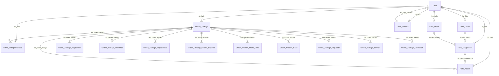

| Tabla | pfx | Relaciones |
|---|:--:|---|
| `Activo_Indisponibilidad` | `ain` | ✓ `ain_activo` → `Activo` · ✓ `ain_cliente` → `Cliente` · ✓ `ain_falla` → `Falla` · ✓ `ain_orden_trabajo` → `Orden_Trabajo` · ○ `ain_activo` → `Activo` |
| `Falla` | `fal` | ✓ `fal_activo` → `Activo` · ✓ `fal_activo_componente` → `Activo_Componente` · ✓ `fal_activo_estado_posterior` → `Activo_Estado` · ✓ `fal_cliente` → `Cliente` · ✓ `fal_criticidad_nivel` → `Criticidad_Nivel` · ✓ `fal_dictado_voz` → `Dictado_Voz` · ✓ `fal_falla_sintoma` → `Falla_Sintoma` · ✓ `fal_usuario_reporta` → `Usuario` |
| `Falla_Accion` | `fac` | ✓ `fac_falla` → `Falla` · ✓ `fac_falla_diagnostico` → `Falla_Diagnostico` · ✓ `fac_orden_trabajo` → `Orden_Trabajo` · ✓ `fac_usuario_ejecuta` → `Usuario` · ○ `fac_falla` → `Falla` · ○ `fac_cliente` → `Cliente` |
| `Falla_Causa` | `fca` | ✓ `fca_causa_padre` → `Falla_Causa` · ✓ `fca_cliente` → `Cliente` · ○ `fca_falla` → `Falla` |
| `Falla_Diagnostico` | `fdi` | ✓ `fdi_falla` → `Falla` · ✓ `fdi_falla_causa` → `Falla_Causa` · ✓ `fdi_falla_modo` → `Falla_Modo` · ✓ `fdi_usuario_diagnostica` → `Usuario` · ○ `fdi_falla` → `Falla` · ○ `fdi_cliente` → `Cliente` |
| `Falla_Modo` | `fmo` | ✓ `fmo_activo_tipo` → `Activo_Tipo` · ✓ `fmo_cliente` → `Cliente` · ○ `fmo_falla` → `Falla` |
| `Falla_Sintoma` | `fsi` | ✓ `fsi_activo_tipo` → `Activo_Tipo` · ✓ `fsi_cliente` → `Cliente` · ○ `fsi_falla` → `Falla` |
| `Indisponibilidad_Motivo` `C` | `inm` | — |
| `Orden_Trabajo` | `otr` | ✓ `otr_activo` → `Activo` · ✓ `otr_activo_componente` → `Activo_Componente` · ✓ `otr_activo_posicion` → `Activo_Posicion` · ✓ `otr_centro_costo` → `Centro_Costo` · ✓ `otr_checklist_hallazgo` → `Checklist_Hallazgo` · ✓ `otr_cierre_motivo` → `Orden_Trabajo_Cierre_Motivo` · ✓ `otr_cliente` → `Cliente` · ✓ `otr_cliente_instalacion` → `Cliente_Instalacion` · ✓ `otr_dictado_voz` → `Dictado_Voz` · ✓ `otr_entrada_modo` → `Entrada_Modo` · ✓ `otr_falla` → `Falla` · ✓ `otr_instalacion_area` → `Instalacion_Area` · ✓ `otr_orden_trabajo_estado` → `Orden_Trabajo_Estado` · ✓ `otr_orden_trabajo_estrategia` → `Orden_Trabajo_Estrategia` · ✓ `otr_orden_trabajo_origen` → `Orden_Trabajo_Origen` · ✓ `otr_orden_trabajo_prioridad` → `Orden_Trabajo_Prioridad` · ✓ `otr_orden_trabajo_tipo` → `Orden_Trabajo_Tipo` · ✓ `otr_ot_origen` → `Orden_Trabajo` · ✓ `otr_plan_mantenimiento_ocurrencia` → `Plan_Mantenimiento_Ocurrencia` · ✓ `otr_prediccion` → `Prediccion` · ✓ `otr_tarea_ocurrencia` → `Tarea_Ocurrencia` · ✓ `otr_usuario_cierre` → `Usuario` · ✓ `otr_usuario_generador` → `Usuario` · ✓ `otr_usuario_responsable` → `Usuario` · ✓ `otr_usuario_solicitante` → `Usuario` |
| `Orden_Trabajo_Asignacion` | `ota` | ✓ `ota_asignado_por` → `Usuario` · ✓ `ota_grupo_trabajo` → `Grupo_Trabajo` · ✓ `ota_orden_trabajo` → `Orden_Trabajo` · ✓ `ota_proveedor` → `Proveedor` · ✓ `ota_usuario` → `Usuario` · ○ `ota_orden_trabajo` → `Orden_Trabajo` · ○ `ota_cliente` → `Cliente` |
| `Orden_Trabajo_Checklist` | `otc` | ✓ `otc_checklist_ejecucion` → `Checklist_Ejecucion` · ✓ `otc_checklist_ocurrencia` → `Checklist_Ocurrencia` · ✓ `otc_checklist_plantilla_version` → `Checklist_Plantilla_Version` · ✓ `otc_momento_ejecucion` → `Momento_Ejecucion` · ✓ `otc_orden_trabajo` → `Orden_Trabajo` · ○ `otc_orden_trabajo` → `Orden_Trabajo` · ○ `otc_cliente` → `Cliente` |
| `Orden_Trabajo_Cierre_Motivo` `C` | `ocm` | ○ `ocm_orden_trabajo` → `Orden_Trabajo` |
| `Orden_Trabajo_Especialidad` | `oep` | ✓ `oep_especialidad` → `Especialidad` · ✓ `oep_orden_trabajo` → `Orden_Trabajo` · ○ `oep_orden_trabajo` → `Orden_Trabajo` · ○ `oep_especialidad` → `Especialidad` · ○ `oep_cliente` → `Cliente` |
| `Orden_Trabajo_Estado` `C` | `ote` | ○ `ote_orden_trabajo` → `Orden_Trabajo` |
| `Orden_Trabajo_Estado_Historial` | `oeh` | ✓ `oeh_estado_anterior` → `Orden_Trabajo_Estado` · ✓ `oeh_estado_nuevo` → `Orden_Trabajo_Estado` · ✓ `oeh_orden_trabajo` → `Orden_Trabajo` · ✓ `oeh_usuario_creacion` → `Usuario` · ○ `oeh_orden_trabajo_estado` → `Orden_Trabajo_Estado` · ○ `oeh_cliente` → `Cliente` |
| `Orden_Trabajo_Estrategia` `C` | `oet` | ○ `oet_orden_trabajo` → `Orden_Trabajo` |
| `Orden_Trabajo_Mano_Obra` | `omo` | ✓ `omo_especialidad` → `Especialidad` · ✓ `omo_moneda` → `Moneda` · ✓ `omo_orden_trabajo` → `Orden_Trabajo` · ✓ `omo_proveedor` → `Proveedor` · ✓ `omo_usuario` → `Usuario` · ○ `omo_orden_trabajo` → `Orden_Trabajo` · ○ `omo_cliente` → `Cliente` |
| `Orden_Trabajo_Origen` `C` | `oto` | ○ `oto_orden_trabajo` → `Orden_Trabajo` |
| `Orden_Trabajo_Paso` | `otp` | ✓ `otp_orden_trabajo` → `Orden_Trabajo` · ✓ `otp_plan_mantenimiento_actividad` → `Plan_Mantenimiento_Actividad` · ✓ `otp_procedimiento_paso` → `Procedimiento_Paso` · ✓ `otp_usuario_ejecutor` → `Usuario` · ○ `otp_orden_trabajo` → `Orden_Trabajo` · ○ `otp_cliente` → `Cliente` |
| `Orden_Trabajo_Prioridad` `C` | `opr` | ○ `opr_orden_trabajo` → `Orden_Trabajo` |
| `Orden_Trabajo_Repuesto` | `ore` | ✓ `ore_activo_componente` → `Activo_Componente` · ✓ `ore_activo_medidor` → `Activo_Medidor` · ✓ `ore_componente_repuesto_instalacion` → `Componente_Repuesto_Instalacion` · ✓ `ore_moneda` → `Moneda` · ✓ `ore_orden_trabajo` → `Orden_Trabajo` · ✓ `ore_repuesto` → `Repuesto` · ✓ `ore_repuesto_lote` → `Repuesto_Lote` · ○ `ore_orden_trabajo` → `Orden_Trabajo` · ○ `ore_repuesto` → `Repuesto` · ○ `ore_cliente` → `Cliente` |
| `Orden_Trabajo_Servicio` | `ots` | ✓ `ots_moneda` → `Moneda` · ✓ `ots_orden_trabajo` → `Orden_Trabajo` · ✓ `ots_proveedor` → `Proveedor` · ○ `ots_orden_trabajo` → `Orden_Trabajo` · ○ `ots_cliente` → `Cliente` |
| `Orden_Trabajo_Tipo` `C` | `ott` | ○ `ott_orden_trabajo` → `Orden_Trabajo` |
| `Orden_Trabajo_Validacion` | `otv` | ✓ `otv_archivo_firma` → `Archivo` · ✓ `otv_orden_trabajo` → `Orden_Trabajo` · ✓ `otv_usuario` → `Usuario` · ○ `otv_orden_trabajo` → `Orden_Trabajo` · ○ `otv_cliente` → `Cliente` |
| `Resultado_Paso` `C` | `rpa` | — |
| `Rol_Ejecucion` `C` | `rej` | — |
| `Validacion_Tipo` `C` | `vat` | — |

### D10 · Bitácora

4 tablas: 3 de negocio y 1 catálogos.

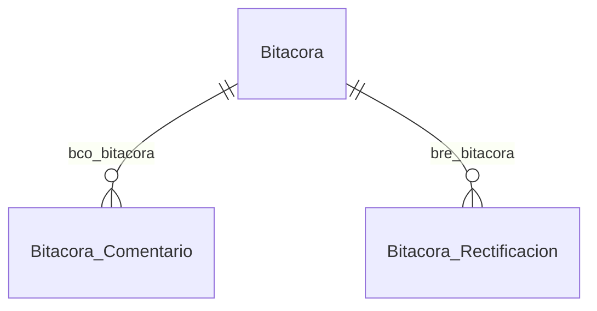

| Tabla | pfx | Relaciones |
|---|:--:|---|
| `Bitacora` | `bit` | ✓ `bit_activo` → `Activo` · ✓ `bit_activo_componente` → `Activo_Componente` · ✓ `bit_alerta` → `Alerta` · ✓ `bit_bitacora_tipo` → `Bitacora_Tipo` · ✓ `bit_cliente` → `Cliente` · ✓ `bit_cliente_instalacion` → `Cliente_Instalacion` · ✓ `bit_dictado_voz` → `Dictado_Voz` · ✓ `bit_entrada_modo` → `Entrada_Modo` · ✓ `bit_instalacion_area` → `Instalacion_Area` · ✓ `bit_orden_trabajo` → `Orden_Trabajo` · ✓ `bit_severidad` → `Severidad` · ✓ `bit_usuario_creacion` → `Usuario` |
| `Bitacora_Comentario` | `bco` | ✓ `bco_bitacora` → `Bitacora` · ✓ `bco_comentario_padre` → `Bitacora_Comentario` · ✓ `bco_dictado_voz` → `Dictado_Voz` · ✓ `bco_usuario_creacion` → `Usuario` · ○ `bco_bitacora` → `Bitacora` · ○ `bco_cliente` → `Cliente` |
| `Bitacora_Rectificacion` | `bre` | ✓ `bre_bitacora` → `Bitacora` · ✓ `bre_usuario_creacion` → `Usuario` · ○ `bre_bitacora` → `Bitacora` · ○ `bre_cliente` → `Cliente` |
| `Bitacora_Tipo` `C` | `bti` | ○ `bti_bitacora` → `Bitacora` |

### D11 · Evidencias y visión

9 tablas: 6 de negocio y 3 catálogos.

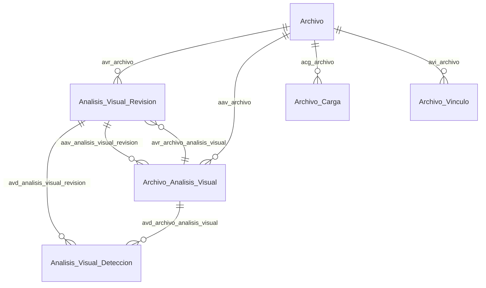

| Tabla | pfx | Relaciones |
|---|:--:|---|
| `Analisis_Visual_Deteccion` | `avd` | ✓ `avd_analisis_visual_revision` → `Analisis_Visual_Revision` · ✓ `avd_severidad` → `Severidad` · ✓ `avd_usuario_confirmacion` → `Usuario` · ○ `avd_archivo_analisis_visual` → `Archivo_Analisis_Visual` · ○ `avd_cliente` → `Cliente` |
| `Analisis_Visual_Revision` | `avr` | ✓ `avr_archivo` → `Archivo` · ✓ `avr_cliente` → `Cliente` · ✓ `avr_proceso_estado` → `Proceso_Estado` · ✓ `avr_usuario_revision` → `Usuario` · ○ `avr_archivo_analisis_visual` → `Archivo_Analisis_Visual` |
| `Archivo` | `arc` | ✓ `arc_archivo_antivirus_estado` → `Archivo_Antivirus_Estado` · ✓ `arc_archivo_categoria` → `Archivo_Categoria` · ✓ `arc_cliente` → `Cliente` |
| `Archivo_Analisis_Visual` | `aav` | ✓ `aav_analisis_visual_revision` → `Analisis_Visual_Revision` · ✓ `aav_archivo` → `Archivo` · ✓ `aav_proceso_estado` → `Proceso_Estado` · ○ `aav_archivo` → `Archivo` · ○ `aav_cliente` → `Cliente` |
| `Archivo_Antivirus_Estado` `C` | `aae` | ○ `aae_archivo` → `Archivo` |
| `Archivo_Carga` | `acg` | ✓ `acg_archivo` → `Archivo` · ✓ `acg_archivo_carga_estado` → `Archivo_Carga_Estado` · ✓ `acg_cliente` → `Cliente` · ○ `acg_archivo` → `Archivo` |
| `Archivo_Carga_Estado` `C` | `acs` | ○ `acs_archivo_carga` → `Archivo_Carga` |
| `Archivo_Categoria` `C` | `aca` | ○ `aca_archivo` → `Archivo` |
| `Archivo_Vinculo` | `avi` | ✓ `avi_activo` → `Activo` · ✓ `avi_archivo` → `Archivo` · ✓ `avi_bitacora` → `Bitacora` · ✓ `avi_checklist_ejecucion_respuesta` → `Checklist_Ejecucion_Respuesta` · ✓ `avi_checklist_hallazgo` → `Checklist_Hallazgo` · ✓ `avi_checklist_plantilla_item` → `Checklist_Plantilla_Item` · ✓ `avi_falla` → `Falla` · ✓ `avi_orden_trabajo` → `Orden_Trabajo` · ✓ `avi_orden_trabajo_paso` → `Orden_Trabajo_Paso` · ✓ `avi_permiso_trabajo` → `Permiso_Trabajo` · ✓ `avi_plan_mantenimiento_actividad` → `Plan_Mantenimiento_Actividad` · ✓ `avi_repuesto` → `Repuesto` · ✓ `avi_tarea_ejecucion` → `Tarea_Ejecucion` · ○ `avi_archivo` → `Archivo` · ○ `avi_cliente` → `Cliente` |

### D12 · Machine learning

15 tablas: 10 de negocio y 5 catálogos.

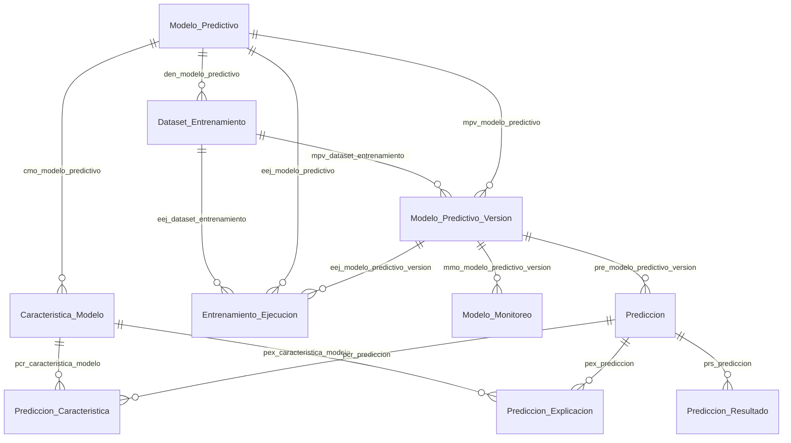

| Tabla | pfx | Relaciones |
|---|:--:|---|
| `Caracteristica_Modelo` | `cmo` | ✓ `cmo_modelo_predictivo` → `Modelo_Predictivo` · ✓ `cmo_tipo_dato` → `Tipo_Dato` · ✓ `cmo_unidad_medida` → `Unidad_Medida` · ✓ `cmo_variable_medicion` → `Variable_Medicion` · ○ `cmo_cliente` → `Cliente` |
| `Caracteristica_Tipo` `C` | `ctm` | — |
| `Dataset_Entrenamiento` | `den` | ✓ `den_cliente` → `Cliente` · ✓ `den_modelo_predictivo` → `Modelo_Predictivo` |
| `Entrenamiento_Ejecucion` | `eej` | ✓ `eej_dataset_entrenamiento` → `Dataset_Entrenamiento` · ✓ `eej_modelo_predictivo` → `Modelo_Predictivo` · ✓ `eej_modelo_predictivo_version` → `Modelo_Predictivo_Version` · ✓ `eej_proceso_estado` → `Proceso_Estado` · ○ `eej_cliente` → `Cliente` |
| `Modelo_Formato` `C` | `mfo` | *referenciada por 1 tabla* |
| `Modelo_Monitoreo` | `mmo` | ✓ `mmo_cliente` → `Cliente` · ✓ `mmo_modelo_predictivo_version` → `Modelo_Predictivo_Version` |
| `Modelo_Objetivo` `C` | `mob` | *referenciada por 1 tabla* |
| `Modelo_Predictivo` | `mpr` | ✓ `mpr_activo_tipo` → `Activo_Tipo` · ✓ `mpr_cliente` → `Cliente` · ✓ `mpr_modelo_objetivo` → `Modelo_Objetivo` |
| `Modelo_Predictivo_Version` | `mpv` | ✓ `mpv_dataset_entrenamiento` → `Dataset_Entrenamiento` · ✓ `mpv_modelo_formato` → `Modelo_Formato` · ✓ `mpv_modelo_predictivo` → `Modelo_Predictivo` · ✓ `mpv_plan_version_estado` → `Plan_Version_Estado` · ✓ `mpv_usuario_publicacion` → `Usuario` · ○ `mpv_modelo_predictivo` → `Modelo_Predictivo` · ○ `mpv_cliente` → `Cliente` |
| `Nivel_Riesgo` `C` | `nri` | — |
| `Prediccion` | `pre` | ✓ `pre_activo` → `Activo` · ✓ `pre_activo_componente` → `Activo_Componente` · ✓ `pre_alerta` → `Alerta` · ✓ `pre_cliente` → `Cliente` · ✓ `pre_componente_repuesto_instalacion` → `Componente_Repuesto_Instalacion` · ✓ `pre_modelo_predictivo_version` → `Modelo_Predictivo_Version` · ✓ `pre_orden_trabajo` → `Orden_Trabajo` · ✓ `pre_prediccion_estado` → `Prediccion_Estado` · ✓ `pre_severidad` → `Severidad` · ✓ `pre_usuario_revision` → `Usuario` |
| `Prediccion_Caracteristica` | `pcr` | ✓ `pcr_caracteristica_modelo` → `Caracteristica_Modelo` · ✓ `pcr_prediccion` → `Prediccion` · ○ `pcr_prediccion` → `Prediccion` · ○ `pcr_cliente` → `Cliente` |
| `Prediccion_Estado` `C` | `pde` | ○ `pde_prediccion` → `Prediccion` |
| `Prediccion_Explicacion` | `pex` | ✓ `pex_caracteristica_modelo` → `Caracteristica_Modelo` · ✓ `pex_prediccion` → `Prediccion` · ○ `pex_prediccion` → `Prediccion` · ○ `pex_cliente` → `Cliente` |
| `Prediccion_Resultado` | `prs` | ✓ `prs_falla` → `Falla` · ✓ `prs_orden_trabajo` → `Orden_Trabajo` · ✓ `prs_prediccion` → `Prediccion` · ✓ `prs_usuario_evaluacion` → `Usuario` · ○ `prs_prediccion` → `Prediccion` · ○ `prs_cliente` → `Cliente` |

### D13 · Terceros y procedimientos

11 tablas: 5 de negocio y 6 catálogos.

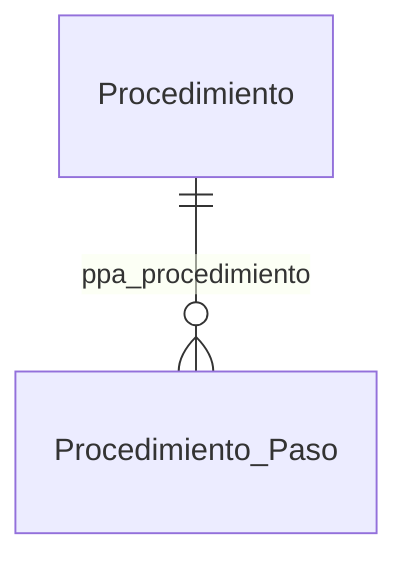

| Tabla | pfx | Relaciones |
|---|:--:|---|
| `Alerta` | `ale` | ✓ `ale_activo` → `Activo` · ✓ `ale_activo_componente` → `Activo_Componente` · ✓ `ale_activo_medidor` → `Activo_Medidor` · ✓ `ale_alerta_estado` → `Alerta_Estado` · ✓ `ale_alerta_tipo` → `Alerta_Tipo` · ✓ `ale_bodega` → `Bodega` · ✓ `ale_checklist_ejecucion_respuesta` → `Checklist_Ejecucion_Respuesta` · ✓ `ale_cliente` → `Cliente` · ✓ `ale_cliente_instalacion` → `Cliente_Instalacion` · ✓ `ale_orden_trabajo` → `Orden_Trabajo` · ✓ `ale_plan_mantenimiento_ocurrencia` → `Plan_Mantenimiento_Ocurrencia` · ✓ `ale_prediccion` → `Prediccion` · ✓ `ale_repuesto` → `Repuesto` · ✓ `ale_severidad` → `Severidad` · ✓ `ale_unidad_medida` → `Unidad_Medida` · ✓ `ale_usuario_atencion` → `Usuario` |
| `Alerta_Estado` `C` | `aet` | ○ `aet_alerta` → `Alerta` |
| `Alerta_Tipo` `C` | `alt` | ○ `alt_alerta` → `Alerta` |
| `Diagnostico_Metodo` `C` | `dme` | — |
| `Permiso_Trabajo` | `ptr` | ✓ `ptr_archivo` → `Archivo` · ✓ `ptr_cliente` → `Cliente` · ✓ `ptr_orden_trabajo` → `Orden_Trabajo` · ✓ `ptr_permiso_trabajo_estado` → `Permiso_Trabajo_Estado` · ✓ `ptr_permiso_trabajo_tipo` → `Permiso_Trabajo_Tipo` · ✓ `ptr_usuario_solicitante` → `Usuario` · ○ `ptr_permiso` → `Permiso` |
| `Permiso_Trabajo_Estado` `C` | `pte` | ○ `pte_permiso_trabajo` → `Permiso_Trabajo` |
| `Permiso_Trabajo_Tipo` `C` | `ptt` | ○ `ptt_permiso_trabajo` → `Permiso_Trabajo` |
| `Procedimiento` | `prc` | ✓ `prc_activo_tipo` → `Activo_Tipo` · ✓ `prc_cliente` → `Cliente` · ✓ `prc_permiso_trabajo_tipo` → `Permiso_Trabajo_Tipo` |
| `Procedimiento_Paso` | `ppa` | ✓ `ppa_procedimiento` → `Procedimiento` · ✓ `ppa_variable_medicion` → `Variable_Medicion` · ○ `ppa_procedimiento` → `Procedimiento` · ○ `ppa_cliente` → `Cliente` |
| `Proveedor` | `prv` | ✓ `prv_cliente` → `Cliente` |
| `Servicio_Tipo` `C` | `sti` | — |

### D14 · Descubrimiento, voz e importación

7 tablas: 4 de negocio y 3 catálogos.

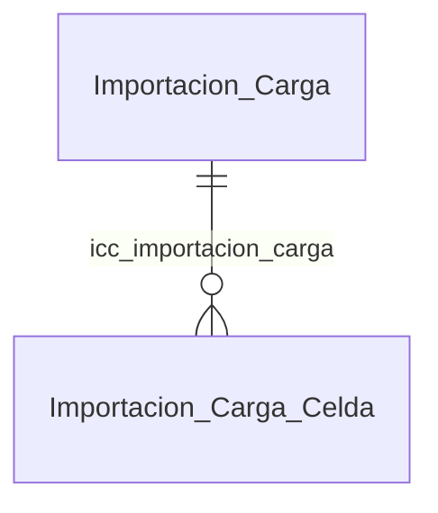

| Tabla | pfx | Relaciones |
|---|:--:|---|
| `Dictado_Voz` | `dvo` | ✓ `dvo_archivo` → `Archivo` · ✓ `dvo_cliente` → `Cliente` · ✓ `dvo_idioma` → `Idioma` · ✓ `dvo_proceso_estado` → `Proceso_Estado` · ✓ `dvo_usuario` → `Usuario` |
| `Entrada_Modo` `C` | `emo` | *referenciada por 5 tablas* |
| `Importacion_Carga` | `ica` | ✓ `ica_cliente` → `Cliente` · ✓ `ica_cliente_instalacion` → `Cliente_Instalacion` · ✓ `ica_importacion_tipo` → `Importacion_Tipo` · ✓ `ica_proceso_estado` → `Proceso_Estado` |
| `Importacion_Carga_Celda` | `icc` | ✓ `icc_importacion_carga` → `Importacion_Carga` · ✓ `icc_importacion_celda_estado` → `Importacion_Celda_Estado` · ○ `icc_importacion_carga` → `Importacion_Carga` · ○ `icc_cliente` → `Cliente` |
| `Importacion_Celda_Estado` `C` | `ice` | *referenciada por 1 tabla* |
| `Importacion_Tipo` `C` | `iti` | *referenciada por 1 tabla* |
| `Registro_Descubrimiento` | `rde` | ✓ `rde_bitacora` → `Bitacora` · ✓ `rde_checklist_ejecucion` → `Checklist_Ejecucion` · ✓ `rde_cliente` → `Cliente` · ✓ `rde_cliente_instalacion` → `Cliente_Instalacion` · ✓ `rde_orden_trabajo` → `Orden_Trabajo` · ✓ `rde_registro_origen` → `Registro_Origen` · ✓ `rde_tarea_ocurrencia` → `Tarea_Ocurrencia` · ✓ `rde_usuario` → `Usuario` · ✓ `rde_usuario_revision` → `Usuario` |

### D15 · Modelo comercial y costo de operación

18 tablas: 10 de negocio y 8 catálogos.

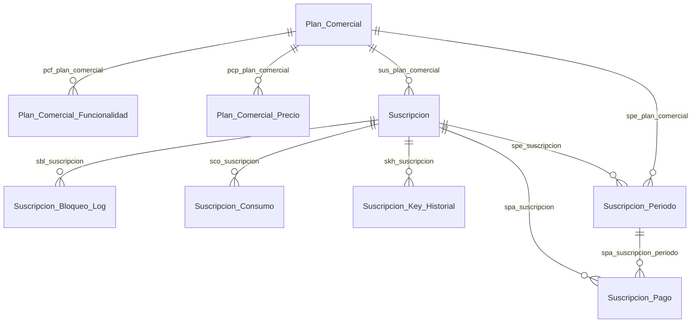

| Tabla | pfx | Relaciones |
|---|:--:|---|
| `Funcionalidad` `C` | `fun` | *referenciada por 2 tablas* |
| `Funcionalidad_Tipo` `C` | `fnt` | ○ `fnt_funcionalidad` → `Funcionalidad` |
| `Periodicidad_Cobro` `C` | `pcb` | *referenciada por 2 tablas* |
| `Plan_Comercial` | `plc` | ○ `plc_cliente` → `Cliente` |
| `Plan_Comercial_Funcionalidad` | `pcf` | ✓ `pcf_cliente` → `Cliente` · ✓ `pcf_funcionalidad` → `Funcionalidad` · ✓ `pcf_plan_comercial` → `Plan_Comercial` · ○ `pcf_plan_comercial` → `Plan_Comercial` · ○ `pcf_funcionalidad` → `Funcionalidad` |
| `Plan_Comercial_Precio` | `pcp` | ✓ `pcp_periodicidad_cobro` → `Periodicidad_Cobro` · ✓ `pcp_plan_comercial` → `Plan_Comercial` · ○ `pcp_plan_comercial` → `Plan_Comercial` · ○ `pcp_cliente` → `Cliente` |
| `Suscripcion` | `sus` | ✓ `sus_cliente` → `Cliente` · ✓ `sus_plan_comercial` → `Plan_Comercial` · ✓ `sus_suscripcion_estado` → `Suscripcion_Estado` |
| `Suscripcion_Bloqueo_Log` | `sbl` | ✓ `sbl_suscripcion` → `Suscripcion` · ○ `sbl_suscripcion` → `Suscripcion` · ○ `sbl_cliente` → `Cliente` |
| `Suscripcion_Consumo` | `sco` | ✓ `sco_suscripcion` → `Suscripcion` · ○ `sco_suscripcion` → `Suscripcion` · ○ `sco_cliente` → `Cliente` |
| `Suscripcion_Estado` `C` | `sue` | ○ `sue_suscripcion` → `Suscripcion` |
| `Suscripcion_Key_Historial` | `skh` | ✓ `skh_suscripcion` → `Suscripcion` · ○ `skh_suscripcion` → `Suscripcion` · ○ `skh_cliente` → `Cliente` |
| `Suscripcion_Pago` | `spa` | ✓ `spa_archivo` → `Archivo` · ✓ `spa_suscripcion_pago_estado` → `Suscripcion_Pago_Estado` · ✓ `spa_suscripcion_periodo` → `Suscripcion_Periodo` · ✓ `spa_usuario_verificador` → `Usuario` · ○ `spa_suscripcion` → `Suscripcion` · ○ `spa_cliente` → `Cliente` |
| `Suscripcion_Pago_Estado` `C` | `spo` | ○ `spo_suscripcion_pago` → `Suscripcion_Pago` |
| `Suscripcion_Periodo` | `spe` | ✓ `spe_periodicidad_cobro` → `Periodicidad_Cobro` · ✓ `spe_plan_comercial` → `Plan_Comercial` · ✓ `spe_suscripcion` → `Suscripcion` · ✓ `spe_suscripcion_periodo_estado` → `Suscripcion_Periodo_Estado` · ○ `spe_suscripcion` → `Suscripcion` · ○ `spe_cliente` → `Cliente` |
| `Suscripcion_Periodo_Estado` `C` | `spd` | ○ `spd_suscripcion_periodo` → `Suscripcion_Periodo` |
| `Uf_Origen` `C` | `ufo` | *referenciada por 1 tabla* |
| `Valor_Uf` | `vuf` | ✓ `vuf_uf_origen` → `Uf_Origen` · ○ `vuf_cliente` → `Cliente` |
| `Voz_Motor` `C` | `vmo` | — |

---

## 4. Índice inverso: quién usa cada catálogo

Un catálogo con muchas entradas es un concepto central del modelo; uno con ninguna es un candidato
a revisar. Ordenado por uso.

| Catálogo | pfx | Lo referencian |
|---|:--:|---:|
| `Severidad` | `sev` | 7 |
| `Proceso_Estado` | `pes` | 6 |
| `Moneda` | `mon` | 6 |
| `Especialidad` | `esp` | 6 |
| `Entrada_Modo` | `emo` | 5 |
| `Registro_Origen` | `ror` | 4 |
| `Criticidad_Nivel` | `crn` | 4 |
| `Tipo_Dato` | `tda` | 3 |
| `Permiso_Trabajo_Tipo` | `ptt` | 3 |
| `Momento_Ejecucion` | `moe` | 3 |
| `Activo_Estado` | `aes` | 3 |
| `Tarea_Ocurrencia_Estado` | `toe` | 2 |
| `Plan_Version_Estado` | `pve` | 2 |
| `Plan_Ocurrencia_Estado` | `poe` | 2 |
| `Periodicidad_Cobro` | `pcb` | 2 |
| `Orden_Trabajo_Tipo` | `ott` | 2 |
| `Orden_Trabajo_Prioridad` | `opr` | 2 |
| `Orden_Trabajo_Estado` | `ote` | 2 |
| `Operador_Comparacion` | `opc` | 2 |
| `Medicion_Calidad` | `mca` | 2 |
| `Funcionalidad` | `fun` | 2 |
| `Especialidad_Nivel` | `enl` | 2 |
| `Dato_Origen` | `dor` | 2 |
| `Checklist_Ocurrencia_Estado` | `coe` | 2 |
| `Unidad_Tiempo` | `uti` | 1 |
| `Uf_Origen` | `ufo` | 1 |
| `Tarea_Prioridad` | `tpa` | 1 |
| `Suscripcion_Periodo_Estado` | `spd` | 1 |
| `Suscripcion_Pago_Estado` | `spo` | 1 |
| `Suscripcion_Estado` | `sue` | 1 |
| `Repuesto_Retiro_Motivo` | `rrm` | 1 |
| `Repuesto_Estado_Final` | `ref` | 1 |
| `Programacion_Tipo` | `pti` | 1 |
| `Prediccion_Estado` | `pde` | 1 |
| `Permiso_Trabajo_Estado` | `pte` | 1 |
| `Permiso_Ambito` | `pam` | 1 |
| `Orden_Trabajo_Origen` | `oto` | 1 |
| `Orden_Trabajo_Estrategia` | `oet` | 1 |
| `Orden_Trabajo_Cierre_Motivo` | `ocm` | 1 |
| `Modelo_Objetivo` | `mob` | 1 |
| `Modelo_Formato` | `mfo` | 1 |
| `Magnitud` | `mag` | 1 |
| `Inventario_Movimiento_Tipo` | `imt` | 1 |
| `Instalacion_Area_Tipo` | `iat` | 1 |
| `Importacion_Tipo` | `iti` | 1 |
| `Importacion_Celda_Estado` | `ice` | 1 |
| `Frecuencia_Tipo` | `fre` | 1 |
| `Dia_Semana` | `dse` | 1 |
| `Componente_Tipo` | `cto` | 1 |
| `Componente_Posicion` | `cpn` | 1 |
| `Checklist_Version_Estado` | `cve` | 1 |
| `Checklist_Item_Tipo` | `cit` | 1 |
| `Checklist_Ejecucion_Estado` | `cee` | 1 |
| `Checklist_Asignacion_Tipo` | `cat` | 1 |
| `Bitacora_Tipo` | `bti` | 1 |
| `Archivo_Categoria` | `aca` | 1 |
| `Archivo_Carga_Estado` | `acs` | 1 |
| `Archivo_Antivirus_Estado` | `aae` | 1 |
| `Alerta_Tipo` | `alt` | 1 |
| `Alerta_Estado` | `aet` | 1 |
| `Activo_Posicion_Motivo` | `apm` | 1 |
| `Activo_Componente_Estado` | `ace` | 1 |

**14 catálogos sin referencia detectada** por el análisis automático:

`Caracteristica_Tipo`, `Checklist_Respuesta_Estado`, `Cumplimiento_Politica`, `Dependencia_Accion`, `Diagnostico_Metodo`, `Funcionalidad_Tipo`, `Indisponibilidad_Motivo`, `Nivel_Riesgo`, `Responsabilidad_Tipo`, `Resultado_Paso`, `Rol_Ejecucion`, `Servicio_Tipo`, `Validacion_Tipo`, `Voz_Motor`

No significa que sobren: significa que la tabla que los usa todavía no tiene DDL escrito, así que
la FK no se pudo verificar. **Es la lista que hay que revisar al escribir cada bloque**, y por eso
está aquí y no escondida.

---

*Generado desde el registro de prefijos y desde las FK parseadas de los scripts `.sql` reales.*
*Verificadas: 554. Derivadas de la convención: 241. Regenerar con `gen_relaciones.py`.*