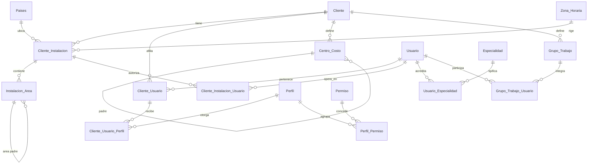
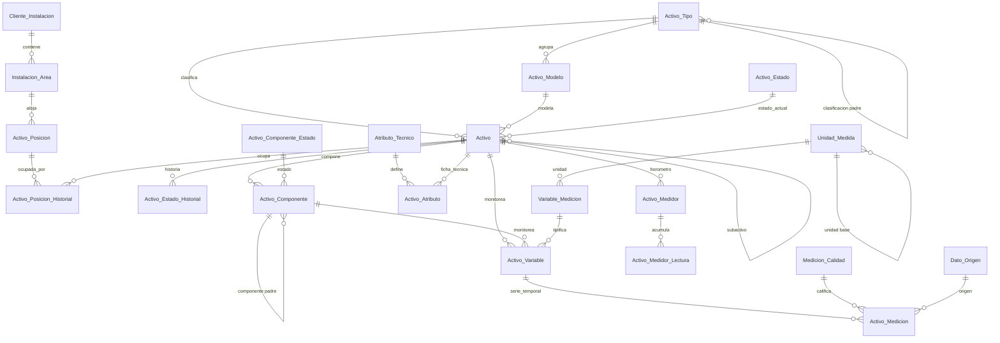
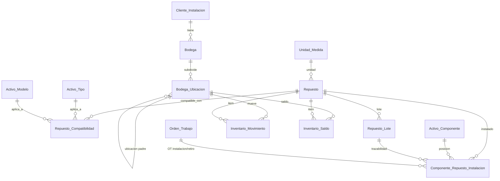
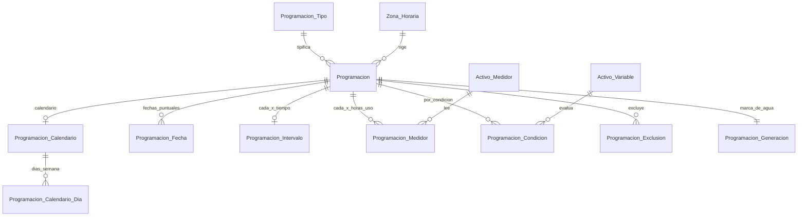
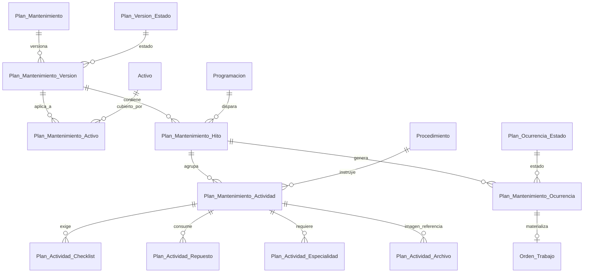
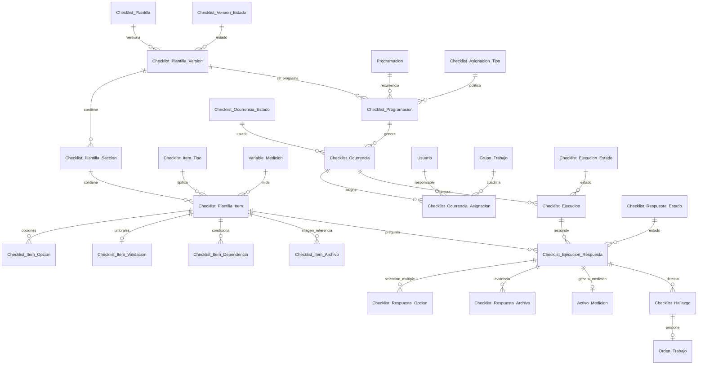
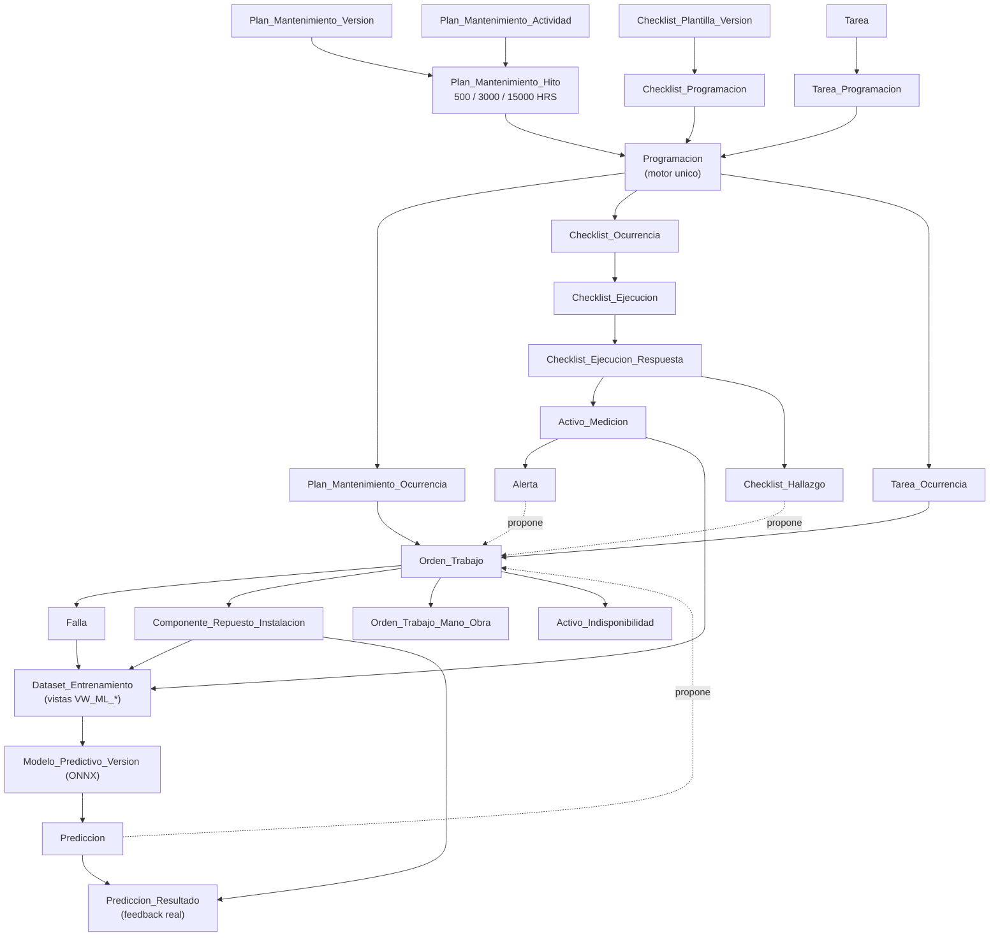

# SIGMA — Análisis crítico y modelo lógico corregido (v2)

**Sistema Integrado de Gestión de Mantenimiento Industrial**
Cliente de validación: Hamburgo S.A. (Renca, Chile) · Base SQL Server · ASP.NET WebForms + Web API + Flutter

Fecha: 19-08-2026 · Reemplaza a `DISENO_MODELO_DATOS_SIGMA.md` (v1)

---

## 0. Resumen ejecutivo

Este documento hace tres cosas: **(a)** audita el diseño v1 contra el contexto funcional y contra los tres archivos reales de Hamburgo, **(b)** corrige lo que está mal o falta, y **(c)** entrega el modelo lógico completo — dominios, ERD, diccionario, índices y reglas — listo para pasar a DDL.

**Veredicto sobre v1:** la arquitectura general es correcta y se conserva. La separación plantilla → versión → programación → ocurrencia → ejecución → respuesta → medición es la decisión más importante del diseño y está bien tomada. El motor de programación único compartido por planes, tareas y checklists también.

Pero v1 tiene **7 defectos estructurales** y **19 omisiones** frente a los requisitos. Los tres más caros de corregir después son:

| # | Defecto | Consecuencia si se construye así |
|---|---|---|
| **E-01** | No existe el nivel **hito** en el plan de mantenimiento | El plan de Blowers (500/3000/6000/9000/12000/15000 HRS) no se puede representar. Cada actividad generaría su propia ocurrencia y su propia OT: el overhaul de 15.000 h produciría **10 OT sueltas** en vez de una con 10 pasos. |
| **E-02** | La regla "valor canónico por unidad" se declara pero **no tiene columna donde guardarse** | Las series temporales quedan con unidades mezcladas (°C y °F, mm/s e in/s). El dataset de ML sale corrupto y el error solo aparece al entrenar. |
| **E-03** | El aislamiento multicliente se **afirma** pero no se **fuerza** | Nada en la base impide que una OT del cliente A apunte a un activo del cliente B. El contexto §54 pide constraints, no buenas intenciones. |

Y la omisión más visible: `Checklist_Asignacion_Tipo` incluye el valor `GRUPO`, **pero en todo v1 no existe ninguna tabla de grupos**. Es una FK a la nada.

**Tamaño del modelo corregido:** 171 prefijos únicos verificados sin colisión (1 colisión detectada y resuelta), sobre **152 tablas nuevas** (124 heredadas de v1 + 28 incorporadas aquí) y 4 tablas existentes que se amplían.

---

## 1. Insumos analizados y estado de verificación

### 1.1 Analizado directamente

| Insumo | Origen | Qué aportó |
|---|---|---|
| `CONTEXTO_CLAUDE_SIGMA_MODELO_DATOS.md` | adjunto | 87 secciones de requisitos funcionales; 17 casos de prueba (§80); 17 preguntas de diseño (§81) |
| `DISENO_MODELO_DATOS_SIGMA.md` (v1) | adjunto | Modelo previo auditado en este documento |
| `MATRIZ OT.xlsx` | adjunto | **7.043 filas reales**, 24 columnas, OT 1 a 23.164, años 2025–2026 |
| `HAM006 PLAN ANUAL DE MANTENIMIENTO DE BLOWERS.xlsx` | adjunto | 12 hojas: plan por horas, ficha técnica, calendario anual 2020–2025, histórico, compras |
| `OT 23074.pdf` | adjunto | Formato real de OT cerrada (SOP-09-R11) |
| `PATRON_TABLAS.md` | `C:\Capstone\PATRONES\ASP\BaseDatos` | **Convención definitiva** de tablas |
| `PATRON_SP.md`, `CONVENCIONES.md` | `C:\Capstone\PATRONES\ASP` | Nomenclatura, tipos, prohibiciones, encoding |

### 1.2 NO verificado — supuestos abiertos

> **Importante.** En `C:\Capstone\PATRONES` hay patrones, pero **no está el DDL real de la base SIGMA**. En `CAPSTONE\SIGMA` solo hay un README. Por lo tanto lo siguiente son **supuestos** tomados del contexto §6/§74/§75 y deben verificarse antes de ejecutar cualquier DDL:

| Supuesto | Verificación (§14 de este documento) |
|---|---|
| Los 171 prefijos propuestos no colisionan con tablas no documentadas | `SELECT DISTINCT TABLE_NAME FROM INFORMATION_SCHEMA.COLUMNS WHERE COLUMN_NAME LIKE '<pfx>[_]%'` |
| La tabla de países se llama `Paises` con prefijo `pai` | **Colisión detectada** — ver §12.1 |
| `Cliente_Usuario_Perfil.cup_id_perfil` referencia `Usuario_Perfil.upe_id` | Contexto §75 — decisión en §5.16 |
| Coexisten `Cliente_Instalacion_Usuario` y `Usuario_Instalacion` | Contexto §74 — decisión en §5.17 |
| El nombre de la base es `db_acd593_sigma` | v1 lo afirma; `PATRON_SP.md` usa `FacilityGes`; el ejemplo de entrenamiento usa `SIGMA` |

---

## 2. Convención definitiva

Decisión tomada: **`PATRON_TABLAS.md` manda**, sin excepciones. Esto resuelve tres conflictos que estaban abiertos entre los documentos.

| Elemento | Regla | Fuente |
|---|---|---|
| Nombre de tabla | `Pascal_Snake_Case`, español, **singular** — `Plan_Mantenimiento_Hito` | PATRON_TABLAS §1.1 |
| Nombre de columna | minúsculas en el DDL, MAYÚSCULAS dentro de los SP | CONVENCIONES §1.1 |
| Prefijo | 3 letras, **único en toda la base**, derivado por la regla de §1.2 | PATRON_TABLAS §1.2 |
| PK | `<pfx>_id INT NOT NULL IDENTITY(1,1)`, `CONSTRAINT PK_<TABLA>` | PATRON_TABLAS §3 |
| FK | `<pfx>_<entidad_referida>` **sin** sufijo `_id`; `CONSTRAINT FK_<PFX>_<TABLA_REF>` | PATRON_TABLAS §1.3 |
| Fecha/hora | `DATETIME` | PATRON_TABLAS §3.1 |
| Cantidades | `DECIMAL(18,2)` | PATRON_TABLAS §3.1 |
| Texto | `NVARCHAR(50\|100\|200\|500)` / `NVARCHAR(MAX)` | PATRON_TABLAS §3.1 |
| Booleano | `BIT NOT NULL DEFAULT 0\|1` | PATRON_TABLAS §3.1 |
| Auditoría maestro/transaccional | `_usuario_creacion`, `_fecha_creacion`, `_usuario_actualizacion`, `_fecha_actualizacion`, `_habilitado` | PATRON_TABLAS §2 |
| Auditoría append-only | solo `_usuario_creacion` + `_fecha_creacion` | PATRON_TABLAS §2 |
| Relación N:N pura | sin `_habilitado`, baja física por `DEL_`, `UX_` sobre el par | PATRON_TABLAS §4 |
| Catálogo | ids fijos con `IDENTITY_INSERT`, carga idempotente | PATRON_TABLAS §5 |
| Archivo `.sql` | UTF-8 **con BOM**, CRLF | CONVENCIONES §2 |

### 2.1 Conflicto 1 — `DATETIME` vs `datetime2`

El contexto §52 pide `datetime2`; `PATRON_TABLAS.md` §3.1 dice `DATETIME`. **Gana `DATETIME`.**

Justificación: `DATETIME` cubre 1753–9999 con precisión de 3,33 ms. Ningún dato de mantenimiento industrial necesita más — la lectura de un horómetro no se registra al microsegundo. El costo de desviarse (los SP, el generador de código de `ENTRENAMIENTO/03-Generador` y los Model C# existentes asumen `DateTime` de `DATETIME`) es mayor que el beneficio.

El requisito multipaís **sí** se resuelve, pero por otra vía: columnas de instante operacional con sufijo `_utc`, almacenadas siempre en UTC, y conversión en la API contra `Cliente_Instalacion.cin_zona_horaria`. Las columnas de auditoría siguen con `GETDATE()` como en el resto de la base.

### 2.2 Conflicto 2 — `INT` vs `BIGINT`

El contexto §53 pide `BIGINT` en mediciones, logs, respuestas y predicciones. `PATRON_TABLAS.md` §3.1 lo permite **"solo si se esperan > 2.000 millones de filas"**. **Gana `INT`**, con umbral documentado.

Cálculo con datos reales: Hamburgo generó 7.043 filas de OT en 2 años. Proyectando el peor caso comercial razonable — 100 clientes × 500 activos × 3 mediciones manuales/día — son ~55 millones de filas al año en `Activo_Medicion`: **38 años** hasta agotar `INT`.

> Condición de revisión, a dejar escrita en el código: si se conecta captura automática por sensores IoT (§16 del contexto), `Activo_Medicion`, `Activo_Medidor_Lectura` y `Prediccion` pasan a `BIGINT`. Es una migración de tipo de PK: hay que preverla, no adelantarla.

### 2.3 Conflicto 3 — MAYÚSCULAS vs minúsculas en columnas

El ejemplo `ENTRENAMIENTO/02-Ejemplo-Usuario/BD/00_TBL_USUARIO.sql` declara `[USU_ID]` en mayúsculas. `PATRON_TABLAS.md` §1.1 aclara que eso es el estilo de las **tablas heredadas**, que no se renombran. **Las tablas nuevas van en `Pascal_Snake_Case` con columnas minúsculas en el DDL.** v1 acertó en esto.

---

## 3. Evidencia de los archivos de Hamburgo

Esta sección no es color local: cada hallazgo se traduce en una decisión del modelo. Los números salen de leer los archivos, no del resumen del contexto.

### 3.1 `MATRIZ OT.xlsx` — 7.043 filas

| Hallazgo medido | Requisito que impone |
|---|---|
| **`ESPECIALIDAD`: 23 valores distintos para ~6 conceptos reales.** `Mecánico` (3.942), `Mecánica` (62), `Mecanico` (60), `mecanico` (20), y además `Refrigeración` / `Refrgeración` | Catálogo `Especialidad` con FK. Texto libre garantiza que el filtro "OT mecánicas" pierda 145 filas |
| **`ESTRATEGIA DE MTTO`: 24 valores distintos para 4 conceptos.** `Preventivo Programado` (2.365) + `Preventivo  Programdo` (21) + `Preventivo Ptogramado` (2) + `preventivo Programado` (4)… | **Dos dimensiones colapsadas en una columna**: tipo (PREVENTIVO/CORRECTIVO) × estrategia (RUTINARIO/PROGRAMADO). v1 solo modeló tipo → se necesita `Orden_Trabajo_Estrategia` |
| **`EJECUTANTE`: 412 cadenas distintas; 4.822 de 7.043 filas (68 %) traen varias personas.** `D.Molina + F.Mendez` (324), y también `B.Moris + M.Diaz` (120) junto a `M.Diaz + B.Moris` (244) — el mismo par contado dos veces | N:M obligatorio (`Orden_Trabajo_Asignacion`). Y los pares que se repiten cientos de veces **son cuadrillas estables** → justifica `Grupo_Trabajo` |
| **`ACTIVIDAD`: hasta 847 caracteres, 2.779 textos distintos.** Un solo campo contiene 15 sub-ítems `.- Chequear estado de polines…` | El bloque de texto **ya es un checklist** escrito a mano. Va a `Procedimiento_Paso` / `Checklist_Plantilla_Item`, no a `NVARCHAR(MAX)` |
| **`ÁREA`: 161 valores** incluyendo `L1-L2`, `L3 y L4`, `L1,L2,L3 y L4` (≈800 filas multi-área) y `Planta`/`PLANTA` duplicados por caja | `Instalacion_Area` jerárquica. Las filas multi-área son **filas de planificación**, no OT: generan N ocurrencias, una por área (§9.3) |
| **`LUGAR / EQUIPO`: 935 valores** que mezclan activo (`HORNO 2`), grupo de activos (`HORNOS`), área (`PLANTA`), y hasta texto de actividad (`TROQUELES de Cuchillo L3:`) | Jerarquía `Cliente_Instalacion → Instalacion_Area → Activo_Posicion → Activo → Activo_Componente` |
| **El estado de la OT es solo `ABIERTA` o `CERRADA`.** Las 7.043 filas dicen `CERRADA` | No hay ciclo de vida: la planilla registra el final, nunca el proceso. Catálogo de 9 estados con ids fijos + `Orden_Trabajo_Estado_Historial` |
| **`INTERNO O CONTRATISTA`: `I` (6.371), `E` (146), y 12 variantes más** — `l`, `i`, `1`, `}`, `2025` y una celda con caracteres de teclado | Ejecutante externo ≠ usuario del sistema → `Proveedor` + `ota_proveedor` |
| **`PERMISO DE TRABAJO`: 6.542 filas informadas, 6.524 dicen `NO`** | El proceso existe aunque hoy casi no se use → `Permiso_Trabajo` (§65) |
| **`IMAGEN DE REFERENCIA`: columna presente, 1 sola fila con dato** | Evidencia **de referencia** (planificador → técnico) distinta de la de ejecución (§66) |
| **N° de OT: 7.035 valores, 7.019 distintos → 16 correlativos duplicados** | `UX_OTR_CLIENTE_CORRELATIVO` los va a rechazar. Hay que resolverlos en staging, no en el DDL |
| `H/H` en horas decimales: `0.1`, `0.16`, `0.5`, `12` | `Orden_Trabajo_Mano_Obra` en minutos enteros; la importación multiplica por 60 |
| `Año`: 4.271 filas de 2025 y **2.772 de 2026** en la misma hoja | La planilla **mezcla plan y ejecución**. Es el argumento central para separar Programación / Ocurrencia / Ejecución |

### 3.2 `HAM006 PLAN ANUAL BLOWERS.xlsx` — 12 hojas

**Hoja `Plan de tarea`** — el plan real, literal:

```text
Mantenimiento Preventivo
  ├── 500 HRS    → Cambio de filtro de aire · Cambio de aceite
  ├── 3000 HRS   → filtro · aceite · retén (a evaluar)
  ├── 6000 HRS   → filtro · aceite · instrumentación · retén
  ├── 9000 HRS   → filtro · aceite · correas · instrumentación
  │                 · calibración válvula check · calibración válvula alivio
  └── 12OOO HRS  → filtro · aceite            ← sí, con letra O en el Excel
Over Haul
  └── 15000 HRS  → filtro · aceite · balanceo de lóbulos · rodamientos · retén
                    · porta anillera · anillos · instrumentación · motor · poleas
```

Esto es **plan → hito → actividad**, tres niveles. v1 tiene dos. Es el defecto **E-01**.

**Hoja `Equipos Blowers`** — ficha técnica con atributos que no existen en ninguna otra máquina de la planta:

```text
Soplador N1 · Marca Aerzen · Modelo GM10S · N° Serie 1559766
RPM 4800 · KW 24.5 · Peso 106 KG · Año de construcción 216   ← dato sucio
Motor: Aerzen · KW 30 · RPM 2960 · Peso 238 KG
Rodamientos: 6312-C3 / 6212-C3        ← distinto en N3: 6309-C3 / 6209-C3
```

→ "Datos técnicos dinámicos" del contexto §11. **v1 no tiene dónde guardarlos.** Y `Rodamientos: 6312-C3` es la compatibilidad de repuesto por modelo de activo, que sí está en v1.

**Hojas `Blowers` / `Blower Ultimo Mantt` / `Historico`** — el hallazgo más sutil:

```text
CB01 · SEMANA 43-45 · DESINSTALACIÓN: 31-10-2021 · INSTALACIÓN: 14-11-2021
      "en el blower 1 estará instalado ..."
Blower 1 (S682730) / (Nuevo)          ← serie distinta, mismo nombre
Compras: "Arriendo de equipo para backup" · "Desmontaje de blower N°3" · "Montaje de blower N°3"
```

Durante el overhaul se **desmonta** el blower titular y se **instala uno arrendado** en la misma posición. `CB01` no es una máquina: es una **posición funcional** que distintas máquinas físicas ocupan a lo largo del tiempo. Si `Activo` fuera a la vez posición y máquina, al cambiar la máquina se pierde el historial de la posición **o** el de la máquina. → `Activo_Posicion` + `Activo_Posicion_Historial` (§5.9).

**Hoja `Compras relacionadas`** — 59 filas: `OC · Fecha · Empresa · Denominación · Fecha facturación · N° factura · Monto · Activo`

```text
7752  2020-07-13  Aerzen      Mtto anual blower de harina        2.096.900  Blower 4
7796  2020-07-21  Aerzen      HH mantención blower día no hábil    360.000  Blower 4
8958  2021-01-28  Aerzen      Arriendo de equipo para backup       325.000  Blower 1
9212  2021-03-10  Aerzen      Desmontaje de blower 4               920.484  Blower 4
```

Proveedores reales: Aerzen, Rodacenter, Isibas, Tran-seg, Lubeng. **v1 no tiene ninguna tabla de terceros ni de costos.** El contexto §49/§50 pide dejarlo preparado sin convertir SIGMA en ERP.

**Hoja `2025`** — calendario anual: filas `CB01 (1559766)`…`CB04`, columnas semana 1–52, leyenda `Atrasado / Programado / Realizado`, marca `Externo` en ejecutante, y actividades sueltas fuera de plan (`Paleta original`, `Cambio de sellos`). → estados de ocurrencia + actividades **adicionales** no programadas (§48 del contexto).

### 3.3 `OT 23074.pdf`

Campos que el formato real exige y que hay que poder reconstruir:

```text
N° 23074 · Fecha 03-08-2026 · Calificación: Mecánico
GENERÓ: Sebastián Lagunas          RESPONSABLE: B.Guzman + A.Reyes    ← otra vez, dos personas
DURACIÓN ESTIMADA: 0:06:00         NOTAS:
ACTIVO  DESCRIPCIÓN: ABLANDADORES  CLASIFICACIÓN 1: ABLANDADORES
        UBICADO EN O ES PARTE DE: // HAMBURGO S.A./     ← ruta jerárquica
        TIPO: Preventivo Rutinario CLASIFICACIÓN 2:     CENTRO DE COSTO:
        PRIORIDAD: A               OT ABIERTA / CERRADA: CERRADA
TAREA PLANIFICADA: DEJAR AREAS LIMPIAS Y ORDENADAS      ← la actividad del plan
DESCRIPCIÓN: REGENERAR LOS ABLANDADORES DE FORMA MANUAL
FECHA PROGRAMADA · TIPO DE TRABAJO · ACTIVADOR · FECHA DEL EVENTO
FECHA/HORA INICIO · FECHA/HORA FINALIZACIÓN · TIEMPO TOTAL DE TRABAJO
TIEMPO REAL DE PARO DEL ACTIVO: 0:06:00
SOLICITADO POR: Planificador de mantenimiento · NÚMERO DE SOLICITUD
SUBTAREAS: GRUPO | PROCEDIMIENTO | RESULTADO
ACEPTADO POR: Jefe de Mantenimiento | VALIDADO POR: Supervisor | REALIZADO POR: B.Guzman + A.Reyes
```

Tres consecuencias:

1. **`CLASIFICACIÓN 1` / `CLASIFICACIÓN 2`** → `Activo_Tipo` debe ser **jerárquico** (`ati_activo_tipo_padre`), no una lista plana.
2. **Tres firmas distintas** (aceptado / validado / realizado) → `Orden_Trabajo_Validacion` con tipo, tal como v1 lo propone. Correcto.
3. **`ACTIVADOR`** es el origen de la OT → `Orden_Trabajo_Origen`. Correcto en v1.

---

## 4. Auditoría del diseño v1

### 4.1 Lo que v1 hace bien y se conserva

- Cadena plantilla → versión → programación → ocurrencia → asignación → ejecución → respuesta → medición.
- Motor de programación **único** compartido por planes, tareas y checklists (evita tres motores de recurrencia).
- Versión publicada inmutable; la ocurrencia congela la versión que la originó.
- Respuesta tipada en columnas separadas (`_valor_texto`, `_valor_numero`, `_valor_bit`, `_valor_fecha`) en vez de un `NVARCHAR(MAX)` genérico.
- Evidencias con FK explícitas por entidad en vez de una relación polimórfica `tipo/id`.
- `Componente_Repuesto_Instalacion` como historial de repuesto instalado — es la tabla que produce el label real de RUL.
- Bitácora append-only con rectificación en vez de UPDATE.
- Append-only para mediciones, lecturas, movimientos, historiales y predicciones.
- `_uuid` para idempotencia móvil sin romper la PK `INT`.

### 4.2 Defectos estructurales

| # | Defecto | Dónde | Corrección |
|---|---|---|---|
| **E-01** | Falta el nivel **hito** entre versión del plan y actividad | §8 de v1 | `Plan_Mantenimiento_Hito` (§5.1) |
| **E-02** | Se declara "valor canónico" pero no existe la columna ni la tabla de conversión | v1 §16, regla 6 | `ume_unidad_base`/`ume_factor` + `amd_valor_canonico` (§5.2) |
| **E-03** | Aislamiento multicliente sin mecanismo que lo fuerce | v1 §2.1 | Claves compuestas `(cliente, id)` + FK compuestas (§5.3) |
| **E-04** | `Checklist_Asignacion_Tipo` = `GRUPO` pero **no hay tabla de grupos** | v1 §9 | `Grupo_Trabajo` + `Grupo_Trabajo_Usuario` (§5.4) |
| **E-05** | `Usuario_Especialidad.ues_nombre` es **texto libre** | v1 §4 | Catálogo `Especialidad` (§5.5) — la MATRIZ prueba por qué |
| **E-06** | `Orden_Trabajo_Tipo` mezcla tipo y estrategia | v1 §11 | `Orden_Trabajo_Estrategia` separada (§5.6) |
| **E-07** | El generador de ocurrencias no tiene marca de agua → **riesgo de duplicados** | v1 §7 | `Programacion_Generacion` (§5.7) |

### 4.3 Omisiones frente al contexto

| # | Falta | Contexto | Severidad |
|---|---|---|---|
| O-01 | Datos técnicos dinámicos del activo (RPM, KW, peso, año) | §11 | Alta |
| O-02 | Posición funcional vs máquina física | §11, Blowers | Alta |
| O-03 | Proveedor / contratista / servicio externo | §49 | Alta |
| O-04 | Costos (monto por OT, servicio, repuesto) | §50 | Media |
| O-05 | Centro de costo | §11, §30, OT 23074 | Media |
| O-06 | Procedimiento reutilizable + pasos | §64 | Alta |
| O-07 | Permiso de trabajo | §65 | Media |
| O-08 | Transcripción de audio (Azure AI Speech) | §38 | Media |
| O-09 | Evidencia de referencia adjunta a la definición | §66 | Media |
| O-10 | Alertas | §19, §27 | Alta |
| O-11 | Umbrales advertencia/crítico por ítem y acciones condicionales fuera de rango | §19 | Alta |
| O-12 | Recurrencia mensual ordinal ("primer lunes", "último día") y anual | §20 | Alta |
| O-13 | Estado `REPROGRAMADA` y traza de reprogramación | §21 | Media |
| O-14 | Vida útil teórica en **horas, días y ciclos** por separado; `es_reparable`, `es_consumible` | §13 | Media |
| O-15 | Flags de variable: relevante para IA, permite manual, permite sensor, decimales | §14 | Media |
| O-16 | Categoría de tarea; estado a nivel de tarea | §23 | Baja |
| O-17 | Estado del componente | §12 | Baja |
| O-18 | Resolución de `Cliente_Usuario_Perfil` → `Perfil` | §75 | Alta |
| O-19 | Resolución `Cliente_Instalacion_Usuario` vs `Usuario_Instalacion` | §74 | Alta |

### 4.4 Errores menores de v1

- `Bitacora` usa el prefijo `bit`, que es también el nombre del tipo `BIT`. Legal en SQL Server, pero `bit_habilitado BIT` se lee mal en revisión. Se mantiene por consistencia con la regla de derivación, entre corchetes en el DDL.
- v1 propone crear `Pais`; la base ya tiene `Paises` con prefijo `pai`. **Colisión** → se reutiliza `Paises` (§12.1).
- `Prediccion_Explicacion` usa prefijo `pem`, que no deriva del nombre (`pex` o `pee` serían correctos). Se corrige a `pex`.
- `otr_activo` implícitamente obligatorio; la MATRIZ tiene 742 filas cuyo lugar es `PLANTA` o `INFRAESTRUCTURA`, sin activo. Debe ser NULL con `CHECK` (§5.8).
- v1 no define qué pasa con una actividad **adicional** ejecutada fuera de programación (hoja `2025`). Se resuelve con `Orden_Trabajo_Origen = MANUAL` y ocurrencia nula.

---

## 5. Decisiones de diseño

Cada decisión responde a un defecto de §4 o a una de las 17 preguntas del contexto §81.

### 5.1 Plan → Hito → Actividad (corrige E-01)

Se agrega `Plan_Mantenimiento_Hito` (`pmh`) entre `Plan_Mantenimiento_Version` y `Plan_Mantenimiento_Actividad`.

```text
Plan_Mantenimiento            "Plan Preventivo Blower Aerzen GM10S"
└── Plan_Mantenimiento_Version  v1 (publicada, inmutable)
    ├── Plan_Mantenimiento_Hito   "500 HRS"    → Programacion (MEDIDOR, cada 500 h)
    │   ├── Actividad  Cambio de filtro de aire
    │   └── Actividad  Cambio de aceite
    ├── Plan_Mantenimiento_Hito   "9000 HRS"   → Programacion (MEDIDOR, cada 9000 h)
    │   └── 6 actividades
    └── Plan_Mantenimiento_Hito   "15000 HRS — Over Haul"
        └── 10 actividades
```

**El hito, no la actividad, es lo que se programa y lo que genera la ocurrencia.** Por eso `Plan_Actividad_Programacion` de v1 desaparece y su lugar lo toma `pmh_programacion`. Consecuencias:

- Una ocurrencia de hito → **una** OT con N pasos, no N OT. Es como funciona el overhaul real.
- El hito lleva `pmh_valor_medidor` (500, 3000, 15000) y `pmh_orden`, que es lo que el planificador ve.
- Un hito puede tener alcance calendario en vez de medidor (`Programacion` tipo `CALENDARIO`) sin cambiar la estructura: el motor de programación es el mismo.
- Se conserva `Plan_Mantenimiento_Activo` a nivel de **versión** (a qué máquinas aplica el plan) y se agrega `pmo_activo` en la ocurrencia (para cuál se generó).

> Alternativa descartada: dejar el hito como un atributo `paa_hito NVARCHAR(50)` de la actividad. Agrupar por texto es exactamente el error que el contexto §71 prohíbe, y hace imposible colgar la programación del hito.

### 5.2 Unidad canónica y valor canónico (corrige E-02)

`Unidad_Medida` gana tres columnas:

| Columna | Tipo | Uso |
|---|---|---|
| `ume_unidad_base` | `INT NULL` FK a sí misma | °F → °C; NULL si la unidad **es** la base |
| `ume_factor` | `DECIMAL(18,6) NOT NULL DEFAULT 1` | valor_base = valor × factor + offset |
| `ume_offset` | `DECIMAL(18,6) NOT NULL DEFAULT 0` | °F→°C: factor 0,555556 · offset −17,777778 |

Y `Activo_Medicion` gana `amd_valor_canonico DECIMAL(18,6) NOT NULL` + `amd_unidad_canonica INT NOT NULL`.

La regla: **se conserva el valor tal como lo ingresó el técnico** (`amd_valor` + `amd_unidad_medida`, auditable) **y se calcula el canónico en la misma transacción** dentro del SP `INS_ACTIVO_MEDICION`. La vista de ML lee siempre la columna canónica. Sin esto, "temperatura promedio 30 días" (contexto §45) suma °C con °F.

Lo mismo aplica a `Checklist_Ejecucion_Respuesta.cer_valor_numero` → se propaga a la medición ya canonizada.

### 5.3 Aislamiento multicliente forzado por la base (corrige E-03)

v1 pone `<pfx>_cliente` en cada tabla, lo cual está bien pero **no impide nada**. Se agrega el mecanismo:

1. Cada tabla raíz de tenant declara una clave única redundante:

```sql
CONSTRAINT UX_ACT_CLIENTE_ID UNIQUE ([act_cliente], [act_id])
```

2. Las tablas dependientes referencian el **par**, no el id suelto:

```sql
CONSTRAINT FK_OTR_ACTIVO_CLIENTE FOREIGN KEY ([otr_cliente], [otr_activo])
    REFERENCES [dbo].[Activo] ([act_cliente], [act_id])
```

Con eso, una OT del cliente 7 apuntando a un activo del cliente 9 **es imposible**: el motor la rechaza. No depende de que la API recuerde validar (contexto §68: "nunca confiar en IDs enviados por Flutter").

Se aplica a los pares de alto riesgo, no a todos — el costo es una columna `INT` extra ya presente y un índice único que además sirve para las consultas:

| Padre | Hijos con FK compuesta |
|---|---|
| `Activo` | `Orden_Trabajo`, `Tarea`, `Checklist_Ocurrencia`, `Activo_Componente`, `Activo_Variable`, `Activo_Medidor`, `Falla`, `Bitacora`, `Prediccion` |
| `Cliente_Instalacion` | `Instalacion_Area`, `Activo_Posicion`, `Bodega`, `Orden_Trabajo`, `Tarea`, `Plan_Mantenimiento` |
| `Checklist_Plantilla_Version` | `Checklist_Programacion`, `Checklist_Ocurrencia` |
| `Repuesto` | `Repuesto_Lote`, `Inventario_Saldo`, `Orden_Trabajo_Repuesto` |

### 5.4 Grupos de trabajo (corrige E-04)

```text
Grupo_Trabajo        (gtr)  cliente, planta, nombre "Turno noche mecánicos", vigencia
Grupo_Trabajo_Usuario(gtu)  grupo × usuario, es_lider, vigencia
```

Justificación empírica: en la MATRIZ, `D.Molina + F.Mendez` aparece 324 veces y `M.Alfaro + F.Jofre` 253. No son asignaciones ad-hoc, son cuadrillas. Modelarlas permite que el planificador asigne "Turno noche" en vez de repetir dos nombres 300 veces, y que el histórico sobreviva a la rotación de personas.

La asignación queda: `<x>_ocurrencia_asignacion` con `_usuario NULL` **y** `_grupo_trabajo NULL`, con `CHECK` de que exactamente uno esté informado según `<x>_asignacion_tipo`.

### 5.5 Catálogo de especialidades (corrige E-05)

`Especialidad` (`esp`): `esp_cliente NULL` (NULL = global SIGMA), `esp_codigo`, `esp_nombre`, `esp_orden`.

Carga inicial derivada de los datos reales: `MECANICO`, `ELECTRICO`, `ELECTROMECANICO`, `INSTRUMENTISTA`, `REFRIGERACION`, `LIMPIEZA`, `INFRAESTRUCTURA`.

Se usa en cuatro lugares:

- `Usuario_Especialidad` → `ues_especialidad` (FK, ya no texto) + `ues_fecha_vencimiento` para certificaciones.
- `Plan_Actividad_Especialidad` (`pae`) → una actividad puede requerir **varias** (contexto §63).
- `Orden_Trabajo_Especialidad` (`oep`) → la "Calificación: Mecánico" del PDF.
- `Orden_Trabajo_Mano_Obra.omo_especialidad` → con qué especialidad trabajó cada persona.

### 5.6 Tipo × Estrategia de OT (corrige E-06)

```text
Orden_Trabajo_Tipo       (ott)  PREVENTIVA · CORRECTIVA · PREDICTIVA          ← ids fijos 1,2,3
Orden_Trabajo_Estrategia (oet)  RUTINARIO · PROGRAMADO · EMERGENCIA
                                · INSPECCION · OVERHAUL · MEJORA
```

`Preventivo Rutinario` = tipo 1 × estrategia 1. `Correctivo Programado` = tipo 2 × estrategia 2. Con una sola columna no se puede consultar "todo lo correctivo" sin `LIKE '%orrectiv%'`, que es lo que hoy obliga la planilla.

`oet_orden_trabajo_tipo NULL` permite restringir qué estrategias son válidas para cada tipo, o dejarlo abierto.

### 5.7 Marca de agua del generador de ocurrencias (corrige E-07)

`Programacion_Generacion` (`pge`), una fila por programación:

| Columna | Uso |
|---|---|
| `pge_programacion` | FK, único |
| `pge_horizonte_dia` | cuántos días adelante generar (default 60) |
| `pge_fecha_generada_hasta_utc` | **marca de agua**: nunca se regenera antes de este instante |
| `pge_ultimo_valor_medidor` | último valor de horómetro ya convertido en ocurrencia |
| `pge_ultima_ejecucion_utc`, `pge_ocurrencias_generadas` | observabilidad del job |

El job es idempotente: genera desde `MAX(fecha_generada_hasta_utc, GETUTCDATE())` hasta `+horizonte`, y avanza la marca dentro de la misma transacción. Sin esta tabla, dos ejecuciones concurrentes del job duplican ocurrencias, y ninguna constraint natural lo evita porque una ocurrencia legítima puede repetirse en la misma fecha para distintos activos.

Refuerzo adicional: `UX_PMO_PROGRAMACION_ACTIVO_FECHA (pmo_programacion, pmo_activo, pmo_fecha_programada_utc)` — cinturón y tirantes.

Para reglas por medidor: la generación **no** corre por calendario sino al insertar una lectura (`INS_ACTIVO_MEDIDOR_LECTURA` evalúa `Programacion_Medidor` y compara contra `pge_ultimo_valor_medidor`).

### 5.8 OT sin activo

`otr_activo` pasa a `NULL` con la regla:

```sql
CONSTRAINT CK_OTR_UBICACION CHECK ([otr_activo] IS NOT NULL OR [otr_instalacion_area] IS NOT NULL)
```

742 filas de la MATRIZ (`PLANTA`, `INFRAESTRUCTURA`) son trabajo de planta sin equipo asociado. Forzar un activo obligaría a inventar un activo ficticio "PLANTA", que contamina todos los KPI por equipo y todos los datasets de ML.

### 5.9 Posición funcional vs máquina física (cubre O-02)

```text
Instalacion_Area          Sala de Blowers
└── Activo_Posicion (apo)   CB01  — posición funcional, código estable, QR pegado aquí
    └── Activo_Posicion_Historial (aph)
        ├── Blower 1 (serie 1559766)  desde 2016-01-01 hasta 2021-10-31   motivo OVERHAUL
        ├── Blower arrendado Aerzen   desde 2021-10-31 hasta 2021-11-14   motivo RESPALDO
        └── Blower 1 (serie S682730)  desde 2021-11-14 hasta NULL          motivo REEMPLAZO
```

`Activo` sigue siendo la **máquina física identificada por serie**. `Activo_Posicion` es dónde trabaja. `act_activo_posicion` guarda la posición **actual** (denormalización controlada, para no hacer join al historial en cada listado); `Activo_Posicion_Historial` guarda la verdad.

Esto responde la pregunta §81.9 ("¿cómo modelar componentes reemplazables?") un nivel más arriba de lo que v1 la resolvió: `Componente_Repuesto_Instalacion` hace lo mismo para el rodamiento dentro del componente; `Activo_Posicion_Historial` lo hace para la máquina dentro de la planta.

> Si el negocio decide no usar posiciones, la tabla queda vacía y `act_activo_posicion` NULL: no bloquea nada. Pero sin ella, el histórico de "qué pasó en CB01" se parte en dos el día que se cambia la máquina.

### 5.10 Datos técnicos dinámicos (cubre O-01)

```text
Atributo_Tecnico (ate)  catálogo: codigo RPM · nombre · unidad_medida · tipo_dato · orden
                        ate_activo_tipo NULL → qué atributos aplican a qué tipo de máquina
Activo_Atributo  (aat)  activo × atributo → valor_texto / valor_numero / valor_fecha + unidad
```

Es EAV **acotado por catálogo**: solo se pueden guardar atributos declarados, con tipo y unidad conocidos. Esto NO es lo que el contexto §71 prohíbe (una tabla ancha `maq_temperatura, maq_vibracion…`) ni una bolsa JSON.

Distinción clave que hay que respetar al implementar:

- `Activo_Atributo` = **placa/ficha**: no cambia, no se mide. RPM nominal 4800, KW 24.5, año de construcción.
- `Activo_Variable` + `Activo_Medicion` = **condición**: se mide, tiene serie temporal, alimenta ML. Temperatura actual 74 °C.

Confundirlas es el error clásico: si "RPM" se guarda como medición, ensucia el dataset con un valor constante; si "temperatura" se guarda como atributo, se pierde la serie.

### 5.11 Terceros, servicios y costos (cubre O-03, O-04, O-05)

Alcance deliberadamente **contenido**: registrar el gasto asociado al mantenimiento, no gestionar compras.

```text
Proveedor (prv)                cliente, rut, nombre, giro, contacto, es_contratista
Centro_Costo (cco)             cliente, codigo, nombre, centro_costo_padre NULL
Orden_Trabajo_Servicio (ots)   OT × proveedor · tipo (SERVICIO/ARRIENDO/MONTAJE/DESMONTAJE/HH)
                               · descripcion · monto DECIMAL(18,2) · moneda
                               · documento_referencia (OC/factura) · fechas
```

Y tres columnas que se agregan a tablas existentes:

- `Orden_Trabajo_Asignacion.ota_proveedor NULL` — el ejecutante externo (`E` en la MATRIZ) no es un `Usuario` de SIGMA.
- `Orden_Trabajo.otr_centro_costo NULL` — campo del formato real.
- `Orden_Trabajo_Repuesto.ore_costo_unitario NULL` — para el costo de repuestos consumidos.

Lo que **no** se hace: `Orden_Compra`, `Factura`, `Recepcion`. Si mañana se integra con el ERP, `ots_documento_referencia` es el punto de anclaje.

### 5.12 Procedimientos reutilizables (cubre O-06)

```text
Procedimiento      (prc)  cliente NULL, codigo, nombre, version, activo_tipo NULL
Procedimiento_Paso (ppa)  procedimiento, orden, nombre, instruccion, es_punto_control,
                          requiere_evidencia, requiere_medicion, variable_medicion NULL
```

`Plan_Mantenimiento_Actividad.paa_procedimiento NULL` y `Orden_Trabajo_Paso.otp_procedimiento_paso NULL` lo enganchan.

Regla de congelamiento: al abrir la OT, los pasos del procedimiento **se copian** a `Orden_Trabajo_Paso` con su texto. Cambiar el procedimiento mañana no reescribe la OT de ayer — mismo principio que el versionado de checklist (§82 del contexto).

Los 847 caracteres de `ACTIVIDAD` con 15 sub-ítems son, literalmente, un procedimiento sin tabla.

### 5.13 Permiso de trabajo (cubre O-07)

```text
Permiso_Trabajo_Tipo (ptt)  ALTURA · ESPACIO_CONFINADO · CALIENTE · ELECTRICO · IZAJE · BLOQUEO
Permiso_Trabajo      (ptr)  cliente, orden_trabajo, tipo, numero, estado,
                            usuario_solicitante, usuario_autorizador,
                            fecha_solicitud/autorizacion/vencimiento_utc, observacion
```

Y `Plan_Mantenimiento_Actividad.paa_requiere_permiso BIT` + `paa_permiso_trabajo_tipo NULL` para que el requisito venga del plan. Módulo pequeño; se implementa en fase 2, pero la columna existe desde el inicio.

### 5.14 Alertas y umbrales condicionales (cubre O-10, O-11)

`Checklist_Item_Validacion` se amplía:

| Columna nueva | Uso |
|---|---|
| `civ_valor_advertencia` | ≥ 70 → advertencia |
| `civ_valor_critico` | ≥ 80 → crítico |
| `civ_requiere_comentario_fuera_rango` | BIT |
| `civ_requiere_evidencia_fuera_rango` | BIT |
| `civ_genera_alerta` | BIT |
| `civ_genera_hallazgo` | BIT |

Y una tabla de alertas transversal:

```text
Alerta_Tipo (alt)  MEDICION_FUERA_RANGO · HALLAZGO_CRITICO · OCURRENCIA_VENCIDA
                   · PREDICCION_RIESGO · STOCK_MINIMO · PERMISO_VENCIDO
Alerta      (ale)  cliente, planta, tipo, severidad, activo NULL, componente NULL,
                   origen explícito (medicion NULL / respuesta NULL / prediccion NULL /
                   ocurrencia NULL), titulo, descripcion, estado, fecha_utc,
                   usuario_reconocimiento NULL, orden_trabajo NULL
```

Igual que con las evidencias, **origen por FK explícita nullable, no `tipo_entidad/id_entidad`**. Coherente con la decisión ya tomada en v1 §13.

La alerta **propone**; no cierra ni aprueba nada (contexto §16, regla ya correcta en v1).

### 5.15 Recurrencia completa (cubre O-12)

`Programacion_Calendario` se amplía para cubrir los casos que v1 no alcanza:

| Columna | Valores | Caso que resuelve |
|---|---|---|
| `pca_frecuencia` | `DIARIA` · `SEMANAL` · `MENSUAL` · `ANUAL` | "mantención anual" (§20) |
| `pca_intervalo` | 1, 2, 3… | "cada 2 semanas", "cada 3 días" |
| `pca_semana_ordinal` | 1..5, **−1 = última** | "**primer lunes** del mes" |
| `pca_dia_mes` | 1..31, **−1 = último día** | "día 1", "**último día** del mes" |
| `pca_mes` | 1..12 NULL | frecuencia anual: "cada julio" |
| `pca_hora_local` | `TIME` | 08:00 |

Combinado con `Programacion_Calendario_Dia` (días de semana), cubre los 12 tipos del contexto §20. La tabla de configuraciones está en §10.2.

### 5.16 `Cliente_Usuario_Perfil` → `Perfil` (resuelve O-18, contexto §75)

**Diagnóstico.** Si `cup_id_perfil` referencia `Usuario_Perfil.upe_id`, entonces el perfil por cliente apunta a una *asignación previa de perfil a un usuario*, no a un perfil. Eso significa que:

- para dar perfil `TECNICO` a un usuario en el cliente A, primero tiene que existir una fila en `Usuario_Perfil` de ese usuario;
- el mismo perfil "TECNICO" tiene un `upe_id` distinto por usuario, así que `WHERE cup_id_perfil = 3` no significa nada estable;
- y hay dos fuentes de verdad para "qué perfil tiene este usuario".

**Decisión.** `Cliente_Usuario_Perfil.cup_perfil` debe referenciar `Perfil.per_id`. Es lo que hace consultable "todos los técnicos del cliente 7".

**Cómo hacerlo sin romper lo existente** (PATRON_TABLAS §7: no se borra la columna vieja):

1. `ALTER TABLE Cliente_Usuario_Perfil ADD cup_perfil INT NULL` + FK a `Perfil`.
2. Backfill: `UPDATE ... SET cup_perfil = upe.upe_perfil FROM Usuario_Perfil upe WHERE upe.upe_id = cup_id_perfil`.
3. Los SP nuevos leen `cup_perfil`. `cup_id_perfil` queda documentada como **deprecada**.
4. Cuando ningún SP la use, se hace `NOT NULL` en `cup_perfil`.

> **Pendiente de verificación.** No tuve acceso al DDL real. Antes de ejecutar: `SELECT COLUMN_NAME, DATA_TYPE FROM INFORMATION_SCHEMA.COLUMNS WHERE TABLE_NAME IN ('Cliente_Usuario_Perfil','Usuario_Perfil','Perfil','Perfiles')`.

### 5.17 `Cliente_Instalacion_Usuario` vs `Usuario_Instalacion` (resuelve O-19, contexto §74)

**Decisión: `Cliente_Instalacion_Usuario` es la tabla válida. `Usuario_Instalacion` se declara legada.**

Razón: SIGMA es multicliente, y la autorización a una planta solo tiene sentido dentro del cliente al que la planta pertenece. `Cliente_Instalacion_Usuario` ya lleva ese contexto; `Usuario_Instalacion` relaciona usuario con instalación saltándose el cliente, lo que permite el escenario que el contexto §54 prohíbe.

Se agregan a `Cliente_Instalacion_Usuario`, de forma idempotente, `ciu_fecha_inicio DATE NULL` y `ciu_fecha_fin DATE NULL` (vigencia). **No** se agrega `ciu_tecnico`: la condición de técnico se resuelve por perfil (v1 acertó en esto).

No se crea una tercera tabla. Migración: volcar las filas de `Usuario_Instalacion` que no existan en `Cliente_Instalacion_Usuario`, dejar la vieja en solo lectura, y una vista `VW_USUARIO_INSTALACION_COMPAT` durante la transición.

### 5.18 Concurrencia: quién gana la actividad abierta (contexto §56, §81.4)

Sin `rowversion` y sin transacciones explícitas largas. El patrón del grupo ya tiene la respuesta (`PATRON_SP.md` §3): **UPDATE condicional + `@@ROWCOUNT`**.

```sql
-- SP: UPD_CHECKLIST_OCURRENCIA_TOMAR
BEGIN TRANSACTION
    UPDATE Checklist_Ocurrencia
       SET coc_checklist_ocurrencia_estado = @EN_EJECUCION,
           coc_usuario_actualizacion       = @USUARIO,
           coc_fecha_actualizacion         = GETDATE()
     WHERE coc_id = @ID
       AND coc_checklist_ocurrencia_estado = @DISPONIBLE   -- ← la carrera se decide aquí

    IF @@ROWCOUNT = 0
    BEGIN
        ROLLBACK TRANSACTION
        RAISERROR('1.- LA ACTIVIDAD YA FUE TOMADA POR OTRO TECNICO.', 16, 1)
        RETURN -1
    END

    INSERT Checklist_Ocurrencia_Asignacion (...)   -- responsable real
COMMIT TRANSACTION
```

El segundo técnico recibe `@@ROWCOUNT = 0` y un mensaje claro. No hace falta `ROWVERSION` (que además no está en la tabla de tipos de `PATRON_TABLAS.md` §3.1) ni bloqueo pesimista.

### 5.19 Qué pasa si se edita un checklist con ejecuciones (contexto §81.7)

Regla dura, ya correcta en v1 y aquí explicitada:

- Una `Checklist_Plantilla_Version` en estado `PUBLICADA` **no admite UPDATE** de secciones, ítems, opciones ni validaciones. Los SP `UPD_` y `DEL_` de esas tablas validan el estado de la versión padre y devuelven error.
- Editar = crear versión `n+1` en `BORRADOR`, copiando la estructura, y publicarla.
- `Checklist_Ocurrencia.coc_checklist_plantilla_version` congela la versión; `Checklist_Ejecucion_Respuesta.cer_checklist_plantilla_item` apunta a ítems de **esa** versión. Una ejecución histórica se reconstruye exacta, con su orden, unidades, umbrales y opciones.
- La programación (`Checklist_Programacion`) apunta a la versión vigente y se **repunta** manualmente al publicar la nueva. Deliberado: publicar una versión no debe cambiar en silencio lo que los técnicos tienen asignado.

### 5.20 Cómo se calcula la vida útil real (contexto §81.10, §78)

No se guarda calculada: se **deriva** de `Componente_Repuesto_Instalacion` (`cri`), que registra instalación y retiro con fecha **y** lectura de medidor:

```text
vida_real_hora  = cri_lectura_final − cri_lectura_inicial
vida_real_dia   = DATEDIFF(day, cri_fecha_instalacion_utc, cri_fecha_retiro_utc)
censurado       = (cri_motivo_retiro <> 'FALLA')     ← reemplazo preventivo NO es una falla
```

El campo `cri_fallo BIT` distingue el label de clasificación; `censurado` es el que evita que el modelo de supervivencia aprenda que "todo dura exactamente lo que duró hasta que alguien lo cambió". Esta distinción está bien planteada en v1 §14 y se conserva.

---

## 6. Arquitectura por dominios

14 dominios. El orden es también el orden de dependencia: cada uno solo referencia a los anteriores (salvo dos FK cruzadas documentadas en §6.1).

| # | Dominio | Tablas | Qué resuelve |
|---|---|---|---|
| D1 | Organización y seguridad | 12 | Cliente, planta, área, usuario, perfil, permiso, especialidad, grupo, centro de costo |
| D2 | Activos y ubicación técnica | 12 | Máquina, posición funcional, componente, tipo, modelo, estado, atributos técnicos |
| D3 | Variables, mediciones y medidores | 8 | Serie temporal de condición + horómetros/contadores |
| D4 | Repuestos e inventario | 8 | Catálogo, compatibilidad, instalación física, bodega, lote, movimiento, saldo |
| D5 | Motor de programación | 10 | Recurrencia única compartida por planes, tareas y checklists |
| D6 | Planes de mantenimiento | 11 | Plan → versión → **hito** → actividad → ocurrencia |
| D7 | Checklist dinámico | 19 | Plantilla versionada → programación → ocurrencia → ejecución → respuesta |
| D8 | Tareas | 10 | Tarea asignable con una o múltiples fechas |
| D9 | Órdenes de trabajo, fallas y tiempos | 22 | OT, asignación, pasos, mano de obra, repuestos, validación, falla, indisponibilidad |
| D10 | Bitácora abierta | 5 | Registro libre del técnico, append-only con rectificación |
| D11 | Evidencias y análisis visual | 16 | Azure Blob, vínculos explícitos, transcripción, visión |
| D12 | ML y predicciones | 10 | Dataset, modelo, versión ONNX, predicción, explicación, feedback, monitoreo |
| D13 | Terceros, permisos y procedimientos | 8 | Proveedor, servicio externo, permiso de trabajo, procedimiento, alerta |
| D14 | Staging de importación | 2 | Carga de Excel sin contaminar el modelo operacional |

> La suma de la columna da 153 y no 152 porque `Bitacora_Archivo` se cuenta dos veces: pertenece a D10 por su semántica y a D11 por su FK a `Archivo`. Se crea una sola vez, en el script de D10.

### 6.1 FK que cruzan dominios (crear al final del módulo correspondiente)

Solo dos, y ambas son deliberadas:

| FK | Desde | Hacia | Por qué |
|---|---|---|---|
| `FK_AMD_CHECKLIST_EJECUCION_RESPUESTA` | D3 `Activo_Medicion` | D7 `Checklist_Ejecucion_Respuesta` | Una respuesta de tipo medición **es** una medición; sin esta FK la trazabilidad se pierde |
| `FK_CHA_ORDEN_TRABAJO` | D7 `Checklist_Hallazgo` | D9 `Orden_Trabajo` | Hallazgo → OT correctiva |

Ambas se agregan con `ALTER TABLE ... ADD CONSTRAINT` idempotente **al final** del script del dominio que llega después, nunca dentro del `CREATE TABLE`.

---

## 7. Diagramas ER (Mermaid)

### 7.1 D1 — Organización y seguridad



### 7.2 D2 + D3 — Activos, atributos, variables y mediciones



### 7.3 D4 — Repuestos e inventario



### 7.4 D5 — Motor de programación



### 7.5 D6 — Planes de mantenimiento (con hito)



### 7.6 D7 — Checklist dinámico



### 7.7 D9 — Órdenes de trabajo, fallas y tiempos

```mermaid
erDiagram
    Orden_Trabajo_Tipo          ||--o{ Orden_Trabajo                   : tipo
    Orden_Trabajo_Estrategia    ||--o{ Orden_Trabajo                   : estrategia
    Orden_Trabajo_Origen        ||--o{ Orden_Trabajo                   : activador
    Orden_Trabajo_Estado        ||--o{ Orden_Trabajo                   : estado
    Orden_Trabajo_Prioridad     ||--o{ Orden_Trabajo                   : prioridad
    Activo                      ||--o{ Orden_Trabajo                   : interviene
    Instalacion_Area            ||--o{ Orden_Trabajo                   : ubica
    Centro_Costo                ||--o{ Orden_Trabajo                   : imputa
    Orden_Trabajo               ||--o{ Orden_Trabajo_Asignacion        : ejecutores
    Usuario                     ||--o{ Orden_Trabajo_Asignacion        : interno
    Proveedor                   ||--o{ Orden_Trabajo_Asignacion        : externo
    Orden_Trabajo               ||--o{ Orden_Trabajo_Especialidad      : requiere
    Orden_Trabajo               ||--o{ Orden_Trabajo_Paso              : subtareas
    Procedimiento_Paso          ||--o{ Orden_Trabajo_Paso              : "copiado de"
    Orden_Trabajo               ||--o{ Orden_Trabajo_Mano_Obra         : horas_hombre
    Orden_Trabajo               ||--o{ Orden_Trabajo_Repuesto          : consume
    Orden_Trabajo               ||--o{ Orden_Trabajo_Checklist         : exige
    Orden_Trabajo               ||--o{ Orden_Trabajo_Servicio          : contrata
    Proveedor                   ||--o{ Orden_Trabajo_Servicio          : provee
    Orden_Trabajo               ||--o{ Orden_Trabajo_Estado_Historial  : traza
    Orden_Trabajo               ||--o{ Orden_Trabajo_Validacion        : firma
    Orden_Trabajo               ||--o{ Permiso_Trabajo                 : requiere
    Permiso_Trabajo_Tipo        ||--o{ Permiso_Trabajo                 : tipo
    Orden_Trabajo               ||--o{ Activo_Indisponibilidad         : detiene
    Orden_Trabajo               ||--o{ Falla                           : diagnostica
    Falla_Sintoma               ||--o{ Falla                           : sintoma
    Falla_Modo                  ||--o{ Falla                           : modo
    Falla                       ||--o{ Falla_Diagnostico               : analiza
    Falla_Causa                 ||--o{ Falla_Diagnostico               : causa
    Falla_Causa                 ||--o{ Falla_Causa                     : "causa padre"
    Falla                       ||--o{ Falla_Accion                    : corrige
    Falla                       ||--o{ Falla_Archivo                   : evidencia
```



### 7.8 D11 + D12 — Evidencias, visión y machine learning

```mermaid
erDiagram
    Archivo_Categoria       ||--o{ Archivo                     : categoriza
    Archivo                 ||--o| Archivo_Carga               : carga_reanudable
    Archivo                 ||--o| Archivo_Transcripcion       : speech_to_text
    Archivo                 ||--o{ Activo_Archivo              : de_activo
    Archivo                 ||--o{ Componente_Archivo          : de_componente
    Archivo                 ||--o{ Repuesto_Archivo            : de_repuesto
    Archivo                 ||--o{ Tarea_Archivo               : de_tarea
    Archivo                 ||--o{ Orden_Trabajo_Archivo       : de_OT
    Archivo                 ||--o{ Checklist_Respuesta_Archivo : de_respuesta
    Archivo                 ||--o{ Falla_Archivo               : de_falla
    Archivo                 ||--o{ Bitacora_Archivo            : de_bitacora
    Archivo                 ||--o{ Plan_Actividad_Archivo      : de_referencia
    Archivo                 ||--o{ Checklist_Item_Archivo      : de_referencia
    Archivo                 ||--o{ Archivo_Analisis_Visual     : analiza
    Archivo_Analisis_Visual ||--o{ Analisis_Visual_Deteccion   : detecta
    Analisis_Visual_Deteccion ||--o{ Analisis_Visual_Revision   : revisa_humano

    Dataset_Entrenamiento   ||--o{ Entrenamiento_Ejecucion     : entrena
    Modelo_Predictivo       ||--o{ Modelo_Predictivo_Version   : versiona
    Modelo_Predictivo_Version ||--o{ Entrenamiento_Ejecucion    : produce
    Modelo_Predictivo_Version ||--o{ Prediccion                 : infiere
    Modelo_Predictivo_Version ||--o{ Modelo_Monitoreo           : vigila
    Caracteristica_Modelo   ||--o{ Prediccion_Caracteristica   : feature
    Prediccion              ||--o{ Prediccion_Caracteristica   : usa
    Prediccion              ||--o{ Prediccion_Explicacion       : explica
    Prediccion              ||--o| Prediccion_Resultado         : feedback_real
    Activo                  ||--o{ Prediccion                   : sobre
    Activo_Componente       ||--o{ Prediccion                   : sobre
    Prediccion              ||--o| Orden_Trabajo                : propone
```



### 7.9 Trazabilidad completa (visión de conjunto)



---

## 8. Diccionario de datos

### 8.0 Convenciones de lectura

Para no repetir el bloque de auditoría en 150 tablas, se usan tres marcas:

| Marca | Columnas que agrega al final de la tabla |
|---|---|
| **AUD-M** | `<pfx>_usuario_creacion INT NOT NULL` · `<pfx>_fecha_creacion DATETIME NOT NULL DF GETDATE()` · `<pfx>_usuario_actualizacion INT NULL` · `<pfx>_fecha_actualizacion DATETIME NULL` · `<pfx>_habilitado BIT NOT NULL DF 1` |
| **AUD-A** | `<pfx>_usuario_creacion INT NOT NULL` · `<pfx>_fecha_creacion DATETIME NOT NULL DF GETDATE()` (append-only: sin actualización ni baja lógica) |
| **AUD-R** | igual a AUD-A; relación N:N pura, baja física por `DEL_` |

Toda tabla lleva además `<pfx>_id INT NOT NULL IDENTITY(1,1)` como PK. No se repite en cada tabla.
`*_utc` = instante almacenado en UTC. Los `DECIMAL(18,6)` son la excepción documentada para mediciones industriales (PATRON_TABLAS §3.1 permite `DECIMAL(18,2)`; la precisión adicional se justifica en §2.2 de v1 y se mantiene).

---

### 8.1 D1 — Organización y seguridad

#### Tablas heredadas que se amplían (`ALTER TABLE` idempotente, una columna por bloque)

| Tabla | Columnas a agregar |
|---|---|
| `Cliente_Instalacion` (`cin`) | `cin_pais INT NULL` FK `Paises` · `cin_zona_horaria INT NULL` FK `Zona_Horaria` · `cin_codigo NVARCHAR(50) NULL` · `cin_latitud DECIMAL(10,7) NULL` · `cin_longitud DECIMAL(10,7) NULL` |
| `Cliente_Instalacion_Usuario` (`ciu`) | `ciu_fecha_inicio DATE NULL` · `ciu_fecha_fin DATE NULL` |
| `Cliente_Usuario_Perfil` (`cup`) | `cup_perfil INT NULL` FK `Perfil` — ver §5.16; `cup_id_perfil` queda **deprecada** |
| `Usuario_Instalacion` (`uin`) | ninguna — **tabla legada**, ver §5.17 |

#### Tablas nuevas

**`Zona_Horaria` (`zho`)** — catálogo

| Columna | Tipo | Null | Nota |
|---|---|---|---|
| `zho_nombre` | `NVARCHAR(100)` | NO | "Hora estándar de Pacífico SA" |
| `zho_identificador_windows` | `NVARCHAR(100)` | NO | `Pacific SA Standard Time` |
| `zho_identificador_iana` | `NVARCHAR(100)` | NO | `America/Santiago` |
| `zho_offset_minuto` | `INT` | NO | offset base, referencial |
| AUD-M | | | |

**`Idioma` (`idi`)** — catálogo: `idi_codigo NVARCHAR(10)` (es-CL) · `idi_nombre NVARCHAR(100)` · `idi_orden INT` · AUD-M

**`Permiso` (`per`)** — catálogo de permisos finos: `per_codigo NVARCHAR(100)` UX · `per_nombre NVARCHAR(200)` · `per_modulo NVARCHAR(100)` · `per_descripcion NVARCHAR(500) NULL` · AUD-M

**`Perfil_Permiso` (`ppe`)** — N:N: `ppe_perfil INT` · `ppe_permiso INT` · `UX_PPE_PERFIL_PERMISO` · AUD-R

**`Especialidad` (`esp`)** — catálogo (§5.5)

| Columna | Tipo | Null | Nota |
|---|---|---|---|
| `esp_cliente` | `INT` | SÍ | NULL = catálogo global SIGMA |
| `esp_codigo` | `NVARCHAR(50)` | NO | `MECANICO`, `ELECTRICO`, `REFRIGERACION`… |
| `esp_nombre` | `NVARCHAR(100)` | NO | |
| `esp_orden` | `INT` | SÍ | |
| AUD-M | | | `UX_ESP_CLIENTE_CODIGO (esp_cliente, esp_codigo)` |

**`Usuario_Especialidad` (`ues`)**

| Columna | Tipo | Null | Nota |
|---|---|---|---|
| `ues_usuario` | `INT` | NO | FK `Usuario` |
| `ues_cliente` | `INT` | NO | FK `Cliente` |
| `ues_especialidad` | `INT` | NO | FK `Especialidad` — **ya no texto libre** |
| `ues_nivel` | `NVARCHAR(50)` | SÍ | BASICO / INTERMEDIO / EXPERTO |
| `ues_certificacion` | `NVARCHAR(200)` | SÍ | |
| `ues_fecha_vencimiento` | `DATE` | SÍ | vencimiento de la certificación |
| AUD-M | | | `UX_UES_USUARIO_CLIENTE_ESPECIALIDAD` |

**`Grupo_Trabajo` (`gtr`)** (§5.4)

| Columna | Tipo | Null | Nota |
|---|---|---|---|
| `gtr_cliente` | `INT` | NO | |
| `gtr_cliente_instalacion` | `INT` | SÍ | NULL = grupo transversal al cliente |
| `gtr_codigo` | `NVARCHAR(50)` | NO | |
| `gtr_nombre` | `NVARCHAR(200)` | NO | "Turno noche mecánicos" |
| `gtr_especialidad` | `INT` | SÍ | especialidad predominante |
| `gtr_descripcion` | `NVARCHAR(500)` | SÍ | |
| AUD-M | | | `UX_GTR_CLIENTE_CODIGO` |

**`Grupo_Trabajo_Usuario` (`gtu`)**: `gtu_grupo_trabajo` · `gtu_usuario` · `gtu_es_lider BIT DF 0` · `gtu_fecha_inicio DATE` · `gtu_fecha_fin DATE NULL` · `UX_GTU_GRUPO_USUARIO` · AUD-R

**`Instalacion_Area` (`iar`)**

| Columna | Tipo | Null | Nota |
|---|---|---|---|
| `iar_cliente` | `INT` | NO | |
| `iar_cliente_instalacion` | `INT` | NO | |
| `iar_area_padre` | `INT` | SÍ | jerarquía: Planta → Producción → Línea 1 |
| `iar_codigo` | `NVARCHAR(50)` | NO | `L1`, `SSBB`, `HORNOS` |
| `iar_nombre` | `NVARCHAR(200)` | NO | |
| `iar_tipo` | `NVARCHAR(50)` | SÍ | AREA / SUBAREA / LINEA / SALA |
| `iar_descripcion` | `NVARCHAR(500)` | SÍ | |
| AUD-M | | | `UX_IAR_INSTALACION_CODIGO` |

**`Centro_Costo` (`cco`)**: `cco_cliente` · `cco_centro_costo_padre NULL` · `cco_codigo NVARCHAR(50)` · `cco_nombre NVARCHAR(200)` · `UX_CCO_CLIENTE_CODIGO` · AUD-M

---

### 8.2 D2 — Activos y ubicación técnica

**`Activo_Tipo` (`ati`)** — catálogo **jerárquico** (corrige el hallazgo `CLASIFICACIÓN 1/2` del PDF): `ati_cliente NULL` · `ati_activo_tipo_padre INT NULL` · `ati_codigo` · `ati_nombre` · `ati_orden` · AUD-M

**`Activo_Modelo` (`amo`)**: `amo_cliente NULL` · `amo_activo_tipo` · `amo_fabricante NVARCHAR(200)` · `amo_nombre NVARCHAR(200)` (GM10S) · `amo_descripcion` · AUD-M

**`Activo_Estado` (`aes`)** — catálogo ids fijos: 1 OPERATIVO · 2 OPERATIVO_CON_OBSERVACION · 3 DETENIDO · 4 EN_MANTENIMIENTO · 5 FUERA_DE_SERVICIO · 6 DADO_DE_BAJA

**`Activo_Posicion` (`apo`)** (§5.9)

| Columna | Tipo | Null | Nota |
|---|---|---|---|
| `apo_cliente` | `INT` | NO | |
| `apo_cliente_instalacion` | `INT` | NO | |
| `apo_instalacion_area` | `INT` | NO | |
| `apo_codigo` | `NVARCHAR(50)` | NO | `CB01` — **estable, es el que va en el QR** |
| `apo_nombre` | `NVARCHAR(200)` | NO | "Blower 1 sala de blowers" |
| `apo_activo_tipo` | `INT` | SÍ | qué tipo de máquina admite |
| `apo_critica` | `BIT` | NO | DF 0 |
| AUD-M | | | `UX_APO_CLIENTE_CODIGO` |

**`Activo` (`act`)**

| Columna | Tipo | Null | Nota |
|---|---|---|---|
| `act_uuid` | `UNIQUEIDENTIFIER` | NO | DF `NEWID()`, UX — payload del QR y clave de sincronización |
| `act_cliente` | `INT` | NO | |
| `act_cliente_instalacion` | `INT` | NO | |
| `act_instalacion_area` | `INT` | SÍ | |
| `act_activo_posicion` | `INT` | SÍ | posición **actual** (la historia va en `aph`) |
| `act_activo_tipo` | `INT` | NO | |
| `act_activo_modelo` | `INT` | SÍ | |
| `act_activo_estado` | `INT` | NO | |
| `act_activo_padre` | `INT` | SÍ | subactivo |
| `act_centro_costo` | `INT` | SÍ | |
| `act_codigo` | `NVARCHAR(50)` | NO | código interno |
| `act_nombre` | `NVARCHAR(200)` | NO | |
| `act_numero_serie` | `NVARCHAR(100)` | SÍ | **identidad física real** (1559766, S682730) |
| `act_fabricante` | `NVARCHAR(200)` | SÍ | |
| `act_anio_fabricacion` | `INT` | SÍ | |
| `act_criticidad` | `INT` | NO | 1 baja … 4 crítica |
| `act_fecha_puesta_marcha` | `DATE` | SÍ | |
| `act_fecha_baja` | `DATE` | SÍ | |
| `act_descripcion` | `NVARCHAR(500)` | SÍ | |
| AUD-M | | | `UX_ACT_CLIENTE_CODIGO` · **`UX_ACT_CLIENTE_ID (act_cliente, act_id)`** ← habilita las FK compuestas de §5.3 |

**`Activo_Posicion_Historial` (`aph`)** — append-only

| Columna | Tipo | Null | Nota |
|---|---|---|---|
| `aph_cliente` | `INT` | NO | |
| `aph_activo_posicion` | `INT` | NO | |
| `aph_activo` | `INT` | NO | qué máquina física ocupa la posición |
| `aph_fecha_inicio_utc` | `DATETIME` | NO | |
| `aph_fecha_fin_utc` | `DATETIME` | SÍ | NULL = ocupación vigente |
| `aph_motivo` | `NVARCHAR(50)` | NO | INSTALACION / REEMPLAZO / RESPALDO / OVERHAUL / BAJA |
| `aph_orden_trabajo` | `INT` | SÍ | OT que ejecutó el montaje/desmontaje |
| `aph_observacion` | `NVARCHAR(500)` | SÍ | |
| AUD-A | | | índice único filtrado: una sola ocupación vigente por posición |

**`Activo_Componente` (`aco`)**: `aco_cliente` · `aco_activo` · `aco_componente_padre NULL` · `aco_codigo` · `aco_nombre` · `aco_tipo NVARCHAR(100)` · `aco_posicion NVARCHAR(100)` (lado A / lado B) · `aco_criticidad INT` · `aco_activo_componente_estado INT` · `aco_fecha_instalacion DATE NULL` · AUD-M · `UX_ACO_ACTIVO_CODIGO`

**`Activo_Componente_Estado` (`ace`)** — catálogo: OPERATIVO · CON_OBSERVACION · DEGRADADO · FUERA_DE_SERVICIO · RETIRADO

**`Activo_Estado_Historial` (`aeh`)** — append-only: `aeh_cliente` · `aeh_activo` · `aeh_activo_estado` · `aeh_fecha_inicio_utc` · `aeh_fecha_fin_utc NULL` · `aeh_motivo NVARCHAR(500)` · `aeh_orden_trabajo NULL` · AUD-A

**`Atributo_Tecnico` (`ate`)** (§5.10)

| Columna | Tipo | Null | Nota |
|---|---|---|---|
| `ate_cliente` | `INT` | SÍ | NULL = global |
| `ate_activo_tipo` | `INT` | SÍ | a qué tipo de máquina aplica |
| `ate_codigo` | `NVARCHAR(50)` | NO | `RPM_NOMINAL`, `POTENCIA_KW`, `PESO` |
| `ate_nombre` | `NVARCHAR(200)` | NO | |
| `ate_tipo_dato` | `NVARCHAR(20)` | NO | TEXTO / NUMERO / FECHA / BIT |
| `ate_unidad_medida` | `INT` | SÍ | |
| `ate_orden` | `INT` | SÍ | |
| AUD-M | | | `UX_ATE_CLIENTE_CODIGO` |

**`Activo_Atributo` (`aat`)**: `aat_cliente` · `aat_activo` · `aat_atributo_tecnico` · `aat_valor_texto NVARCHAR(500) NULL` · `aat_valor_numero DECIMAL(18,6) NULL` · `aat_valor_fecha DATETIME NULL` · `aat_valor_bit BIT NULL` · `aat_unidad_medida NULL` · AUD-M · `UX_AAT_ACTIVO_ATRIBUTO`
> La API valida que solo la columna de valor correspondiente a `ate_tipo_dato` esté informada — misma regla que en `Checklist_Ejecucion_Respuesta`.

---

### 8.3 D3 — Variables, mediciones y medidores

**`Unidad_Medida` (`ume`)** (§5.2)

| Columna | Tipo | Null | Nota |
|---|---|---|---|
| `ume_codigo` | `NVARCHAR(20)` | NO | `C`, `F`, `MM_S`, `BAR`, `H`, `CICLO` |
| `ume_nombre` | `NVARCHAR(100)` | NO | |
| `ume_simbolo` | `NVARCHAR(20)` | NO | °C |
| `ume_magnitud` | `NVARCHAR(50)` | NO | TEMPERATURA / VIBRACION / PRESION / TIEMPO… |
| `ume_unidad_base` | `INT` | SÍ | FK a sí misma; NULL = **es** la base de su magnitud |
| `ume_factor` | `DECIMAL(18,6)` | NO | DF 1 |
| `ume_offset` | `DECIMAL(18,6)` | NO | DF 0 |
| AUD-M | | | `UX_UME_CODIGO` |

**`Variable_Medicion` (`vme`)** (cubre O-15)

| Columna | Tipo | Null | Nota |
|---|---|---|---|
| `vme_cliente` | `INT` | SÍ | NULL = catálogo global |
| `vme_codigo` | `NVARCHAR(50)` | NO | `TEMPERATURA`, `VIBRACION`, `PRESION`, `RPM` |
| `vme_nombre` | `NVARCHAR(200)` | NO | |
| `vme_unidad_medida` | `INT` | NO | unidad por defecto |
| `vme_tipo_dato` | `NVARCHAR(20)` | NO | NUMERO / BIT / TEXTO |
| `vme_decimales` | `INT` | NO | DF 2 |
| `vme_relevante_ia` | `BIT` | NO | DF 1 — entra o no al dataset |
| `vme_permite_manual` | `BIT` | NO | DF 1 |
| `vme_permite_sensor` | `BIT` | NO | DF 0 |
| `vme_descripcion` | `NVARCHAR(500)` | SÍ | |
| AUD-M | | | `UX_VME_CLIENTE_CODIGO` |

**`Activo_Variable` (`ava`)** — qué se monitorea en cada máquina/componente

| Columna | Tipo | Null | Nota |
|---|---|---|---|
| `ava_cliente` / `ava_activo` | `INT` | NO | FK compuesta a `Activo(act_cliente, act_id)` |
| `ava_activo_componente` | `INT` | SÍ | nivel componente (rodamiento lado A) |
| `ava_variable_medicion` | `INT` | NO | |
| `ava_unidad_medida` | `INT` | NO | unidad esperada en esta máquina |
| `ava_valor_minimo` / `ava_valor_maximo` | `DECIMAL(18,6)` | SÍ | rango físico plausible |
| `ava_valor_advertencia` | `DECIMAL(18,6)` | SÍ | ≥ 70 |
| `ava_valor_critico` | `DECIMAL(18,6)` | SÍ | ≥ 80 |
| `ava_frecuencia_esperada_hora` | `INT` | SÍ | cada cuánto se espera una lectura |
| AUD-M | | | `UX_AVA_ACTIVO_COMPONENTE_VARIABLE` |

**`Activo_Medicion` (`amd`)** — append-only, **tabla central de ML**

| Columna | Tipo | Null | Nota |
|---|---|---|---|
| `amd_uuid` | `UNIQUEIDENTIFIER` | NO | DF `NEWID()`, UX — idempotencia móvil |
| `amd_cliente` | `INT` | NO | |
| `amd_activo_variable` | `INT` | NO | |
| `amd_activo` | `INT` | NO | denormalizado, para indexar sin join |
| `amd_activo_componente` | `INT` | SÍ | denormalizado |
| `amd_fecha_medicion_utc` | `DATETIME` | NO | instante real de la medición |
| `amd_valor` | `DECIMAL(18,6)` | NO | **tal como lo ingresó el técnico** |
| `amd_unidad_medida` | `INT` | NO | unidad ingresada |
| `amd_valor_canonico` | `DECIMAL(18,6)` | NO | **← corrige E-02** |
| `amd_unidad_canonica` | `INT` | NO | unidad base de la magnitud |
| `amd_medicion_calidad` | `INT` | NO | VALIDA / ESTIMADA / CORREGIDA / INVALIDA |
| `amd_dato_origen` | `INT` | NO | CHECKLIST / SENSOR / MANUAL / OT / IMPORTACION / IA |
| `amd_checklist_ejecucion_respuesta` | `INT` | SÍ | FK cruzada, ver §6.1 |
| `amd_orden_trabajo` | `INT` | SÍ | |
| `amd_observacion` | `NVARCHAR(500)` | SÍ | |
| AUD-A | | | |

**`Activo_Medidor` (`ame`)** — horómetro / contador de ciclos

`ame_cliente` · `ame_activo` · `ame_activo_componente NULL` · `ame_codigo` · `ame_nombre` · `ame_unidad_medida` (H / CICLO / KM) · `ame_valor_actual DECIMAL(18,2)` · `ame_fecha_valor_actual_utc` · `ame_valor_reinicio DECIMAL(18,2) NULL` · `ame_permite_reinicio BIT` · AUD-M · `UX_AME_ACTIVO_CODIGO`

> `ame_valor_actual` es denormalización controlada: el motor de programación por medidor lo consulta en cada evaluación y hacer `MAX()` sobre el histórico en cada lectura no escala. La verdad sigue estando en `Activo_Medidor_Lectura`; el SP `INS_ACTIVO_MEDIDOR_LECTURA` actualiza ambas en la misma transacción.

**`Activo_Medidor_Lectura` (`aml`)** — append-only: `aml_uuid` · `aml_cliente` · `aml_activo_medidor` · `aml_fecha_lectura_utc` · `aml_valor_acumulado DECIMAL(18,2)` · `aml_es_reinicio BIT DF 0` · `aml_dato_origen` · `aml_medicion_calidad` · `aml_orden_trabajo NULL` · `aml_observacion` · AUD-A

> Regla de integridad: una lectura acumulada **no retrocede** salvo `aml_es_reinicio = 1`. El SP valida contra `ame_valor_actual` y rechaza con `RAISERROR` (contexto §16 / v1 §16).

**Catálogos del dominio** (ids fijos): `Medicion_Calidad` (`mca`) 1 VALIDA · 2 ESTIMADA · 3 CORREGIDA · 4 INVALIDA · `Dato_Origen` (`dor`) 1 CHECKLIST · 2 SENSOR · 3 MANUAL · 4 ORDEN_TRABAJO · 5 IMPORTACION · 6 IA · 7 BITACORA

---

### 8.4 D4 — Repuestos e inventario

**`Repuesto` (`rep`)** (cubre O-14)

| Columna | Tipo | Null | Nota |
|---|---|---|---|
| `rep_cliente` | `INT` | NO | |
| `rep_codigo` | `NVARCHAR(50)` | NO | |
| `rep_nombre` | `NVARCHAR(200)` | NO | "Rodamiento SKF 6205" |
| `rep_fabricante` / `rep_modelo` | `NVARCHAR(200)` | SÍ | SKF / 6205 |
| `rep_unidad_medida` | `INT` | NO | UN / L / KG |
| `rep_vida_util_hora` | `DECIMAL(18,2)` | SÍ | **tres dimensiones separadas**, no una genérica |
| `rep_vida_util_dia` | `INT` | SÍ | |
| `rep_vida_util_ciclo` | `DECIMAL(18,2)` | SÍ | |
| `rep_es_reparable` | `BIT` | NO | DF 0 |
| `rep_es_consumible` | `BIT` | NO | DF 0 |
| `rep_stock_minimo` | `DECIMAL(18,2)` | SÍ | dispara alerta `STOCK_MINIMO` |
| `rep_descripcion` | `NVARCHAR(500)` | SÍ | |
| AUD-M | | | `UX_REP_CLIENTE_CODIGO` |

**`Repuesto_Compatibilidad` (`rco`)**: `rco_repuesto` · `rco_activo_tipo NULL` · `rco_activo_modelo NULL` · `rco_activo_componente NULL` · `rco_observacion` · AUD-R
> `CHECK` de que al menos uno de los tres alcances esté informado. Es la tabla que representa `Rodamientos: 6312-C3 / 6212-C3` de la ficha del blower.

**`Componente_Repuesto_Instalacion` (`cri`)** — **la tabla que produce el label de RUL**

| Columna | Tipo | Null | Nota |
|---|---|---|---|
| `cri_cliente` | `INT` | NO | |
| `cri_activo_componente` | `INT` | NO | posición técnica |
| `cri_repuesto` | `INT` | NO | qué se instaló |
| `cri_repuesto_lote` | `INT` | SÍ | trazabilidad de lote/serie |
| `cri_orden_trabajo_instalacion` | `INT` | SÍ | |
| `cri_orden_trabajo_retiro` | `INT` | SÍ | |
| `cri_fecha_instalacion_utc` | `DATETIME` | NO | |
| `cri_fecha_retiro_utc` | `DATETIME` | SÍ | NULL = instalado |
| `cri_lectura_inicial` | `DECIMAL(18,2)` | SÍ | horómetro al instalar — 13.500 |
| `cri_lectura_final` | `DECIMAL(18,2)` | SÍ | horómetro al retirar — 20.420 |
| `cri_activo_medidor` | `INT` | SÍ | contra qué medidor se leyó |
| `cri_motivo_retiro` | `NVARCHAR(50)` | SÍ | FALLA / DESGASTE / PREVENTIVO / MEJORA / OTRO |
| `cri_fallo` | `BIT` | NO | DF 0 — **label de clasificación** |
| `cri_estado_final` | `NVARCHAR(50)` | SÍ | observado al retirar |
| `cri_usuario_tecnico` | `INT` | SÍ | |
| AUD-M | | | índice único filtrado: una instalación vigente por posición |

**`Bodega` (`bod`)** · **`Bodega_Ubicacion` (`bub`)** · **`Repuesto_Lote` (`rlo`)** · **`Inventario_Movimiento` (`imo`)** append-only · **`Inventario_Saldo` (`isa`)** — sin cambios respecto de v1; ver v1 §6. Se agrega `ore_costo_unitario DECIMAL(18,2) NULL` a `Orden_Trabajo_Repuesto` (§5.11).

---

### 8.5 D5 — Motor de programación

**`Programacion_Tipo` (`pti`)** — catálogo ids fijos: 1 `ABIERTA` · 2 `FECHA_UNICA` · 3 `CALENDARIO` · 4 `INTERVALO_TIEMPO` · 5 `MEDIDOR` · 6 `CONDICION`

**`Programacion` (`pro`)**

| Columna | Tipo | Null | Nota |
|---|---|---|---|
| `pro_cliente` | `INT` | NO | |
| `pro_programacion_tipo` | `INT` | NO | |
| `pro_nombre` | `NVARCHAR(200)` | NO | |
| `pro_zona_horaria` | `INT` | SÍ | si NULL, hereda de la planta |
| `pro_fecha_inicio` | `DATE` | NO | |
| `pro_fecha_fin` | `DATE` | SÍ | NULL = indefinida |
| `pro_tolerancia_antes_minuto` | `INT` | NO | DF 0 — "disponible desde" |
| `pro_tolerancia_despues_minuto` | `INT` | NO | DF 0 — "vence en" |
| `pro_permite_anticipada` | `BIT` | NO | DF 1 |
| `pro_permite_atrasada` | `BIT` | NO | DF 1 |
| `pro_genera_automaticamente` | `BIT` | NO | DF 1 |
| AUD-M | | | |

**`Programacion_Calendario` (`pca`)** (§5.15)

| Columna | Tipo | Null | Nota |
|---|---|---|---|
| `pca_programacion` | `INT` | NO | UX |
| `pca_frecuencia` | `NVARCHAR(20)` | NO | DIARIA / SEMANAL / MENSUAL / ANUAL |
| `pca_intervalo` | `INT` | NO | DF 1 — "cada 2 semanas" |
| `pca_semana_ordinal` | `INT` | SÍ | 1..5, **−1 = última** → "primer lunes" |
| `pca_dia_mes` | `INT` | SÍ | 1..31, **−1 = último día** |
| `pca_mes` | `INT` | SÍ | 1..12, solo frecuencia ANUAL |
| `pca_hora_local` | `TIME(0)` | NO | 08:00 |
| AUD-M | | | `CHECK` de combinaciones válidas por frecuencia |

**`Programacion_Calendario_Dia` (`pcd`)**: `pcd_programacion_calendario` · `pcd_dia_semana INT` (1 lunes … 7 domingo) · `UX_PCD_CALENDARIO_DIA` · AUD-R

**`Programacion_Fecha` (`pfe`)**: `pfe_programacion` · `pfe_fecha DATE` · `pfe_hora TIME(0) NULL` · `pfe_incluida BIT DF 1` · `UX_PFE_PROGRAMACION_FECHA` · AUD-R

**`Programacion_Intervalo` (`pin`)**: `pin_programacion` UX · `pin_fecha_ancla_utc DATETIME` · `pin_cantidad INT` · `pin_unidad_tiempo NVARCHAR(20)` (MINUTO/HORA/DIA/SEMANA/MES/ANIO) · AUD-M

**`Programacion_Medidor` (`pme`)**

| Columna | Tipo | Null | Nota |
|---|---|---|---|
| `pme_programacion` | `INT` | NO | |
| `pme_activo_medidor` | `INT` | NO | horómetro concreto |
| `pme_valor_inicial` | `DECIMAL(18,2)` | NO | desde qué lectura cuenta |
| `pme_cada_cantidad` | `DECIMAL(18,2)` | NO | **500** horas |
| `pme_anticipacion` | `DECIMAL(18,2)` | NO | DF 0 — avisar 50 h antes |
| AUD-M | | | `UX_PME_PROGRAMACION_MEDIDOR` |

**`Programacion_Condicion` (`pco`)**: `pco_programacion` · `pco_activo_variable` · `pco_operador NVARCHAR(10)` (`>=`, `<=`, `>`, `<`, `=`) · `pco_umbral DECIMAL(18,6)` · `pco_duracion_minima_minuto INT NULL` · `pco_severidad NVARCHAR(20)` · AUD-M

**`Programacion_Exclusion` (`pxc`)**: `pxc_programacion` · `pxc_fecha_inicio_utc` · `pxc_fecha_fin_utc` · `pxc_motivo NVARCHAR(200)` · AUD-M — feriados, paradas de planta, vacaciones

**`Programacion_Generacion` (`pge`)** (§5.7 — **tabla nueva, corrige E-07**)

| Columna | Tipo | Null | Nota |
|---|---|---|---|
| `pge_programacion` | `INT` | NO | **UX** — una fila por programación |
| `pge_horizonte_dia` | `INT` | NO | DF 60 |
| `pge_fecha_generada_hasta_utc` | `DATETIME` | SÍ | marca de agua |
| `pge_ultimo_valor_medidor` | `DECIMAL(18,2)` | SÍ | último valor ya convertido en ocurrencia |
| `pge_ultima_ejecucion_utc` | `DATETIME` | SÍ | |
| `pge_ocurrencias_generadas` | `INT` | NO | DF 0 |
| `pge_ultimo_error` | `NVARCHAR(500)` | SÍ | |
| AUD-M | | | |

---

### 8.6 D6 — Planes de mantenimiento

**`Plan_Mantenimiento` (`pma`)**: `pma_cliente` · `pma_cliente_instalacion` · `pma_codigo` · `pma_nombre` · `pma_descripcion` · `pma_usuario_planificador` · `pma_activo_tipo NULL` · `pma_activo_modelo NULL` · AUD-M · `UX_PMA_CLIENTE_CODIGO`

**`Plan_Version_Estado` (`pve`)** — ids fijos: 1 BORRADOR · 2 PUBLICADO · 3 RETIRADO
**`Plan_Ocurrencia_Estado` (`poe`)** — ids fijos: 1 PENDIENTE · 2 DISPONIBLE · 3 EN_EJECUCION · 4 COMPLETADA · 5 VENCIDA · 6 OMITIDA · 7 CANCELADA · **8 REPROGRAMADA** (cubre O-13)

**`Plan_Mantenimiento_Version` (`pmv`)**: `pmv_plan_mantenimiento` · `pmv_numero INT` · `pmv_plan_version_estado` · `pmv_fecha_publicacion DATETIME NULL` · `pmv_usuario_publicacion NULL` · `pmv_observacion` · AUD-M · `UX_PMV_PLAN_NUMERO`

**`Plan_Mantenimiento_Activo` (`pac`)**: `pac_plan_mantenimiento_version` · `pac_activo` · `pac_activo_componente NULL` · `pac_activo_medidor NULL` (contra qué horómetro se cuentan los hitos de este activo) · `UX_PAC_VERSION_ACTIVO_COMPONENTE` · AUD-R

**`Plan_Mantenimiento_Hito` (`pmh`)** — **tabla nueva, corrige E-01**

| Columna | Tipo | Null | Nota |
|---|---|---|---|
| `pmh_plan_mantenimiento_version` | `INT` | NO | |
| `pmh_programacion` | `INT` | NO | **el hito es lo que se programa** |
| `pmh_codigo` | `NVARCHAR(50)` | NO | `H500`, `H15000` |
| `pmh_nombre` | `NVARCHAR(200)` | NO | "500 HRS", "15000 HRS — Over Haul" |
| `pmh_orden` | `INT` | NO | |
| `pmh_valor_medidor` | `DECIMAL(18,2)` | SÍ | 500 / 3000 / 15000 — informativo y de reporte |
| `pmh_unidad_medida` | `INT` | SÍ | H / CICLO |
| `pmh_es_overhaul` | `BIT` | NO | DF 0 |
| `pmh_requiere_parada` | `BIT` | NO | DF 0 |
| `pmh_duracion_estimada_minuto` | `INT` | SÍ | suma o sobrescribe la de las actividades |
| `pmh_orden_trabajo_tipo` | `INT` | SÍ | con qué tipo de OT se materializa |
| `pmh_orden_trabajo_prioridad` | `INT` | SÍ | |
| `pmh_descripcion` | `NVARCHAR(500)` | SÍ | |
| AUD-M | | | `UX_PMH_VERSION_CODIGO` |

**`Plan_Mantenimiento_Actividad` (`paa`)**

| Columna | Tipo | Null | Nota |
|---|---|---|---|
| `paa_plan_mantenimiento_hito` | `INT` | NO | **cambia respecto de v1**: cuelga del hito, no de la versión |
| `paa_procedimiento` | `INT` | SÍ | procedimiento reutilizable (§5.12) |
| `paa_codigo` / `paa_nombre` | | NO | "Cambio de filtro de aire" |
| `paa_descripcion` | `NVARCHAR(MAX)` | SÍ | |
| `paa_orden` | `INT` | NO | |
| `paa_duracion_estimada_minuto` | `INT` | SÍ | |
| `paa_obligatoria` | `BIT` | NO | DF 1 — "a evaluar" del plan real → 0 |
| `paa_requiere_parada` | `BIT` | NO | DF 0 |
| `paa_requiere_permiso` | `BIT` | NO | DF 0 |
| `paa_permiso_trabajo_tipo` | `INT` | SÍ | |
| AUD-M | | | `UX_PAA_HITO_CODIGO` |

**Hijas de actividad**: `Plan_Actividad_Checklist` (`pck`) momento ANTES/DURANTE/DESPUES · `Plan_Actividad_Repuesto` (`par`) cantidad + obligatorio · `Plan_Actividad_Especialidad` (`pae`) N:N con `Especialidad` · `Plan_Actividad_Archivo` (`paf`) **imagen de referencia** (cubre O-09) — todas AUD-R con `UX_` sobre el par.

**`Plan_Mantenimiento_Ocurrencia` (`pmo`)**

| Columna | Tipo | Null | Nota |
|---|---|---|---|
| `pmo_uuid` | `UNIQUEIDENTIFIER` | NO | UX |
| `pmo_cliente` | `INT` | NO | |
| `pmo_plan_mantenimiento_hito` | `INT` | NO | **la ocurrencia es del hito** |
| `pmo_programacion` | `INT` | NO | de qué programación salió |
| `pmo_activo` | `INT` | NO | para qué máquina |
| `pmo_activo_componente` | `INT` | SÍ | |
| `pmo_fecha_programada_utc` | `DATETIME` | NO | |
| `pmo_fecha_limite_utc` | `DATETIME` | SÍ | programada + tolerancia después |
| `pmo_fecha_programada_original_utc` | `DATETIME` | SÍ | si fue reprogramada (O-13) |
| `pmo_ocurrencia_origen` | `INT` | SÍ | FK a sí misma: de qué ocurrencia se reprogramó |
| `pmo_valor_medidor_objetivo` | `DECIMAL(18,2)` | SÍ | 3.000 h acumuladas |
| `pmo_plan_ocurrencia_estado` | `INT` | NO | |
| `pmo_orden_trabajo` | `INT` | SÍ | OT que la materializó |
| AUD-M | | | `UX_PMO_HITO_ACTIVO_FECHA` (anti-duplicado del generador) |

---

### 8.7 D7 — Checklist dinámico

Se conserva íntegramente el diseño de v1 §9, con estas modificaciones:

| Tabla | Cambio |
|---|---|
| `Checklist_Item_Validacion` (`civ`) | **+6 columnas** de umbral y acción condicional (§5.14) |
| `Checklist_Plantilla_Item` (`cpi`) | `+ cpi_unidad_medida INT NULL` (unidad esperada de la respuesta numérica) · `+ cpi_genera_medicion BIT DF 0` · `+ cpi_activo_variable INT NULL` (a qué variable del activo se manda la medición) |
| `Checklist_Ocurrencia` (`coc`) | `+ coc_fecha_programada_original_utc` · `+ coc_ocurrencia_origen INT NULL` (reprogramación) |
| `Checklist_Ocurrencia_Estado` (`coe`) | `+ REPROGRAMADA` |
| `Checklist_Ocurrencia_Asignacion` (`coa`) | `+ coa_grupo_trabajo INT NULL` + `CHECK` de exclusividad usuario/grupo (§5.4) |
| `Checklist_Item_Archivo` (`cia`) | **tabla nueva** — imagen de referencia por ítem (O-09) |
| `Checklist_Ejecucion_Respuesta` (`cer`) | `+ cer_valor_canonico DECIMAL(18,6) NULL` · `+ cer_fuera_rango BIT DF 0` · `+ cer_severidad NVARCHAR(20) NULL` (NORMAL/ADVERTENCIA/CRITICO) |

**`Checklist_Item_Validacion` (`civ`) — versión corregida**

| Columna | Tipo | Null | Nota |
|---|---|---|---|
| `civ_checklist_plantilla_item` | `INT` | NO | UX |
| `civ_valor_minimo` / `civ_valor_maximo` | `DECIMAL(18,6)` | SÍ | rango aceptado |
| `civ_valor_advertencia` | `DECIMAL(18,6)` | SÍ | **nuevo** — ≥ 70 |
| `civ_valor_critico` | `DECIMAL(18,6)` | SÍ | **nuevo** — ≥ 80 |
| `civ_largo_minimo` / `civ_largo_maximo` | `INT` | SÍ | texto |
| `civ_expresion_regular` | `NVARCHAR(500)` | SÍ | |
| `civ_unidad_medida` | `INT` | SÍ | |
| `civ_requiere_comentario_fuera_rango` | `BIT` | NO | **nuevo** — DF 0 |
| `civ_requiere_evidencia_fuera_rango` | `BIT` | NO | **nuevo** — DF 0 |
| `civ_genera_alerta` | `BIT` | NO | **nuevo** — DF 0 |
| `civ_genera_hallazgo` | `BIT` | NO | **nuevo** — DF 0 |
| `civ_mensaje` | `NVARCHAR(500)` | SÍ | qué se le muestra al técnico |
| AUD-M | | | |

**Flujo transaccional de una respuesta de tipo medición** (SP `INS_CHECKLIST_EJECUCION_RESPUESTA`, una sola transacción):

```text
1. INSERT Checklist_Ejecucion_Respuesta          (valor + unidad recibidos)
2. Calcular canonico via Unidad_Medida           → cer_valor_canonico
3. Evaluar Checklist_Item_Validacion             → cer_fuera_rango, cer_severidad
4. SI cpi_genera_medicion = 1
       INSERT Activo_Medicion                    (amd_checklist_ejecucion_respuesta = @ID)
5. SI cer_severidad <> 'NORMAL' Y civ_genera_hallazgo = 1
       INSERT Checklist_Hallazgo
6. SI cer_severidad <> 'NORMAL' Y civ_genera_alerta = 1
       INSERT Alerta
7. COMMIT
```

Ni el hallazgo ni la alerta crean OT automáticamente: **proponen**. La creación exige confirmación de un usuario autorizado (contexto §16, regla de v1 que se mantiene).

---

### 8.8 D8 — Tareas

Se conserva v1 §10 con tres cambios:

| Tabla | Cambio |
|---|---|
| `Tarea_Categoria` (`tca`) | **nueva** — catálogo por cliente (O-16) |
| `Tarea` (`tar`) | `+ tar_tarea_categoria INT NULL` · `+ tar_instalacion_area INT NULL` |
| `Tarea_Ocurrencia_Asignacion` (`toa`) | `+ toa_grupo_trabajo INT NULL` + `CHECK` de exclusividad |
| `Tarea_Ocurrencia` (`toc`) | `+ toc_fecha_programada_original_utc` · `+ toc_ocurrencia_origen INT NULL` |
| `Tarea_Ocurrencia_Estado` (`toe`) | `+ REPROGRAMADA` |

El caso "tarea con 4 fechas" (contexto §80 caso 6) se resuelve sin cambios: una `Programacion` tipo `FECHA_UNICA` con 4 filas en `Programacion_Fecha` y 4 filas en `Tarea_Ocurrencia`, cada una con su propia ejecución, estado y evidencias.

---

### 8.9 D9 — Órdenes de trabajo, fallas y tiempos

**Catálogos con ids fijos**

| Catálogo | Valores |
|---|---|
| `Orden_Trabajo_Tipo` (`ott`) | 1 PREVENTIVA · 2 CORRECTIVA · 3 PREDICTIVA |
| `Orden_Trabajo_Estrategia` (`oet`) | 1 RUTINARIO · 2 PROGRAMADO · 3 EMERGENCIA · 4 INSPECCION · 5 OVERHAUL · 6 MEJORA |
| `Orden_Trabajo_Origen` (`oto`) | 1 MANUAL · 2 PLAN · 3 TAREA · 4 HALLAZGO_CHECKLIST · 5 PREDICCION · 6 ALERTA · 7 FALLA · 8 BITACORA |
| `Orden_Trabajo_Estado` (`ote`) | 1 BORRADOR · 2 ABIERTA · 3 ASIGNADA · 4 EN_EJECUCION · 5 EN_ESPERA · 6 EJECUTADA · 7 VALIDADA · 8 CERRADA · 9 ANULADA |
| `Orden_Trabajo_Prioridad` (`opr`) | 1 BAJA · 2 MEDIA · 3 ALTA · 4 CRITICA |

**`Orden_Trabajo` (`otr`)**

| Columna | Tipo | Null | Nota |
|---|---|---|---|
| `otr_uuid` | `UNIQUEIDENTIFIER` | NO | UX — idempotencia (OT creada desde Flutter) |
| `otr_cliente` | `INT` | NO | |
| `otr_cliente_instalacion` | `INT` | NO | |
| `otr_correlativo` | `INT` | NO | **`UX_OTR_CLIENTE_CORRELATIVO`** — el "N° 23074" |
| `otr_instalacion_area` | `INT` | SÍ | |
| `otr_activo` | `INT` | **SÍ** | ← corregido (§5.8) |
| `otr_activo_componente` | `INT` | SÍ | |
| `otr_activo_posicion` | `INT` | SÍ | congela dónde estaba la máquina |
| `otr_orden_trabajo_tipo` | `INT` | NO | |
| `otr_orden_trabajo_estrategia` | `INT` | NO | **nuevo** (§5.6) |
| `otr_orden_trabajo_origen` | `INT` | NO | el "ACTIVADOR" del PDF |
| `otr_orden_trabajo_estado` | `INT` | NO | |
| `otr_orden_trabajo_prioridad` | `INT` | NO | |
| `otr_centro_costo` | `INT` | SÍ | **nuevo** |
| `otr_usuario_generador` | `INT` | NO | "GENERÓ: Sebastián Lagunas" |
| `otr_usuario_solicitante` | `INT` | SÍ | "SOLICITADO POR" |
| `otr_numero_solicitud` | `NVARCHAR(50)` | SÍ | campo del formato real |
| `otr_usuario_responsable` | `INT` | SÍ | responsable principal |
| `otr_titulo` | `NVARCHAR(200)` | NO | |
| `otr_descripcion` | `NVARCHAR(MAX)` | SÍ | |
| `otr_notas` | `NVARCHAR(MAX)` | SÍ | |
| `otr_fecha_evento_utc` | `DATETIME` | SÍ | "FECHA DEL EVENTO" |
| `otr_fecha_programada_utc` | `DATETIME` | SÍ | |
| `otr_fecha_inicio_real_utc` | `DATETIME` | SÍ | |
| `otr_fecha_fin_real_utc` | `DATETIME` | SÍ | |
| `otr_duracion_estimada_minuto` | `INT` | SÍ | |
| `otr_duracion_real_minuto` | `INT` | SÍ | suma de `Orden_Trabajo_Mano_Obra` |
| `otr_minuto_parada_activo` | `INT` | SÍ | "TIEMPO REAL DE PARO DEL ACTIVO" |
| `otr_requiere_permiso` | `BIT` | NO | DF 0 |
| `otr_resultado` | `NVARCHAR(MAX)` | SÍ | trabajo realizado |
| `otr_plan_mantenimiento_ocurrencia` | `INT` | SÍ | trazabilidad de origen |
| `otr_tarea_ocurrencia` | `INT` | SÍ | |
| `otr_checklist_hallazgo` | `INT` | SÍ | |
| `otr_prediccion` | `INT` | SÍ | |
| `otr_falla` | `INT` | SÍ | |
| AUD-M | | | `UX_OTR_CLIENTE_ID` para las FK compuestas |

> **Sobre las 5 FK nullable de origen** (contexto §60: "evitar múltiples FK nullable sin evaluar primero una alternativa mejor"). Se evaluaron dos alternativas: (a) tabla puente `Orden_Trabajo_Origen_Referencia` con `tipo` + `id` — pierde la integridad referencial, que es justo lo que el contexto pide preservar; (b) supertipo `Actividad_Origen` que todas las ocurrencias hereden — agrega un join a cada consulta y una tabla que no representa nada del negocio. **Se mantienen las FK explícitas** más `otr_orden_trabajo_origen` (que dice cuál de ellas está informada) y un `CHECK` que exige coherencia entre ambos. Es más columnas, pero cada una es una FK real y el plan de ejecución las usa.

**Tablas hijas**

| Tabla | Columnas propias |
|---|---|
| `Orden_Trabajo_Asignacion` (`ota`) | OT · `ota_usuario NULL` · `ota_grupo_trabajo NULL` · **`ota_proveedor NULL`** (ejecutante externo) · `ota_es_responsable BIT` · `ota_rol_ejecucion NVARCHAR(50)` · fechas asignación/aceptación · `CHECK` exactamente una de las tres |
| `Orden_Trabajo_Especialidad` (`oep`) | OT × `Especialidad` — la "Calificación" del PDF · AUD-R |
| `Orden_Trabajo_Paso` (`otp`) | OT · `otp_procedimiento_paso NULL` · orden · nombre · descripción **copiada** · obligatorio · completado · resultado · `otp_usuario_ejecutor` · fecha |
| `Orden_Trabajo_Mano_Obra` (`omo`) | append-only: OT · `omo_usuario NULL` · `omo_proveedor NULL` · fecha inicio/fin utc · `omo_minuto INT` · `omo_especialidad` · `omo_es_hora_extra BIT` · observación |
| `Orden_Trabajo_Repuesto` (`ore`) | OT · repuesto · lote NULL · componente NULL · cantidad planificada/reservada/consumida/devuelta · `ore_costo_unitario NULL` · `ore_componente_repuesto_instalacion NULL` |
| `Orden_Trabajo_Checklist` (`otc`) | OT · versión checklist · ocurrencia NULL · ejecución NULL · momento · obligatorio |
| `Orden_Trabajo_Servicio` (`ots`) | **nueva** — OT · proveedor · tipo (SERVICIO/ARRIENDO/MONTAJE/DESMONTAJE/HH/REPUESTO) · descripción · `ots_monto DECIMAL(18,2)` · `ots_moneda NVARCHAR(10)` · `ots_documento_referencia` (OC/factura) · fechas |
| `Orden_Trabajo_Estado_Historial` (`oeh`) | append-only: OT · estado anterior/nuevo · motivo · usuario · fecha |
| `Orden_Trabajo_Validacion` (`otv`) | OT · `otv_tipo` (ACEPTACION / VALIDACION / EJECUCION ← las **tres firmas** del PDF) · usuario · resultado · fecha utc · observación · archivo firma NULL |
| `Activo_Indisponibilidad` (`ain`) | activo · OT NULL · inicio/fin utc · `ain_planificada BIT` · motivo · `ain_minuto INT` — alimenta MTBF/disponibilidad |

**Fallas** — sin cambios estructurales respecto de v1 §11. `Falla_Sintoma` (`fsi`) · `Falla_Modo` (`fmo`) · `Falla_Causa` (`fca`, jerárquica) · `Falla` (`fal`) · `Falla_Diagnostico` (`fdi`) · `Falla_Accion` (`fac`) · `Falla_Archivo` (`far`).
Se agrega a `Falla`: `fal_consecuencia NVARCHAR(500) NULL` y `fal_activo_estado_posterior INT NULL` (contexto §31).

---

### 8.10 D10 — Bitácora

Sin cambios respecto de v1 §12. `Bitacora` (`bit`) · `Bitacora_Tipo` (`bti`) · `Bitacora_Archivo` (`bar`) · `Bitacora_Comentario` (`bco`) · `Bitacora_Rectificacion` (`bre`).

Se agrega únicamente `bit_alerta INT NULL` para que una bitácora marcada `bit_requiere_atencion = 1` pueda enlazarse con la alerta que generó.

---

### 8.11 D11 — Evidencias, audio y análisis visual

Sin cambios estructurales respecto de v1 §13, más:

**`Archivo_Transcripcion` (`atr`)** — **nueva** (cubre O-08, contexto §38)

| Columna | Tipo | Null | Nota |
|---|---|---|---|
| `atr_archivo` | `INT` | NO | UX — un audio, una transcripción vigente |
| `atr_motor` | `NVARCHAR(100)` | NO | `azure-ai-speech` |
| `atr_modelo_version` | `NVARCHAR(100)` | SÍ | |
| `atr_idioma` | `NVARCHAR(10)` | NO | es-CL |
| `atr_texto` | `NVARCHAR(MAX)` | NO | transcripción literal |
| `atr_confianza` | `DECIMAL(18,6)` | SÍ | |
| `atr_duracion_segundo` | `INT` | SÍ | |
| `atr_estado` | `NVARCHAR(20)` | NO | PENDIENTE / PROCESADA / ERROR |
| `atr_fecha_proceso_utc` | `DATETIME` | SÍ | |
| `atr_revisado_humano` | `BIT` | NO | DF 0 |
| AUD-M | | | |

> El texto transcrito **no** reemplaza datos estructurados (contexto §38). Es contexto adicional; no se convierte en síntoma ni en falla sin revisión humana.

**Nuevas tablas de evidencia de referencia** (cubren O-09): `Plan_Actividad_Archivo` (`paf`) y `Checklist_Item_Archivo` (`cia`), ambas relación pura con `UX_` sobre el par.

> Distinción que hay que respetar en la UI: `paf`/`cia` cuelgan de la **definición** (el planificador muestra cómo debe quedar); `Orden_Trabajo_Archivo`, `Checklist_Respuesta_Archivo`, `Falla_Archivo` cuelgan de la **ejecución** (el técnico documenta cómo quedó). Es la columna `IMAGEN DE REFERENCIA` de la MATRIZ, que existe y está vacía porque no hay dónde ponerla.

---

### 8.12 D12 — Machine learning

Sin cambios estructurales respecto de v1 §14, salvo:

- `Prediccion_Explicacion` cambia de prefijo `pem` a **`pex`** (el anterior no derivaba del nombre).
- `Prediccion` gana `pre_componente_repuesto_instalacion INT NULL` — para predicciones a nivel del repuesto físico instalado, que es la unidad natural del RUL (contexto §42, §77).
- `Prediccion_Resultado` gana `prs_error_absoluto DECIMAL(18,2) NULL` y `prs_mantenimiento_previo BIT` (contexto §44: "¿se realizó mantenimiento antes sí/no?" — sin esa columna no se puede distinguir una predicción errada de una predicción **acertada que provocó una intervención preventiva**).

---

### 8.13 D13 — Terceros, permisos, procedimientos y alertas

| Tabla | Columnas propias principales |
|---|---|
| `Proveedor` (`prv`) | cliente · rut · razón social · nombre fantasía · giro · contacto · email · teléfono · `prv_es_contratista BIT` · `UX_PRV_CLIENTE_RUT` · AUD-M |
| `Permiso_Trabajo_Tipo` (`ptt`) | catálogo: ALTURA · ESPACIO_CONFINADO · TRABAJO_CALIENTE · ELECTRICO · IZAJE · BLOQUEO_ENERGIA |
| `Permiso_Trabajo` (`ptr`) | cliente · OT · tipo · número · estado · usuario solicitante/autorizador · fechas solicitud/autorización/vencimiento utc · observación · AUD-M |
| `Procedimiento` (`prc`) | cliente NULL · código · nombre · versión · `prc_activo_tipo NULL` · descripción · AUD-M · `UX_PRC_CLIENTE_CODIGO` |
| `Procedimiento_Paso` (`ppa`) | procedimiento · orden · nombre · instrucción `NVARCHAR(MAX)` · `ppa_es_punto_control BIT` · `ppa_requiere_evidencia BIT` · `ppa_requiere_medicion BIT` · `ppa_variable_medicion NULL` · AUD-M |
| `Alerta_Tipo` (`alt`) | catálogo, ver §5.14 |
| `Alerta` (`ale`) | cliente · planta · tipo · severidad · activo NULL · componente NULL · **origen por FK explícita**: medición NULL / respuesta NULL / predicción NULL / ocurrencia NULL / medidor NULL · título · descripción · estado (NUEVA/RECONOCIDA/RESUELTA/DESCARTADA) · fecha utc · usuario reconocimiento NULL · OT NULL · AUD-M |

---

### 8.14 D14 — Staging de importación

`Importacion_Carga` (`ica`): cliente · usuario · nombre archivo · hash · tipo (`MATRIZ_OT` / `PLAN_ANUAL` / `ACTIVOS` / `REPUESTOS`) · estado · filas leídas/válidas/rechazadas · fecha · AUD-M
`Importacion_Carga_Celda` (`icc`): append-only · carga · hoja · fila · columna · valor original `NVARCHAR(MAX)` · valor interpretado · estado (`OK` / `AMBIGUO` / `ERROR`) · mensaje

> Regla del contexto §18 de v1, que se refuerza: **nada entra al modelo operacional sin pasar por staging**. Los 24 valores distintos de `ESTRATEGIA DE MTTO` y los 23 de `ESPECIALIDAD` se resuelven aquí, con revisión funcional, no con un `CASE WHEN LIKE '%revent%'` escondido en un SP.

---

## 9. Índices y restricciones

### 9.1 Índices únicos (integridad de negocio)

| Índice | Tabla | Por qué |
|---|---|---|
| `UX_ACT_CLIENTE_CODIGO` | `Activo` | código interno único por cliente |
| `UX_ACT_CLIENTE_ID` | `Activo` | **habilita las FK compuestas de §5.3** |
| `UX_ACT_UUID` | `Activo` | payload del QR |
| `UX_APO_CLIENTE_CODIGO` | `Activo_Posicion` | `CB01` único por cliente |
| `UX_OTR_CLIENTE_CORRELATIVO` | `Orden_Trabajo` | el N° visible de OT |
| `UX_PMV_PLAN_NUMERO` / `UX_CPV_PLANTILLA_NUMERO` | versiones | versión n única por plan/plantilla |
| `UX_PMH_VERSION_CODIGO` | `Plan_Mantenimiento_Hito` | `H500` una vez por versión |
| `UX_CER_EJECUCION_ITEM` | `Checklist_Ejecucion_Respuesta` | una respuesta por ítem por ejecución |
| `UX_PMO_HITO_ACTIVO_FECHA` | `Plan_Mantenimiento_Ocurrencia` | anti-duplicado del generador (§5.7) |
| `UX_*_UUID` | todas las tablas con `_uuid` | idempotencia de reintentos móviles |
| `UX_<PFX>_<A>_<B>` | todas las N:N | par no repetido |
| `UX_ARC_CLIENTE_HASH` | `Archivo` | opcional: evita subir dos veces la misma foto |

### 9.2 Índices únicos **filtrados** (los que evitan estados imposibles)

```sql
-- Una sola ocupación vigente por posición funcional
CREATE UNIQUE NONCLUSTERED INDEX UX_APH_POSICION_VIGENTE
    ON [dbo].[Activo_Posicion_Historial] ([aph_activo_posicion])
    WHERE [aph_fecha_fin_utc] IS NULL

-- Un solo repuesto instalado por posición de componente
CREATE UNIQUE NONCLUSTERED INDEX UX_CRI_COMPONENTE_VIGENTE
    ON [dbo].[Componente_Repuesto_Instalacion] ([cri_activo_componente])
    WHERE [cri_fecha_retiro_utc] IS NULL

-- Un solo estado vigente por activo
CREATE UNIQUE NONCLUSTERED INDEX UX_AEH_ACTIVO_VIGENTE
    ON [dbo].[Activo_Estado_Historial] ([aeh_activo])
    WHERE [aeh_fecha_fin_utc] IS NULL
```

Un índice filtrado hace estructuralmente imposible el estado inconsistente. Sin él, la regla vive solo en el SP y sobrevive hasta la primera carga masiva.

### 9.3 Índices de consulta (los que sostienen las pantallas reales)

| Consulta | Índice |
|---|---|
| **Bandeja móvil del técnico** — pendientes de hoy | `IX_COC_CLIENTE_INSTALACION_ESTADO_FECHA (coc_cliente, coc_cliente_instalacion, coc_checklist_ocurrencia_estado, coc_fecha_limite_utc)` — ídem `toc`, `pmo` |
| **Mi trabajo asignado** | `IX_COA_USUARIO_ACEPTACION (coa_usuario, coa_aceptada, coa_checklist_ocurrencia)` — ídem `toa`, `ota` |
| **Historial de máquina** (§70) | `IX_OTR_ACTIVO_FECHA (otr_cliente, otr_activo, otr_fecha_inicio_real_utc DESC)` |
| **Serie temporal para ML** (§55) | `IX_AMD_VARIABLE_FECHA (amd_cliente, amd_activo_variable, amd_fecha_medicion_utc DESC) INCLUDE (amd_valor_canonico, amd_medicion_calidad)` |
| **Serie por activo/componente** | `IX_AMD_ACTIVO_COMPONENTE_FECHA (amd_cliente, amd_activo, amd_activo_componente, amd_fecha_medicion_utc DESC)` |
| **Lectura de horómetro** | `IX_AML_MEDIDOR_FECHA (aml_activo_medidor, aml_fecha_lectura_utc DESC)` |
| **Calendario anual** | `IX_PMO_CLIENTE_FECHA (pmo_cliente, pmo_fecha_programada_utc)` |
| **OT abiertas por planta** | `IX_OTR_INSTALACION_ESTADO (otr_cliente, otr_cliente_instalacion, otr_orden_trabajo_estado)` |
| **Repuestos instalados vigentes** | ya cubierto por `UX_CRI_COMPONENTE_VIGENTE` |
| **Predicciones recientes** | `IX_PRE_ACTIVO_FECHA (pre_cliente, pre_activo, pre_fecha_ejecucion_utc DESC)` |
| **Alertas abiertas** | `IX_ALE_CLIENTE_ESTADO_FECHA (ale_cliente, ale_estado, ale_fecha_utc DESC)` |
| **Bitácora por activo** | `IX_BIT_CLIENTE_ACTIVO_FECHA (bit_cliente, bit_activo, bit_fecha_registro_utc DESC)` |
| Regla general | **un índice por cada FK que aparezca en el `WHERE` de un `SEL_`** (PATRON_TABLAS §9.7) |

### 9.4 CHECK constraints

```sql
-- OT: o activo o área, pero no ninguno de los dos
CONSTRAINT CK_OTR_UBICACION CHECK ([otr_activo] IS NOT NULL OR [otr_instalacion_area] IS NOT NULL)

-- Asignación: exactamente uno de usuario / grupo / proveedor
CONSTRAINT CK_OTA_DESTINATARIO CHECK (
    (CASE WHEN [ota_usuario]        IS NOT NULL THEN 1 ELSE 0 END) +
    (CASE WHEN [ota_grupo_trabajo]  IS NOT NULL THEN 1 ELSE 0 END) +
    (CASE WHEN [ota_proveedor]      IS NOT NULL THEN 1 ELSE 0 END) = 1)

-- Compatibilidad de repuesto: al menos un alcance
CONSTRAINT CK_RCO_ALCANCE CHECK (
    [rco_activo_tipo] IS NOT NULL OR [rco_activo_modelo] IS NOT NULL OR [rco_activo_componente] IS NOT NULL)

-- Calendario ordinal coherente
CONSTRAINT CK_PCA_ORDINAL CHECK ([pca_semana_ordinal] IS NULL OR [pca_semana_ordinal] BETWEEN -1 AND 5)
CONSTRAINT CK_PCA_DIA_MES CHECK ([pca_dia_mes] IS NULL OR [pca_dia_mes] = -1 OR [pca_dia_mes] BETWEEN 1 AND 31)

-- Rango temporal coherente
CONSTRAINT CK_APH_RANGO CHECK ([aph_fecha_fin_utc] IS NULL OR [aph_fecha_fin_utc] >= [aph_fecha_inicio_utc])
```

### 9.5 Particionamiento

Las append-only de alto volumen (`Activo_Medicion`, `Activo_Medidor_Lectura`, `Inventario_Movimiento`, `Prediccion`, los `_Historial`) admiten particionado por rango de fecha **cuando el volumen lo justifique**. No en la primera versión.

Columnstore: **no** en operacionales. Si se necesita analítica pesada, va en una capa aparte alimentada por las vistas `VW_ML_*`.

---

## 10. Motor de recurrencia — cómo se configura cada caso

Los 12 tipos del contexto §20, resueltos con las mismas 9 tablas de D5. Ningún caso requiere una columna nueva ni un motor paralelo.

| Caso funcional | `Programacion_Tipo` | Configuración |
|---|---|---|
| Abierto / cuando se quiera | `ABIERTA` | ninguna tabla hija; no genera ocurrencias, el técnico la toma cuando quiere |
| Todos los días 08:00 | `CALENDARIO` | `pca`: DIARIA, intervalo 1, hora 08:00 |
| Cada 3 días | `CALENDARIO` | `pca`: DIARIA, **intervalo 3** |
| Lunes, miércoles y viernes | `CALENDARIO` | `pca`: SEMANAL, intervalo 1 + `pcd`: 1, 3, 5 |
| Solo fines de semana | `CALENDARIO` | `pca`: SEMANAL + `pcd`: 6, 7 |
| Cada 2 semanas | `CALENDARIO` | `pca`: SEMANAL, **intervalo 2** + `pcd` con el día |
| Día 1 de cada mes | `CALENDARIO` | `pca`: MENSUAL, `pca_dia_mes = 1` |
| **Último día del mes** | `CALENDARIO` | `pca`: MENSUAL, **`pca_dia_mes = -1`** |
| **Primer lunes del mes** | `CALENDARIO` | `pca`: MENSUAL, **`pca_semana_ordinal = 1`** + `pcd`: 1 |
| Mantención anual en julio | `CALENDARIO` | `pca`: ANUAL, `pca_mes = 7`, `pca_dia_mes = 15` |
| Cada 4 horas de reloj | `INTERVALO_TIEMPO` | `pin`: cantidad 4, unidad `HORA`, ancla al inicio |
| **Cada 500 h de funcionamiento** | `MEDIDOR` | `pme`: `activo_medidor` = horómetro, `cada_cantidad = 500` |
| Cada 10.000 ciclos | `MEDIDOR` | `pme` sobre un medidor con unidad `CICLO` |
| Una o varias fechas puntuales | `FECHA_UNICA` | una fila `pfe` por fecha |
| Si la temperatura supera 80 °C | `CONDICION` | `pco`: variable, operador `>=`, umbral 80 |
| Excluir la parada de planta de enero | cualquiera | `pxc` con el rango — se aplica sobre cualquier tipo |

> **Regla que no se debe romper** (contexto §7 de v1): "cada 8 horas de reloj" (`INTERVALO_TIEMPO`) y "cada 8 horas de funcionamiento" (`MEDIDOR`) son tipos distintos. Un blower detenido 3 días no acumula horas de funcionamiento; sí acumula horas de reloj. Confundirlos genera mantenciones fantasma o mantenciones que nunca llegan.

### 10.1 Ejemplo completo — el plan real de Blowers

```text
Plan_Mantenimiento              "HAM006 — Plan anual de mantenimiento de Blowers"
Plan_Mantenimiento_Version      v1, PUBLICADO, 2025-01-01
Plan_Mantenimiento_Activo       CB01(1559766) · CB02(1559077) · CB03(1559076) · CB04(1559080)
                                cada uno con pac_activo_medidor = su horómetro

Plan_Mantenimiento_Hito  H500      → Programacion (MEDIDOR) → pme_cada_cantidad = 500
    Actividad 1  Cambio de filtro de aire        → Plan_Actividad_Repuesto: filtro aire, cant 1
    Actividad 2  Cambio de aceite                → Plan_Actividad_Repuesto: aceite, cant 20 L

Plan_Mantenimiento_Hito  H9000     → Programacion (MEDIDOR) → pme_cada_cantidad = 9000
    Actividad 1..6  filtro · aceite · correas · instrumentación
                    · calibración válvula check · calibración válvula alivio
    Plan_Actividad_Especialidad     → MECANICO, INSTRUMENTISTA

Plan_Mantenimiento_Hito  H15000  (pmh_es_overhaul = 1, pmh_requiere_parada = 1)
    Actividad 1..10 (incluye balanceo, rodamientos, porta anillera, anillos, motor)
    Plan_Actividad_Repuesto: rodamiento 6312-C3, 6212-C3, retén, anillos…
```

**Qué pasa cuando el horómetro de CB01 llega a 9.000 h:**

```text
1. INS_ACTIVO_MEDIDOR_LECTURA registra 9.012 h
2. El SP evalúa Programacion_Medidor de los hitos cuyos activos incluyen CB01
3. H9000: 9.012 >= (pge_ultimo_valor_medidor + 9000)  → corresponde
4. INSERT Plan_Mantenimiento_Ocurrencia (hito H9000, activo CB01,
       fecha_programada_utc = ahora, valor_medidor_objetivo = 9000)
5. UPDATE Programacion_Generacion SET pge_ultimo_valor_medidor = 9000
6. El planificador la ve en el calendario y la convierte en UNA OT
       con 6 Orden_Trabajo_Paso (uno por actividad del hito)
```

Con v1 el paso 6 habría producido **6 OT distintas**. Ese es el defecto E-01 en concreto.

---

## 11. Machine learning: qué tabla produce qué

El contexto §85 lo dice bien: la IA no puede inventar vida útil si la base no registra el resultado real. Esta sección mapea features y labels a tablas concretas.

### 11.1 Features (X) — todas derivadas, ninguna duplicada

| Grupo de features | Tabla origen | Cómo se calcula |
|---|---|---|
| Identidad y contexto | `Activo`, `Activo_Tipo`, `Activo_Modelo`, `Activo_Componente` | join directo |
| Ficha técnica (RPM nominal, KW) | `Activo_Atributo` | pivot por `ate_codigo` |
| Edad, horas acumuladas | `Activo_Medidor_Lectura` | valor a `fecha_corte_utc` |
| Horas/días desde instalación del repuesto | `Componente_Repuesto_Instalacion` | `lectura_corte − cri_lectura_inicial` |
| Vida nominal consumida | `Repuesto.rep_vida_util_hora` + anterior | ratio |
| Temperatura/vibración promedio 7d, 30d | `Activo_Medicion` | `AVG(amd_valor_canonico)` en ventana |
| **Tendencia** de temperatura/vibración | `Activo_Medicion` | pendiente de regresión lineal sobre la ventana |
| Nº de fallas previas | `Falla` | `COUNT` con `fal_fecha_falla_utc < corte` |
| Nº de mantenciones previas | `Orden_Trabajo` | `COUNT` con estado CERRADA y fecha < corte |
| Días/horas desde última mantención | `Orden_Trabajo` | `MAX(fecha_fin_real_utc)` |
| Severidad de síntomas recientes | `Falla` + `Falla_Sintoma` | agregación por ventana |
| Análisis visual | `Analisis_Visual_Deteccion` | última detección confirmada |
| Contexto de bitácora | `Bitacora` | conteo de INCIDENTE/HALLAZGO por ventana |
| Indisponibilidad acumulada | `Activo_Indisponibilidad` | `SUM(ain_minuto)` |

Todas se materializan en **vistas versionadas** `VW_ML_COMPONENTE_HISTORICO_V1`, no en tablas duplicadas (contexto §45).

### 11.2 Labels (Y)

| Objetivo | Label | Tabla origen |
|---|---|---|
| `SIGMA FAILURE` — clasificación | `fallo_en_7d` / `fallo_en_30d` / `fallo_en_90d` (BIT) | `Falla` con `fal_fecha_falla_utc` en la ventana posterior al corte |
| `SIGMA RUL` — regresión / supervivencia | `vida_restante_hora` + `censurado` | `Componente_Repuesto_Instalacion`: `cri_lectura_final − lectura_corte`; `censurado = (cri_motivo_retiro <> 'FALLA')` |
| `SIGMA VISION` — clasificación de imagen | etiqueta confirmada | `Analisis_Visual_Revision.avr_etiqueta_corregida` |

### 11.3 Las dos reglas que evitan que el modelo sea humo

**1. Nada posterior a `fecha_corte_utc` entra como feature.** Un diagnóstico o un consumo de repuesto registrado *después* del corte es fuga de información: el modelo aprendería a predecir la falla a partir de la reparación de esa falla. Las vistas filtran por fecha de forma explícita, y `Dataset_Entrenamiento` guarda la consulta y su versión para poder auditarlo.

**2. Un reemplazo preventivo no es una falla, es un dato censurado.** `cri_fallo = 0` con `cri_motivo_retiro = 'PREVENTIVO'` significa "duró **al menos** 6.920 horas", no "duró exactamente 6.920 horas". Tratarlos como fallas hace que el modelo aprenda la política de mantenimiento actual en vez del deterioro real — y entonces recomienda exactamente lo que ya se hace.

### 11.4 Estrategia híbrida (contexto §46) — funciona desde el día 1

| Nivel | Qué necesita | Disponible desde |
|---|---|---|
| **1. Reglas** — "vida teórica 8.000 h, van 7.200 → advertencia" | `Repuesto.rep_vida_util_hora` + `Componente_Repuesto_Instalacion` + `Activo_Medidor_Lectura` | **el primer día** |
| **2. Estadística histórica** — "este repuesto en este tipo de máquina dura en promedio 6.900 h" | `Componente_Repuesto_Instalacion` con ~30 retiros del mismo par repuesto/modelo | ~12 meses |
| **3. Machine learning** | dataset con series de medición y labels confirmados | cuando haya historial suficiente y validado |

El nivel 1 y el 2 **no son un premio de consuelo**: cubren la mayor parte del valor operacional y no dependen de Azure ML. El nivel 3 se activa cuando los datos existen, no cuando el proyecto lo necesita para la demo.

---

## 12. Registro de prefijos

171 prefijos únicos verificados por script. La verificación es **necesaria pero no suficiente**: falta contrastarla contra la base real (§14).

### 12.1 Colisión detectada

| Prefijo | Tabla existente | Tabla que v1 proponía crear | Resolución |
|---|---|---|---|
| `pai` | `Paises` (ya en la base) | `Pais` | **No se crea `Pais`.** Se reutiliza `Paises` y se referencia `pai_id` tal como existe. Crear una segunda tabla de países con el mismo prefijo rompería la regla de unicidad y duplicaría el catálogo — exactamente lo que `CONVENCIONES.md` §6 prohíbe. |

### 12.2 Tablas existentes (no se renombran)

Se referencian tal como están. `Perfil` conserva su prefijo actual, a verificar en la base.

| Tabla | pfx | Tabla | pfx | Tabla | pfx |
|---|:--:|---|:--:|---|:--:|
| `Cliente` | `cli` | `Cliente_Instalacion` | `cin` | `Cliente_Instalacion_Usuario` | `ciu` |
| `Cliente_Usuario` | `cus` | `Cliente_Usuario_Perfil` | `cup` | `Log` | `log` |
| `Menu_Funcion` | `mfu` | `Menu_Funcion_Perfil` | `mfp` | `Menu_Perfil` | `mpe` |
| `Menus` | `men` | `Modulos_Sistema` | `mos` | `Paises` | `pai` |
| `Sis_Excepcion` | `sie` | `Sys_Parametros` | `sys` | `Usuario` | `usu` |
| `Usuario_App_Dispositivo` | `uad` | `Usuario_Foto` | `uft` | `Usuario_Instalacion` | `uin` |
| `Usuario_Perfil` | `upe` |  |  |  |  |

### 12.3 Tablas de v1 que se conservan

`Prediccion_Explicacion` corrige su prefijo de `pem` a `pex`. `Plan_Actividad_Programacion` (`pap`) **se elimina**: su función la absorbe `pmh_programacion`.

| Tabla | pfx | Tabla | pfx | Tabla | pfx |
|---|:--:|---|:--:|---|:--:|
| `Activo` | `act` | `Activo_Archivo` | `aar` | `Activo_Componente` | `aco` |
| `Activo_Estado` | `aes` | `Activo_Estado_Historial` | `aeh` | `Activo_Indisponibilidad` | `ain` |
| `Activo_Medicion` | `amd` | `Activo_Medidor` | `ame` | `Activo_Medidor_Lectura` | `aml` |
| `Activo_Modelo` | `amo` | `Activo_Tipo` | `ati` | `Activo_Variable` | `ava` |
| `Analisis_Visual_Deteccion` | `avd` | `Analisis_Visual_Revision` | `avr` | `Archivo` | `arc` |
| `Archivo_Analisis_Visual` | `aav` | `Archivo_Carga` | `acg` | `Archivo_Categoria` | `aca` |
| `Bitacora` | `bit` | `Bitacora_Archivo` | `bar` | `Bitacora_Comentario` | `bco` |
| `Bitacora_Rectificacion` | `bre` | `Bitacora_Tipo` | `bti` | `Bodega` | `bod` |
| `Bodega_Ubicacion` | `bub` | `Caracteristica_Modelo` | `cmo` | `Checklist_Asignacion_Tipo` | `cat` |
| `Checklist_Ejecucion` | `cej` | `Checklist_Ejecucion_Estado` | `cee` | `Checklist_Ejecucion_Respuesta` | `cer` |
| `Checklist_Hallazgo` | `cha` | `Checklist_Item_Dependencia` | `cid` | `Checklist_Item_Opcion` | `cio` |
| `Checklist_Item_Tipo` | `cit` | `Checklist_Item_Validacion` | `civ` | `Checklist_Ocurrencia` | `coc` |
| `Checklist_Ocurrencia_Asignacion` | `coa` | `Checklist_Ocurrencia_Estado` | `coe` | `Checklist_Plantilla` | `cpl` |
| `Checklist_Plantilla_Item` | `cpi` | `Checklist_Plantilla_Seccion` | `cps` | `Checklist_Plantilla_Version` | `cpv` |
| `Checklist_Programacion` | `cpr` | `Checklist_Respuesta_Archivo` | `cra` | `Checklist_Respuesta_Estado` | `cre` |
| `Checklist_Respuesta_Opcion` | `cro` | `Checklist_Version_Estado` | `cve` | `Componente_Archivo` | `car` |
| `Componente_Repuesto_Instalacion` | `cri` | `Dataset_Entrenamiento` | `den` | `Dato_Origen` | `dor` |
| `Entrenamiento_Ejecucion` | `eej` | `Falla` | `fal` | `Falla_Accion` | `fac` |
| `Falla_Archivo` | `far` | `Falla_Causa` | `fca` | `Falla_Diagnostico` | `fdi` |
| `Falla_Modo` | `fmo` | `Falla_Sintoma` | `fsi` | `Idioma` | `idi` |
| `Instalacion_Area` | `iar` | `Inventario_Movimiento` | `imo` | `Inventario_Saldo` | `isa` |
| `Medicion_Calidad` | `mca` | `Modelo_Monitoreo` | `mmo` | `Modelo_Predictivo` | `mpr` |
| `Modelo_Predictivo_Version` | `mpv` | `Orden_Trabajo` | `otr` | `Orden_Trabajo_Archivo` | `oar` |
| `Orden_Trabajo_Asignacion` | `ota` | `Orden_Trabajo_Checklist` | `otc` | `Orden_Trabajo_Estado` | `ote` |
| `Orden_Trabajo_Estado_Historial` | `oeh` | `Orden_Trabajo_Mano_Obra` | `omo` | `Orden_Trabajo_Origen` | `oto` |
| `Orden_Trabajo_Paso` | `otp` | `Orden_Trabajo_Prioridad` | `opr` | `Orden_Trabajo_Repuesto` | `ore` |
| `Orden_Trabajo_Tipo` | `ott` | `Orden_Trabajo_Validacion` | `otv` | `Perfil_Permiso` | `ppe` |
| `Permiso` | `per` | `Plan_Actividad_Checklist` | `pck` | `Plan_Actividad_Programacion` | `pap` |
| `Plan_Actividad_Repuesto` | `par` | `Plan_Mantenimiento` | `pma` | `Plan_Mantenimiento_Actividad` | `paa` |
| `Plan_Mantenimiento_Activo` | `pac` | `Plan_Mantenimiento_Ocurrencia` | `pmo` | `Plan_Mantenimiento_Version` | `pmv` |
| `Plan_Ocurrencia_Estado` | `poe` | `Plan_Version_Estado` | `pve` | `Prediccion` | `pre` |
| `Prediccion_Caracteristica` | `pcr` | `Prediccion_Explicacion` | `pem` | `Prediccion_Resultado` | `prs` |
| `Programacion` | `pro` | `Programacion_Calendario` | `pca` | `Programacion_Calendario_Dia` | `pcd` |
| `Programacion_Condicion` | `pco` | `Programacion_Exclusion` | `pxc` | `Programacion_Fecha` | `pfe` |
| `Programacion_Intervalo` | `pin` | `Programacion_Medidor` | `pme` | `Programacion_Tipo` | `pti` |
| `Repuesto` | `rep` | `Repuesto_Archivo` | `rar` | `Repuesto_Compatibilidad` | `rco` |
| `Repuesto_Lote` | `rlo` | `Tarea` | `tar` | `Tarea_Archivo` | `taa` |
| `Tarea_Checklist` | `tck` | `Tarea_Comentario` | `tco` | `Tarea_Ejecucion` | `tej` |
| `Tarea_Historial` | `thi` | `Tarea_Ocurrencia` | `toc` | `Tarea_Ocurrencia_Asignacion` | `toa` |
| `Tarea_Ocurrencia_Estado` | `toe` | `Tarea_Prioridad` | `tpa` | `Tarea_Programacion` | `tpr` |
| `Unidad_Medida` | `ume` | `Usuario_Especialidad` | `ues` | `Variable_Medicion` | `vme` |
| `Zona_Horaria` | `zho` |  |  |  |  |

### 12.4 Tablas nuevas de v2

28 tablas que v1 no tenía. Cada prefijo deriva por la regla de PATRON_TABLAS §1.2; los ajustados por colisión se marcan abajo.

| Tabla | pfx | Tabla | pfx | Tabla | pfx |
|---|:--:|---|:--:|---|:--:|
| `Activo_Atributo` | `aat` | `Activo_Componente_Estado` | `ace` | `Activo_Posicion` | `apo` |
| `Activo_Posicion_Historial` | `aph` | `Alerta` | `ale` | `Alerta_Tipo` | `alt` |
| `Archivo_Transcripcion` | `atr` | `Atributo_Tecnico` | `ate` | `Centro_Costo` | `cco` |
| `Checklist_Item_Archivo` | `cia` | `Especialidad` | `esp` | `Grupo_Trabajo` | `gtr` |
| `Grupo_Trabajo_Usuario` | `gtu` | `Importacion_Carga` | `ica` | `Importacion_Carga_Celda` | `icc` |
| `Orden_Trabajo_Especialidad` | `oep` | `Orden_Trabajo_Estrategia` | `oet` | `Orden_Trabajo_Servicio` | `ots` |
| `Permiso_Trabajo` | `ptr` | `Permiso_Trabajo_Tipo` | `ptt` | `Plan_Actividad_Archivo` | `paf` |
| `Plan_Actividad_Especialidad` | `pae` | `Plan_Mantenimiento_Hito` | `pmh` | `Procedimiento` | `prc` |
| `Procedimiento_Paso` | `ppa` | `Programacion_Generacion` | `pge` | `Proveedor` | `prv` |
| `Tarea_Categoria` | `tca` |  |  |  |  |

**Prefijos ajustados por colisión interna** (regla PATRON_TABLAS §1.2: "ajustar una letra hasta que sea único"):

| Tabla | Derivación natural | Ocupado por | Prefijo asignado |
|---|:--:|---|:--:|
| `Proveedor` | `pro` | `Programacion` | `prv` |
| `Procedimiento` | `pro` | `Programacion` | `prc` |
| `Plan_Actividad_Archivo` | `paa` | `Plan_Mantenimiento_Actividad` | `paf` |
| `Orden_Trabajo_Estrategia` | `ote` | `Orden_Trabajo_Estado` | `oet` |
| `Orden_Trabajo_Especialidad` | `ote` / `oet` | `Orden_Trabajo_Estado` / `_Estrategia` | `oep` |
| `Alerta_Tipo` | `ati` | `Activo_Tipo` | `alt` |

---

## 13. Verificación contra los 17 casos de prueba (contexto §80)

Cada caso se recorrió contra el modelo. Los tres que fallaban con v1 están marcados.

| # | Caso | Cómo lo resuelve el modelo | v1 |
|---|---|---|---|
| 1 | Checklist diario 08:00, cualquier técnico de Planta Renca | `Programacion` CALENDARIO/DIARIA + `Checklist_Programacion` con `cat = CUALQUIERA_PLANTA` y política `UNO`. La ocurrencia nace sin asignación; el primer técnico vigente en `Cliente_Instalacion_Usuario` que la tome gana (§5.18) | ✅ |
| 2 | Checklist lun/mié/vie asignado a dos técnicos | `pca` SEMANAL + `pcd` {1,3,5}; dos filas en `Checklist_Ocurrencia_Asignacion`; política `TODOS` si ambos deben completarlo, `UNO` si basta uno | ✅ |
| 3 | Inspección de temperatura cada 4 horas | `Programacion` `INTERVALO_TIEMPO` con `pin_cantidad = 4`, `pin_unidad_tiempo = HORA` | ✅ |
| 4 | Checklist abierto, disponible siempre | `Programacion` tipo `ABIERTA`. No genera ocurrencias; la app crea ocurrencia + ejecución en el momento en que el técnico lo inicia | ✅ |
| 5 | **Plan 500 h: al llegar, generar mantención con cambio de filtro y aceite** | `Plan_Mantenimiento_Hito` H500 → `Programacion` MEDIDOR → al insertar lectura se genera **una** `Plan_Mantenimiento_Ocurrencia` → **una** OT con 2 pasos | ❌ **fallaba** (E-01: 2 OT sueltas) |
| 6 | Tarea "Lubricar cadenas" los días 01/09, 08/09, 15/09, 22/09 | `Tarea_Programacion` → `Programacion` `FECHA_UNICA` con 4 filas `pfe` → 4 `Tarea_Ocurrencia` independientes, cada una con su ejecución, estado y evidencias | ✅ |
| 7 | Tarea para tres técnicos responsables | 3 filas en `Tarea_Ocurrencia_Asignacion`, o **1 fila con `toa_grupo_trabajo`** si son una cuadrilla estable | ⚠️ parcial (no había grupos) |
| 8 | OT correctiva creada por el técnico desde Flutter | `otr_orden_trabajo_origen = MANUAL`, `otr_uuid` para idempotencia del reintento, sin ocurrencia asociada | ✅ |
| 9 | Temperatura crítica en checklist genera OT | Respuesta → `cer_fuera_rango = 1`, `cer_severidad = CRITICO` → `Checklist_Hallazgo` + `Alerta` → un usuario autorizado crea la OT con `origen = HALLAZGO_CHECKLIST` y `otr_checklist_hallazgo` | ⚠️ parcial (sin umbrales por ítem ni alertas) |
| 10 | OT predictiva desde IA con 90 % de riesgo | `Prediccion` → aprobación humana → OT con `origen = PREDICCION` y `otr_prediccion`; luego `Prediccion_Resultado` cierra el ciclo | ✅ |
| 11 | Cambio de repuesto: retirar rodamiento viejo, instalar nuevo | Dos filas de `Componente_Repuesto_Instalacion`: la vigente recibe `cri_fecha_retiro_utc` + `cri_lectura_final` + `cri_motivo_retiro` + `cri_fallo`; la nueva nace con `cri_lectura_inicial`. El índice filtrado impide dos vigentes | ✅ |
| 12 | Máquina → motor → rodamiento | `Activo` (`act_activo_padre`) para subactivos + `Activo_Componente` (`aco_componente_padre`) para componentes | ✅ |
| 13 | Foto identifica desgaste | `Archivo` → `Archivo_Analisis_Visual` → `Analisis_Visual_Deteccion` (etiqueta + confianza + bbox) → `Analisis_Visual_Revision` (confirmación humana antes de usarse como label) | ✅ |
| 14 | **Overhaul ejecutado por proveedor externo, con blower de reemplazo arrendado** | `Orden_Trabajo_Asignacion.ota_proveedor` = Aerzen · `Orden_Trabajo_Servicio` con tipos SERVICIO/ARRIENDO/MONTAJE/DESMONTAJE y montos · `Activo_Posicion_Historial` registra el blower de respaldo ocupando CB01 entre el 31-10 y el 14-11 | ❌ **fallaba** (O-02, O-03: no había proveedor ni posición) |
| 15 | Actividad programada no ejecutada dentro de la ventana | `pro_tolerancia_despues_minuto` define `fecha_limite_utc`; un job marca `VENCIDA`. Si se reprograma: nueva ocurrencia con `ocurrencia_origen` apuntando a la vencida, que queda en `REPROGRAMADA` | ⚠️ parcial (no existía `REPROGRAMADA` ni la traza) |
| 16 | Dos técnicos toman la misma actividad abierta | `UPDATE ... WHERE estado = DISPONIBLE` + `@@ROWCOUNT = 0` → `RAISERROR` (§5.18). El segundo recibe "LA ACTIVIDAD YA FUE TOMADA POR OTRO TECNICO" | ✅ |
| 17 | Usuario del cliente A nunca accede a datos del cliente B | Tres capas: `Token.TokenSeguridad()` en el Controller · filtro por `<pfx>_cliente` en todo `SEL_` · **y FK compuestas `(cliente, id)` que hacen imposible el cruce a nivel de motor** (§5.3) | ⚠️ parcial (solo las dos primeras capas) |

**Resultado: 17/17 con el modelo v2.** Con v1 eran 11 completos (✅), 4 parciales (⚠️) y 2 que sencillamente no se podían representar (❌) — y los dos imposibles son justamente el plan de Blowers y el overhaul con proveedor externo, es decir, el caso de validación del proyecto.

---

## 14. Verificación obligatoria antes de generar el DDL

Estas consultas se ejecutan contra la base real y su resultado puede cambiar el modelo. **No son opcionales.**

```sql
-- 14.1 ¿Alguno de los 171 prefijos ya está ocupado?
--      (repetir por prefijo, o generar el script con una lista)
SELECT DISTINCT LEFT(COLUMN_NAME, 3) AS PREFIJO, TABLE_NAME
FROM   INFORMATION_SCHEMA.COLUMNS
WHERE  COLUMN_NAME LIKE '[a-z][a-z][a-z][_]%'
ORDER  BY PREFIJO, TABLE_NAME;

-- 14.2 Nombre real de la tabla de países y de perfiles
SELECT TABLE_NAME FROM INFORMATION_SCHEMA.TABLES
WHERE  TABLE_NAME LIKE '%Pais%' OR TABLE_NAME LIKE '%Perfil%';

-- 14.3 §75 — ¿a qué apunta realmente cup_id_perfil?
SELECT  fk.name                AS CONSTRAINT_FK,
        OBJECT_NAME(fk.parent_object_id)     AS TABLA_ORIGEN,
        c1.name                              AS COLUMNA_ORIGEN,
        OBJECT_NAME(fk.referenced_object_id) AS TABLA_DESTINO,
        c2.name                              AS COLUMNA_DESTINO
FROM    sys.foreign_keys fk
JOIN    sys.foreign_key_columns fkc ON fkc.constraint_object_id = fk.object_id
JOIN    sys.columns c1 ON c1.object_id = fk.parent_object_id     AND c1.column_id = fkc.parent_column_id
JOIN    sys.columns c2 ON c2.object_id = fk.referenced_object_id AND c2.column_id = fkc.referenced_column_id
WHERE   OBJECT_NAME(fk.parent_object_id) IN ('Cliente_Usuario_Perfil','Cliente_Instalacion_Usuario','Usuario_Instalacion');

-- 14.4 §74 — ¿cuántas filas hay en cada tabla de autorización por planta?
SELECT 'Cliente_Instalacion_Usuario' AS TABLA, COUNT(*) AS FILAS FROM Cliente_Instalacion_Usuario
UNION ALL
SELECT 'Usuario_Instalacion', COUNT(*) FROM Usuario_Instalacion;

-- 14.5 ¿Existen ya los perfiles que el modelo asume?
SELECT * FROM Perfil;   -- (o Perfiles) buscar PLANIFICADOR_MANTENCION y TECNICO

-- 14.6 Estado del checklist legado, antes de congelarlo
SELECT 'Checklist' AS TABLA, COUNT(*) AS FILAS FROM Checklist
UNION ALL SELECT 'Checklist_Detalle', COUNT(*) FROM Checklist_Detalle
UNION ALL SELECT 'CheckList_Detalle_ComboBox', COUNT(*) FROM CheckList_Detalle_ComboBox;

-- 14.7 Nombre real de la base y collation (afecta comparaciones de texto)
SELECT DB_NAME() AS BASE, DATABASEPROPERTYEX(DB_NAME(),'Collation') AS COLLATION;
```

**Además, en el archivo de MATRIZ OT hay que resolver antes de migrar:**

- los **16 correlativos de OT duplicados** (7.035 filas con 7.019 valores distintos) — `UX_OTR_CLIENTE_CORRELATIVO` los rechazará;
- el mapeo de las **24 variantes** de `ESTRATEGIA DE MTTO` a `tipo × estrategia`;
- el mapeo de las **23 variantes** de `ESPECIALIDAD` a `Especialidad`;
- las **412 cadenas** de `EJECUTANTE` a `Usuario` y `Grupo_Trabajo` (el separador es `+`, pero hay variantes con `,`, `/` y ` y `);
- el estado de la OT, que hoy solo distingue `ABIERTA` de `CERRADA`: al importar, todas las filas históricas entran como `CERRADA` y el ciclo de vida completo empieza a registrarse recién con SIGMA.

---

## 15. Orden de implementación

Cada bloque es ejecutable y probable de forma independiente. El orden respeta las dependencias de FK.

| # | Bloque | Contenido | Depende de |
|---|---|---|---|
| 1 | **Fundaciones** | `Zona_Horaria`, `Idioma`, `Permiso`, `Perfil_Permiso`, `Especialidad`, `Centro_Costo`, `Grupo_Trabajo`(+usuario); `ALTER` de `Cliente_Instalacion`, `Cliente_Instalacion_Usuario`, `Cliente_Usuario_Perfil` | — |
| 2 | **Ubicación técnica y activos** | `Instalacion_Area`, `Activo_Tipo`, `Activo_Modelo`, `Activo_Estado`, `Activo_Posicion`, `Activo`, `Activo_Posicion_Historial`, `Activo_Componente`(+estado), `Activo_Estado_Historial`, `Atributo_Tecnico`, `Activo_Atributo` | 1 |
| 3 | **Medición** | `Unidad_Medida`, `Variable_Medicion`, `Medicion_Calidad`, `Dato_Origen`, `Activo_Variable`, `Activo_Medicion`, `Activo_Medidor`, `Activo_Medidor_Lectura` | 2 |
| 4 | **Repuestos e inventario** | `Repuesto`, `Repuesto_Compatibilidad`, `Bodega`, `Bodega_Ubicacion`, `Repuesto_Lote`, `Inventario_Movimiento`, `Inventario_Saldo`, `Componente_Repuesto_Instalacion` | 3 |
| 5 | **Motor de programación** | los 10 de D5, incluida `Programacion_Generacion` | 3 |
| 6 | **Terceros y procedimientos** | `Proveedor`, `Permiso_Trabajo_Tipo`, `Procedimiento`, `Procedimiento_Paso`, `Alerta_Tipo`, `Alerta` | 2 |
| 7 | **Checklist nuevo** | los 19 de D7 + sincronización móvil | 5, 3 |
| 8 | **Tareas** | los 10 de D8 | 5 |
| 9 | **Bitácora** | los 5 de D10 | 2 |
| 10 | **Planes de mantenimiento** | D6 completo, con `Plan_Mantenimiento_Hito` | 5, 7 |
| 11 | **Órdenes de trabajo y fallas** | D9 completo + `Permiso_Trabajo` + FK cruzadas de §6.1 | 10, 6 |
| 12 | **Evidencias, audio y visión** | D11 completo | 11 |
| 13 | **ML** | D12 completo + vistas `VW_ML_*` | 12 |
| 14 | **Staging y migración** | D14 + migración del checklist legado (v1 §17) + carga de MATRIZ OT y plan de Blowers | todo |

**Con los bloques 1 a 11 el MVP está completo**: mantenimiento preventivo por calendario y por horómetro, checklist dinámico, tareas, OT, fallas y captura estructurada. La predicción (13) se enciende cuando exista historial suficiente, validado y sin fuga de información — no antes.

Cada bloque produce, en el mismo cambio (PATRON_TABLAS §9.9): los `.sql` de tablas idempotentes, los SP `SEL_`/`INS_`/`UPD_`/`DEL_`, los Model C# y los `.ascx` que correspondan. Todo en UTF-8 con BOM.

---

## 16. Qué queda pendiente

**Bloqueado por falta de acceso:**

1. Verificación de los 171 prefijos contra la base real (§14.1).
2. Resolución definitiva de §74 y §75 — las decisiones de §5.16 y §5.17 están tomadas, pero el `ALTER` concreto depende del DDL actual.
3. Nombre real de la base para el `USE [...]` de todos los scripts.

**Decisiones de negocio que el modelo deja abiertas a propósito:**

4. Si `Activo_Posicion` se usa desde el inicio o solo para los blowers. El modelo funciona con la tabla vacía; la decisión es de proceso, no técnica.
5. Alcance de costos: el modelo llega hasta `Orden_Trabajo_Servicio` con monto. Integrar con el ERP (facturas, órdenes de compra) es una decisión posterior y `ots_documento_referencia` es el punto de anclaje.

**Siguiente entregable natural:** los scripts DDL del bloque 1 y 2, con sus SP, para validar el patrón completo end-to-end antes de generar los 12 bloques restantes.

---

## Anexo — Resumen de cambios v1 → v2

| Categoría | Detalle |
|---|---|
| **Tablas nuevas (28)** | `Especialidad`, `Grupo_Trabajo`, `Grupo_Trabajo_Usuario`, `Centro_Costo`, `Activo_Posicion`, `Activo_Posicion_Historial`, `Atributo_Tecnico`, `Activo_Atributo`, `Activo_Componente_Estado`, `Programacion_Generacion`, `Plan_Mantenimiento_Hito`, `Plan_Actividad_Especialidad`, `Plan_Actividad_Archivo`, `Checklist_Item_Archivo`, `Tarea_Categoria`, `Orden_Trabajo_Estrategia`, `Orden_Trabajo_Especialidad`, `Orden_Trabajo_Servicio`, `Archivo_Transcripcion`, `Proveedor`, `Permiso_Trabajo`, `Permiso_Trabajo_Tipo`, `Procedimiento`, `Procedimiento_Paso`, `Alerta`, `Alerta_Tipo`, `Importacion_Carga`(+`_Celda`) |
| **Tablas eliminadas (1)** | `Plan_Actividad_Programacion` — su función pasa a `pmh_programacion` |
| **Tablas no creadas (1)** | `Pais` — colisión con `Paises` existente |
| **Estructura modificada** | `Plan_Mantenimiento_Actividad` cuelga del hito · `Activo_Tipo` se vuelve jerárquico · `otr_activo` pasa a NULL · `Prediccion_Explicacion` cambia de `pem` a `pex` |
| **Columnas agregadas** | `ume_unidad_base/_factor/_offset` · `amd_valor_canonico/_unidad_canonica` · 6 de umbral en `civ` · `cer_valor_canonico/_fuera_rango/_severidad` · `rep_vida_util_hora/_dia/_ciclo`, `rep_es_reparable/_es_consumible` · `vme_relevante_ia/_permite_manual/_permite_sensor/_decimales` · `pca_semana_ordinal/_dia_mes/_mes` + frecuencia `ANUAL` · `*_grupo_trabajo` en las 3 tablas de asignación · `ota_proveedor` · `otr_centro_costo/_orden_trabajo_estrategia/_usuario_solicitante/_numero_solicitud` · `*_fecha_programada_original_utc` + `*_ocurrencia_origen` en las 3 ocurrencias · `ame_valor_actual` · `ore_costo_unitario` · `fal_consecuencia/_activo_estado_posterior` · `prs_error_absoluto/_mantenimiento_previo` |
| **Restricciones nuevas** | FK compuestas `(cliente, id)` · 3 índices únicos filtrados · 6 `CHECK` · estado `REPROGRAMADA` en 3 catálogos |
| **Conflictos resueltos** | `DATETIME` (no `datetime2`) · `INT` (no `BIGINT`, con umbral documentado) · columnas minúsculas en DDL · sin `ROWVERSION` (concurrencia por `@@ROWCOUNT`) |

---

*Documento generado a partir del análisis directo de los tres archivos de Hamburgo, del contexto funcional y de los patrones del grupo en `C:\Capstone\PATRONES\ASP`.*
